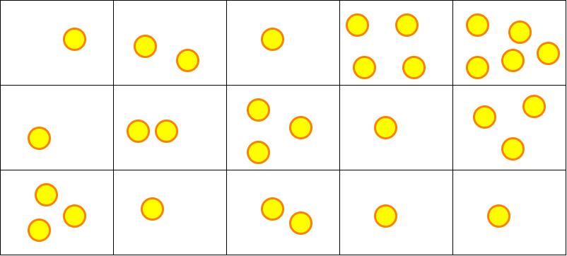

# Activité : Le chercheur d'or

Nature : Débranchée

Matériel : Boîte rangement, perles, papier, crayon

Prérequis : Problèmes d'optimisation combinatoire, algorithmes gloutons

À faire : Par deux

## I. Objectif

L'objectif est de repérer les inconvénients de la stratégie gloutonne et de découvrir la solution à ces inconvénients : la programmation dynamique.

## II. Matériel

Vous disposez, par groupe, d'une boîte de rangement à plusieurs compartiments, de plusieurs perles, d'une feuille et d'un crayon. 

La boîte de rangement représente la mine d'or et les perles représentent les pépites.

## III. Installation

Placez les pépites dans les cases de la boîte comme montré ci-dessous :

## IV. Règles du jeu

Le chercheur d'or souhaite récolter le plus de pépites d'or possible.

Muni d'un radar à pépites, le chercheur d'or connaît précisément le nombre de pépites présentes dans chaque parcelle de la mine.

Il commence toujours par creuser dans la parcelle du coin supérieur gauche de la mine et termine sur la parcelle du coin inférieur droit.

Pour chaque nouvelle parcelle de roche creusée, il récupère le nombre de pépites présentes dans celle-ci et l'ajoute à son butin.

Afin d'éviter de se faire ensevelir, le chercheur n'a d'autre choix que de creuser sur la parcelle située soit à droite soit en bas de sa position actuelle.

Il ne lui reste plus qu'à trouver un chemin optimisé lui permettant de récupérer le maximum de pépites.

## V. Travail à faire

a) Quel est le chemin que le chercheur doit traverser pour récupérer le plus de pépites ?

b) Trouver une méthode/un algorithme permettant de retrouver le chemin maximisant le nombre de pépites pour n'importe quelle configuration de mine.

____________________

[Sommaire](./../../README.md)