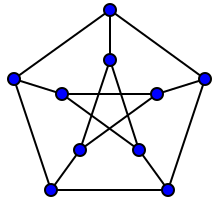

# Exercices

$G =$

```mermaid
    flowchart LR
        0 --> 9
        0 --> 4
        1 --> 3
        1 --> 5
        2 --> 0
        2 --> 1
        3 --> 4
        4 --> 2
        4 --> 8
        5 --> 7
        8 --> 6
        6 --> 2
        7 --> 6
        8 --> 0
        9 --> 3
        9 --> 8
```

## Exercice 1

Écrire une fonction `parcours_largeur_d_abord(g : dict, s : int)->None` qui prend en paramètre un graphe `g` représenté par liste d'adjacence et un sommet de départ et affiche les sommets du graphe dans l'ordre de traitement du parcours en largeur d'abord.

## Exercice 2

Écrire une fonction `parcours_profondeur_d_abord(g : dict, s : int)->None` qui prend en paramètre un graphe `g` représenté par liste d'adjacence et un sommet de départ et affiche les sommets du graphe dans l'ordre de traitement du parcours en profondeur d'abord.

## Exercice 3

Cet exercice répond au problème de connexité d'un graphe et permet de répondre si un graphe est connexe ou non.

Un graphe est dit *connexe* si, à partir de chaque sommet, il existe un chemin le reliant à tous les autres sommets du graphe.

a) Dessiner un graphe non connexe d'ordre $5$.

b) À l'issue d'un parcours sur un graphe non connexe, qu'observe t-on dans la liste `est_visite` ?

c) Écrire une fonction `est_connexe(g : dict)->bool` qui prend en paramètre un graphe `g` et renvoie $True$ s'il est connexe, $False$ sinon.

## Exercice 4

Cet exercice répond au problème de coloration d'un graphe et permet de connaître le nombre chromatique d'un graphe.

Le *nombre chromatique* d'un graphe est le nombre minimal de couleurs nécessaire à colorier les sommets d'un graphe en respectant la contrainte suivante : chaque sommet ne peut être colorié de la même couleur qu'un sommet voisin.

La coloration de graphe est un problème utilisé dans les télécommunications : Certains réseaux de télécommunication sont composés d'émetteurs émettant chacun sur une fréquence particulière.

Lorsque deux émetteurs sont trop proches on ne peut leur allouer la même fréquence à cause des interférences (sauf si éventuellement une montagne les sépare).

Il faut donc modéliser le réseau de télécommunication sous forme de graphe et colorier le graphe de telle façon à trouver le nombre chromatique.

a) Trouver le nombre chromatique du graphe de Peterson :

b) Trouver et écrire en Français, un algorithme glouton permettant de colorier (avec un nombre de couleurs satisfaisant) un graphe.

## Exercice 5

Cet exercice répond au problème de plus court chemin dans un graphe non pondéré.

La *distance* entre deux sommets est le minimum des longueurs des chemins reliant ces deux sommets.

La stratégie est de parcourir en largeur d'abord le graphe et d'ajouter $1$ à la distance à chaque fois que nous passons à un niveau suivant de voisinage.

Appliquer à la main et sur papier l'algorithme du plus court chemin sur le graphe $G$ et donner la distance du sommet $0$ au sommet $7$.

## Exercice 6

Cet exercice répond au problème de présence d'un cycle dans un graphe et permet de répondre si un cycle est présent dans un graphe ou non.

La stratégie est de parcourir le graphe avec un parcours en profondeur et en coloriant les sommets.

Tous les sommets non visités sont blancs.

Lorsque nous visitons un sommet, nous le colorons en gris. Si, lors du parcours, nous rencontrons un sommet colorié en gris, nous avons un cycle. S'il n'y a plus de voisins, nous colorons le sommet en noir.

Appliquer à la main sur papier l'algorithme de présence d'un cycle sur le graphe $G$.

## Exercice 7 (Difficile)

a) Écrire l'instruction permettant de représenter sous forme de liste d'adjacence le graphe de Peterson.

b) Écrire une fonction `colorie(g : dict)->dict` qui prend en paramètre un graphe `g` **non orienté** représenté par une liste d'adjacence et renvoie un dictionnaire associant chaque sommet à une couleur différente de celle de ses voisins d'après l'algorithme glouton trouvé à l'exercice $4$.

## Exercice 8 (Difficile)

Écrire une fonction `distance(g : dict, depart : int, arrivee : int)->int` qui prend en paramètre un graphe `g` **non pondéré** représenté par une liste d'adjacence, deux sommets et renvoie la distance entre `depart` et `arrivee`.

## Exercice 9 (Difficile)

Écrire une fonction `cycle_present(g : dict)->bool` qui prend en paramètre un graphe `g` représenté par une liste d'adjacence et renvoie $True$ s'il admet un cycle, $False$ sinon.

____________

[Sommaire](./../../../README.md)