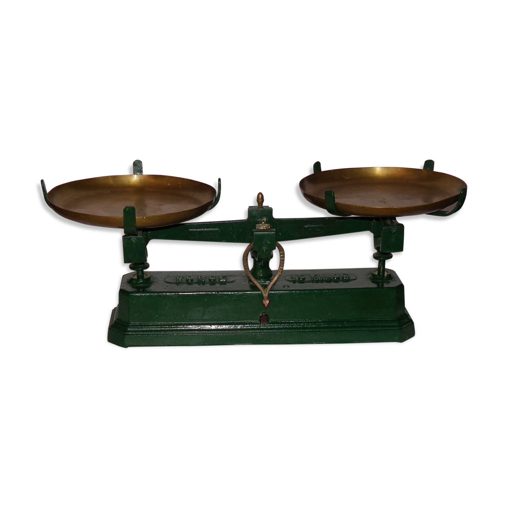
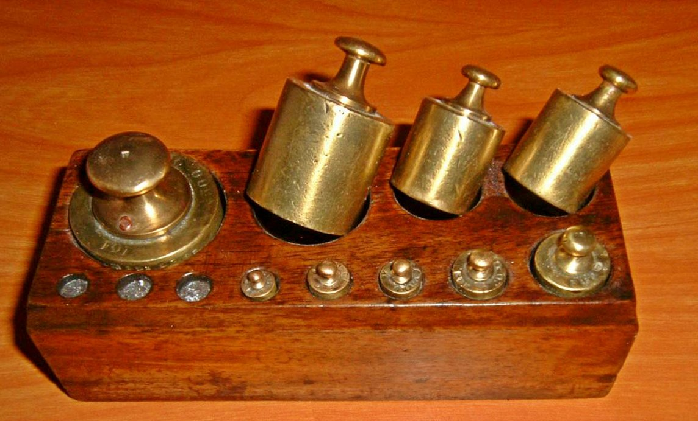

# Activité : Trier à l'aide de balances

Nature : Débranchée

Matériel : Balance à plateaux, dix poids de masses différentes, feuille de papier, crayon

Prérequis : [Complexité](./../Optimisation/Complexité.md)

À faire : Par deux

## I. Objectif

L'objectif de cette activité est de trouver/créer/écrire un algorithme permettant de trier dans l'ordre croissant les poids à l'aide d'une balance à plateaux.

## II. Matériel

Vous disposez chacun d'une balance à plateaux : 

Et de dix poids de masses différentes :

## IV. Travail à faire

a) Trouver un algorithme permettant de trier les poids dans l'ordre croissant de masse.

b) Écrire cet algorithme en français de telle façon à ce n'importe qui puisse le comprendre et le refaire.

_______________________

[Sommaire](./../README.md)
