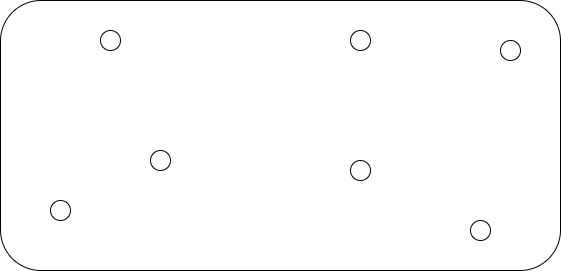

# Activité : Le voyageur de commerce

Nature : Débranchée

Matériel : jeu, feuille de brouillon et crayon

Prérequis : Aucun

À faire : Par deux

## I. Objectif

L'objectif de cette activité est d'élaborer une méthode/un algorithme permettant de répondre au problème du voyageur de commerce.

Depuis une ville de départ, le voyageur cherche à visiter toutes les villes de la région une et une seule fois et finit son tour par la ville de départ.

Il existe plusieurs itinéraires possibles et le voyageur cherche à utiliser celui dont la distance parcourue est la plus petite.

## II. Installation

Vous disposez, par groupe, d'un jeu composé d'une planche de bois sur laquelle est plantée sept clous et une ficelle fixée à l'un des clous : 

Ce jeu est une représentation d'une vue aérienne d'une région, les villes étant symbolisées par les clous et l'itinéraire à emprunter par la ficelle.

## IV. Travail à faire

a) En parcourant les villes à l'aide de la ficelle, trouver l'itinéraire le plus court en répondant au problème du voyageur de commerce.

Afin de comparer efficacement la distance des itinéraires trouvés, marquer d'un trait sur la ficelle.

b) Sur feuille, écrire un algorithme en français permettant de répondre au problème du voyageur de commerce pour n'importe quel configuration de villes.

_______________________

[Sommaire](./../../README.md)

___________

<a property="dct:title" rel="cc:attributionURL" href="https://github.com/boddaert/nsi">Cours NSI</a> by <a rel="cc:attributionURL dct:creator" property="cc:attributionName" href="https://github.com/boddaert">Théo Boddaert</a> is licensed under <a href="https://creativecommons.org/licenses/by/4.0/?ref=chooser-v1" target="_blank" rel="license noopener noreferrer" style="display:inline-block;">CC BY 4.0</a>    
 