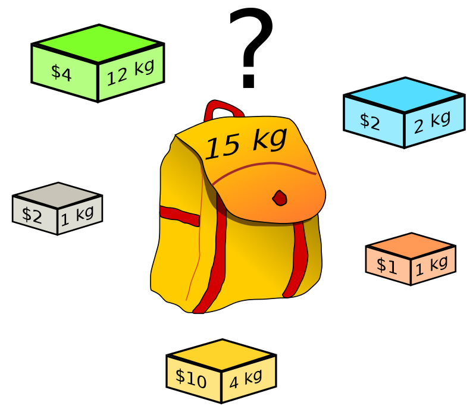

# Exercices

## Exercice 1

a) Proposer l'idée de la stratégie gloutonne répondant au problème du rendu de monnaie.

b) Quelle est la solution donnée par la stratégie gloutonne lorsque la somme à rendre est $42$ ? (Et en utilisant le système monnaitaire de l'Euro)

c) Écrire une fonction `rendu_de_monnaie_glouton(l_pieces : list, somme_a_rendre : int)->list` qui prend en paramètre un système monnaitaire sous forme de liste et un entier et renvoie, en utilisant la stratégie gloutonne, une liste de taille satisfaisante des pièces à rendre.

```python
>>> rendu_de_monnaie_glouton([1, 2, 5, 10, 20, 50], 34)
[20, 10, 2, 2]
```

## Exercice 2

L'objectif du problème du sac à dos est de sélectionner des objets à mettre dans le sac à dos de façon à maximiser la somme des valeurs des objets pris, sous la contrainte que le poids total des objets pris ne dépasse pas la capacité du sac à dos. 

a) Quelles boîtes choisir afin de maximiser la somme emportée tout en ne dépassant pas les quinze kilos autorisés ?



b) Démontrer qu'il s'agit d'un problème d'optimisation combinatoire.

c) Proposer l'idée de la stratégie gloutonne répondant au problème du sac à dos.

Nous souhaitons écrire un programme résolvant automatiquement ce problème.

d) Commencer par représenter en Python l'ensemble des boîtes disponibles à l'aide d'une liste que vous nommerez `boites` dans laquelle chaque boîte est représentée par un tuple composé de la valeur de la boîte et du poids de la boîte.

e) Quel pré-traitement des données pouvons-nous réaliser afin que la stratégie gloutonne soit plus simple à écrire ?

f) Écrire une fonction `sac_a_dos_glouton(capacite_du_sac : int, boites : dict)->int` qui prend en paramètre un entier représentant la capacité maximale d'un sac à dos et d'une liste représentant les boîtes disponibles et renvoie, en utilisant la stratégie gloutonne, une somme des valeurs des boîtes satisfaisante : 

```python
>>> sac_a_dos_glouton(15,boites)
15
```

## Exercice 3 (Difficile)

Les célèbres tableaux de Piet Mondrian représentent un ensemble de formes rectangulaires coloriés dans une certaine couleur.

Le problème est le suivant : pouvons-nous colorier tous les rectangles de ces tableaux avec un nombre de couleur minimal en respectant la contrainte que chaque rectangle ne peut être colorié de la même couleur que ses rectangles voisins ?

a) Proposer une solution utilisant un nombre de couleurs minimal du tableau de Piet Mondrian :


b) Démontrer qu'il s'agit d'un problème d'optimisation combinatoire.

c) Proposer l'idée de la stratégie gloutonne répondant au problème de coloration.

Nous souhaitons écrire un programme résolvant automatiquement ce problème.

d) Commencer par représenter en Python le tableau de Piet Mondrian ci-dessus à l'aide d'un dictionnaire que vous nommerez `tableau_piet_mondrian`.

- Chaque clé de ce dictionnaire est une lettre représentant un rectangle du tableau.

- Chaque valeur est une liste des rectangles voisins.

L'objectif des deux questions suivantes est de construire un dictionnaire de couleurs dont les clés sont les rectangles et leur valeur est la couleur avec laquelle il sont coloriés.

e) Écrire une fonction `couleurs_des_voisins(voisins : list, col_tableau : dict)->list` qui prend en paramètres une liste représentant les voisins d'un rectangle et un dictionnaire représentant un dictionnaire de couleurs.

f) Écrire une fonction `colorie_tableau_glouton(tableau : dict)->dict` qui prend en paramètre un dictionnaire et renvoie un dictionnaire de couleurs complété :

```python
>>> colorie_tableau(tableau_piet_mondrian)
{'a': 'rouge', 'b': 'vert', 'c': 'rouge', 'd': 'vert', 'e': 'bleu', 'f': 'rouge', 'g': 'vert', 'h': 'bleu', 'i': 'vert', 'j': 'rouge', 'k': 'bleu', 'l': 'vert', 'm': 'jaune', 'n': 'rouge', 'o': 'noir', 'p': 'bleu'}
```

_____________________

[Sommaire](./../../../README.md)

___________

<p xmlns:cc="http://creativecommons.org/ns#" xmlns:dct="http://purl.org/dc/terms/"><a property="dct:title" rel="cc:attributionURL" href="https://github.com/boddaert/nsi">Cours NSI</a> by <a rel="cc:attributionURL dct:creator" property="cc:attributionName" href="https://github.com/boddaert">Théo Boddaert</a> is licensed under <a href="https://creativecommons.org/licenses/by/4.0/?ref=chooser-v1" target="_blank" rel="license noopener noreferrer" style="display:inline-block;">CC BY 4.0</a>    </p> 