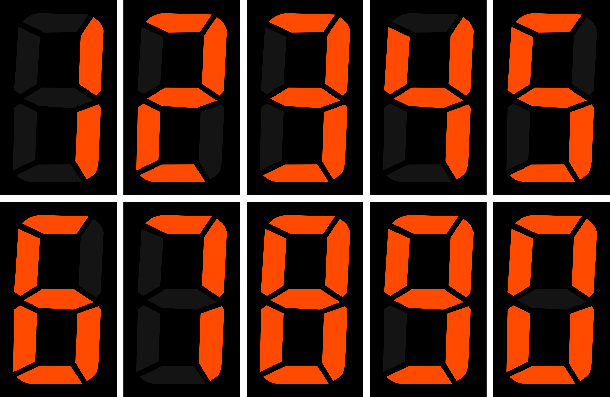

# Activité : Afficheur sept segments

Nature : Débranchée

Matériel : Une feuille de papier et un crayon

Prérequis : circuits combinatoires

À faire : Par deux

## I. Objectif

L'objectif de cette activité est de construire, avec tous les groupes de la classe, une table de vérité permettant d'allumer les bons segments de l'afficheur en fonction du symbole.

## II. Principe d'un afficheur sept segments

Un afficheur sept segments est un afficheur de chiffre comportant sept segments. Ils sont utilisés encore aujourd'hui dans certaines montres ou radio-réveils.

En fonction du chiffre à afficher, certains segments sont allumés, d'autres non :

L'idée est de nommer chacun des segments par une lettre comme ci-dessous :

Ces lettres sont des variables logiques de sortie, elles valent $0$ si le segment correspondant est éteint, $1$ si le segment est allumé.

Ensemble, elles représentent les sorties que l'on doit pouvoir obtenir selon un chiffre passé en entrée.

Par exemple, si l'afficheur souhaite afficher le chiffre $0$, les segments $A$, $B$, $C$, $D$, $E$ et $F$ sont allumés et le segment $G$ est éteint.

Donc si la fonction logique de l'afficheur passe $0$ en entrée, les variables logique de sortie $a$, $b$, $c$, $d$, $e$ et $f$ valent $1$ et $g$ vaut $0$.

## III. Travail à faire

Afin de simplifier la tâche, nous allons diviser le travail parmis tous les groupes de la classe.

Chaque groupe se verra attribué d'un segment et devra établir la fonction logique permettant d'allumer ce segment en fonction des symboles.

a) En prenant en compte que l'afficheur peut également afficher les lettres de A à F, combien de symbole l'afficheur peut-il afficher ?

b) En déduire le nombre de bits nécessaire à la représentation binaire de tous les symboles.

c) En déduire le nombre de bits d'entrée à la fonction logique.

d) Pour quels symboles votre segment s'allume ?

e) Établir la table de vérité de votre segment.

f) Repérer les lignes de votre table de vérité dont le bit de sortie vaut $1$ : il s'agit de tous les cas où le segment s'allume. Écrire la fonction logique pour une seule ligne.

g) En déduire la fonction logique de votre segment.

__________________

[Sommaire](./../../README.md)

___________

<a property="dct:title" rel="cc:attributionURL" href="https://github.com/boddaert/nsi">Cours NSI</a> by <a rel="cc:attributionURL dct:creator" property="cc:attributionName" href="https://github.com/boddaert">Théo Boddaert</a> is licensed under <a href="https://creativecommons.org/licenses/by/4.0/?ref=chooser-v1" target="_blank" rel="license noopener noreferrer" style="display:inline-block;">CC BY 4.0</a>    
 
