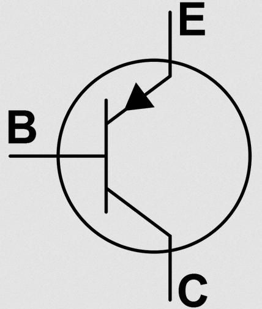

# Circuits combinatoires

## I. Transistors

Lors de la leçon précédente (cf [Modèle Von Neumann](./Modèle_Von_Neumann.md)), nous avons vu que l'unité arithmétique et logique regroupait en interne des circuits électroniques pouvant réaliser des opérations mathématiques sur les nombres comme l'addition par exemple.

> [!IMPORTANT]
> Les opérateurs sont construits à partir de *circuits combinatoires* eux mêmes construits à partir de transistors.

> [!IMPORTANT]
>Un *transistor* est un composant électronique permettant de contrôler ou d'amplifier des tensions et des courants électriques. Ils agissent selon la méthode du tout ou rien comme des interrupteurs qui laissent passer le courant électrique ou non.

## II. Fonctions logiques

### a) Portes logiques

Il existe trois types de transistors agissant différemment sur le courant électrique et représentent les trois *portes logiques* de base que nous connaisons déjà : la porte $NON$, la porte $OU$ et la porte $ET$.

Nous représentons en algèbre de Boole :

- La porte $ET$ par le symbole $\land$.

- La porte $OU$ par le symbole $\lor$.

- La porte $NON$ par le symbole $\lnot$.

> [!TIP]
>Par exemple, la porte $NON$ renvoie $1$ lorsqu'elle prend en entrée $0$ et renvoie $0$ lorsqu'elle prend en entrée $1$ (en sachant que la valeur booléenne $1$ représente $True$ et la valeur booléenne $0$ représente $False$) :
>
> - $\lnot 1=0$
>
> - $\lnot 0=1$

#### <ins>Application 1</ins>

Donner le résultat des opérations logiques suivantes :

1. $0 \land 1$

2. $0 \lor 1$

3. $1 \land 1$

4. $1  \lor 1$

### b) Algèbre de Boole 

Les portes logiques ou la combinaison de plusieurs portes logiques constituent des *fonctions logiques*, elles prennent en entrée des données et donnent en sortie un résultat.

Nous notons $e_0, e_1, e_2, \dots$ les variables d'entrée. Comme ce sont des bits, ces variables valent $0$ ou $1$.

> [!TIP]
> Par exemple, $(\lnot e_0 \lor e_1)\land e_2$ est une fonction logique prenant en entrée trois variables.

Le résultat de cette fonction dépend évidemment des valeurs des variables d'entrées.

Nous connaissons déjà d'autres fonctions logiques : celles permettant de réaliser l'addition entre deux nombres binaires ou encore la multiplication par deux en binaire (cf [Activité sur la découverte du binaire](./../Représentation_des_nombres_en_machine/Activité_découverte_du_binaire.md)).

> L'algèbre de Boole est un algèbre, inventé par le mathématicien Georges Boole en 1854, constitué de portes logiques, de variables logiques et de fonctions logiques et est à l'origine de tout l'électronique.

> [!IMPORTANT]
> Cet algèbre obéit aux lois de distributivité, d'associativité, de commutativité et de neutralité :
>
> - *Distributivité* : $e_0 \land (e_1 \lor e_2) = (e_0 \land e_1)\lor (e_0 \land e_2)$
>
> - *Associativité* : $e_0 \land (e_1 \land e_2) = (e_0 \land e_1) \land e_2$
>
> - *Commutativité* : $e_0 \land e_1 = e_1 \land e_0$
>
> - *Neutralité* : $1 \land e_0 = e_0$ ou $0 \lor e_0 = e_0$

#### <ins>Application 2</ins>

Trouver le résultat, à l'aide de l'algèbre de Boole, des fonctions logiques suivantes :

1. $1 \lor (0 \land 1)$

2. $1 \land (1 \land 0)$

3. $1 \land ( e_1 \land 0)$

4. $0 \land (e_1 \lor e_2)$

### c) Tables de vérité

> [!IMPORTANT]
>Une *table de vérité* est un tableau permettant d'indiquer toutes les sorties d'une fonction logique selon toutes les combinaisons possibles d'entrées.

Les premières colonnes représentent les valeurs possibles des entrées et la dernière colonne représente le résultat de la fonction logique selon les entrées qu'elle a.

> [!TIP]
> Par exemple, la table de vérité de la fonction $(\lnot e_0 \lor e_1)\land e_2$ vue plus haut dans ce chapitre est :
>
> | $e_0$ | $e_1$ | $e_2$ | $\lnot e_0$ | $\lnot e_0 \lor e_1$ | $(\lnot e_0 \lor e_1) \land e_2$ |
> | :---: | :---:| :--- | :---: | :---: | :---: |
> | $0$ | $0$ | $0$ | $1$ | $1$ | $0$ |
> | $0$ | $0$ | $1$ | $1$ | $1$ | $1$ |
> | $0$ | $1$ | $0$ | $1$ | $1$ | $0$ |
> | $0$ | $1$ | $1$ | $1$ | $1$ | $1$ |
> | $1$ | $0$ | $0$ | $0$ | $0$ | $0$ |
> | $1$ | $0$ | $1$ | $0$ | $0$ | $0$ |
> | $1$ | $1$ | $0$ | $0$ | $1$ | $0$ |
> | $1$ | $1$ | $1$ | $0$ | $1$ | $1$ |
>
> Cette table nous indique que si $e_0=0$, $e_1=1$ et $e_2=0$ alors la sortie est $0$.

> [!NOTE]
> Il est préférable de décomposer la fonction logique en plusieurs sous-expressions afin de simplifier.

#### <ins>Application 3</ins>

a) Construire la table de vérité de la fonction logique $(e_0 \lor \lnot e_1)$.

b) Construire la table de vérité de la fonction logique $\lnot (\lnot e_0 \lor e_1)$.

c) Construire la table de vérité de la fonction logique $e_0 \lor (e_1 \land e_2)$.

_________________

[Sommaire](./../../README.md)

___________

<a property="dct:title" rel="cc:attributionURL" href="https://github.com/boddaert/nsi">Cours NSI</a> by <a rel="cc:attributionURL dct:creator" property="cc:attributionName" href="https://github.com/boddaert">Théo Boddaert</a> is licensed under <a href="https://creativecommons.org/licenses/by/4.0/?ref=chooser-v1" target="_blank" rel="license noopener noreferrer" style="display:inline-block;">CC BY 4.0</a>    
 