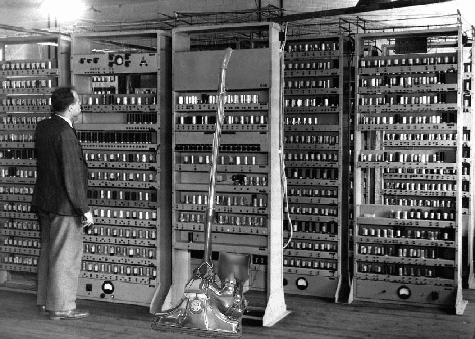
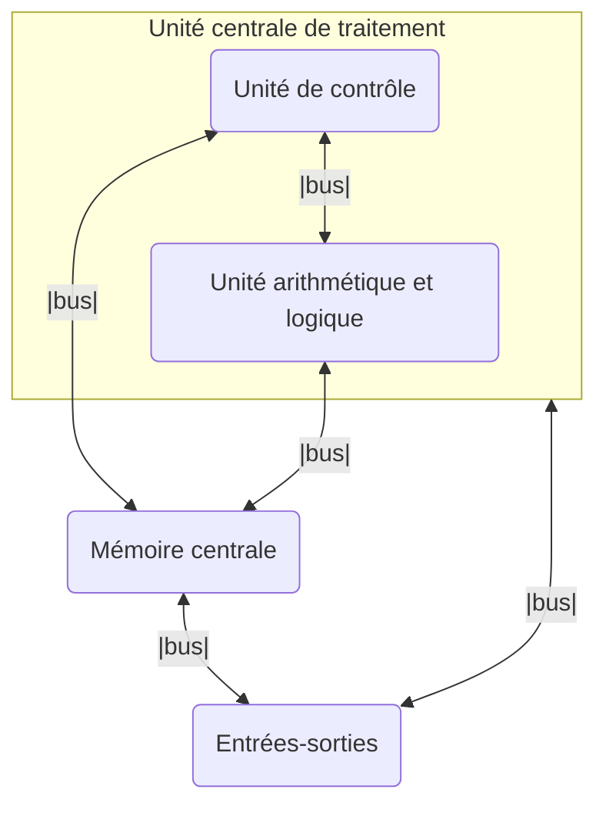

# Architecture Von Neumann

## I. Histoire

Une très grande majorité des ordinateurs d'aujourd'hui fonctionnent selon une architecture bien spécifique : celle de John Von Neumann qui lui donna son nom.

Elle a été conçue au milieu des années quarante par une équipe de chercheurs de l'Université de Pennsylvanie dirigée par Von Neumann.

Le monde découvre en 1945 le nouvel ordinateur basé sur cette architecture : l'EDVAC.

Le monstre occupe une surface de quante-cinq mètres carré et pèse sept mille huit-cent kilos. Il dispose d'une mémoire de mille mots de quarante-quatre bits soit cinq kilo-octet.

Il pouvait réaliser automatiquement en binaire les additions, les soustractions, les multiplications et les divisions.

Malgré une avancée fulgurante de la puissance et de la mémoire jusqu'à aujourd'hui, l'architecture, elle est restée inchangée tant elle est efficace.

## II. Modèle Von Neumann

### a) Schéma

