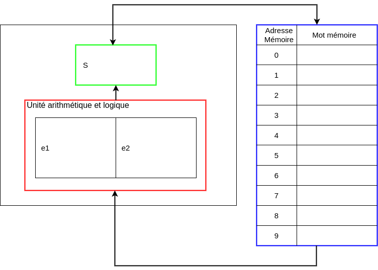

# Activité : Langage d'assemblage sur M10

Nature : Débranchée.

Matériel : Machine M10, un crayon et une feuille de brouillon.

Prérequis : [Modèle Von Neumann](./Modèle_Von_Neumann.md), [Langage machine](./Langage_machine.md).

À faire : Par deux.

## I. Objectif

L'objectif de cette activité est de comprendre et d'écrire un programme dans un langage simplifié d'assemblage.

## II. Règles du jeu

### a) Machine M10

La machine M10 est un ordinateur débranché simplifié, il comporte une mémoire de dix mots mémoires, d'une unité arithmétique et logique et d'un registre $S$ où sera donné le résultat des opérations de calculs.



### b) Jeu d'instruction

> [!IMPORTANT]
> Le *jeu d'instruction* constitue le lexique des opérations réalisables sur cette machine en langage d'assemblage.

La machine M10 dispose de deux types d'instructions :

- Les instructions de transfert.

- Les opérations de calcul.

### c) Syntaxe

Chaque instruction commence par un *mnémonique* suivi de un ou deux opérandes.

Les mnémoniques sont des codes opérations pour indiquer de quelle opération il s'agit.

Les opérandes sont très souvent des adresses mémoires.

### d) Instructions de transfert

Le mnémonique `load` permet de transférer le contenu d'une adresse mémoire vers le contenu du registre $S$.

Le mnémonique `store` permet de transférer le contenu du registre $S$ vers le contenu d'une adresse mémoire.

### e) Opérations de calcul

Le mnémonique `add` suivi de deux adresses mémoires permet d'effectuer la somme des contenus de ces deux adresses et de mettre le résultat dans le registre $S$.

Les mnémoniques `sub`, `mul` et `div` permettent respectivement d'obtenir la différence, le produit et le quotient.

## III. Questions

a) Recopier sur une feuille la machine M10.

b) Choisir un nombre et l'écrire dans la case de mot mémoire d'adresse $0$.

c) Mettre dans la case de mot mémoire d'adresse $1$ la valeur $2$, puis dans celle d'adresse $2$ la valeur $4$.

d) Dérouler pas à pas le programme suivant et indiquer la valeur située dans la case de mot mémoire d'adresse $0$ :

```x86
sub 0 1
store 0
mul 0 2
store 0 
```

e) Effacer, refaire la question b) et c).

f) Écrire un programme permettant de soustraire $2$ au nombre choisi, de le multiplier par $4$ et d'ajouter le nombre choisi au départ.

g) Effacer, écrire dans la case de mot mémoire d'adresse $0$ et d'adresse $1$ la valeur $1$.

h) Écrire un programme permettant d'obtenir $1\times 2\times 3$.

## IV. Extension

Nous allons désormais écrire nos programmes dans la mémoire, sauf si cela est indiqué, la première instruction du programme est située dans la case de mot mémoire d'adresse $0$.

Nous ajoutons également au jeu d'instruction de la machine M10 les instructions de saut.

### a) Instructions de saut

Le mnémonique `jpp x y` suivi de deux adresses mémoires permet de "sauter" à l'intruction d'adresse $x$ si le contenu de l'adresse $y$ est positif.

## V. Suite questions

i) Mettre dans la case de mot mémoire d'adresse $9$ la valeur $2$, puis dans celle d'adresse $8$ la valeur $3$.

j) Écrire le programme suivant dans la mémoire.

```x86
sub 9 8
store 9
jpp 5 9
add 9 8
store 9
mul 9 9
store 9
```

k) Dérouler pas à pas le programme et indiquer la valeur située dans la case de mot mémoire d'adresse $9$.

l) Traduire en langage d'assemblage le programme Python suivant :

```python
n = 5
a = 0
while n >= 0 :
    n = n - 1
    a = a + 2
```

___________________

[Sommaire](./../../README.md)

___________

<p xmlns:cc="http://creativecommons.org/ns#" xmlns:dct="http://purl.org/dc/terms/"><a property="dct:title" rel="cc:attributionURL" href="https://github.com/boddaert/nsi">Cours NSI</a> by <a rel="cc:attributionURL dct:creator" property="cc:attributionName" href="https://github.com/boddaert">Théo Boddaert</a> is licensed under <a href="https://creativecommons.org/licenses/by/4.0/?ref=chooser-v1" target="_blank" rel="license noopener noreferrer" style="display:inline-block;">CC BY 4.0</a>    </p> 
