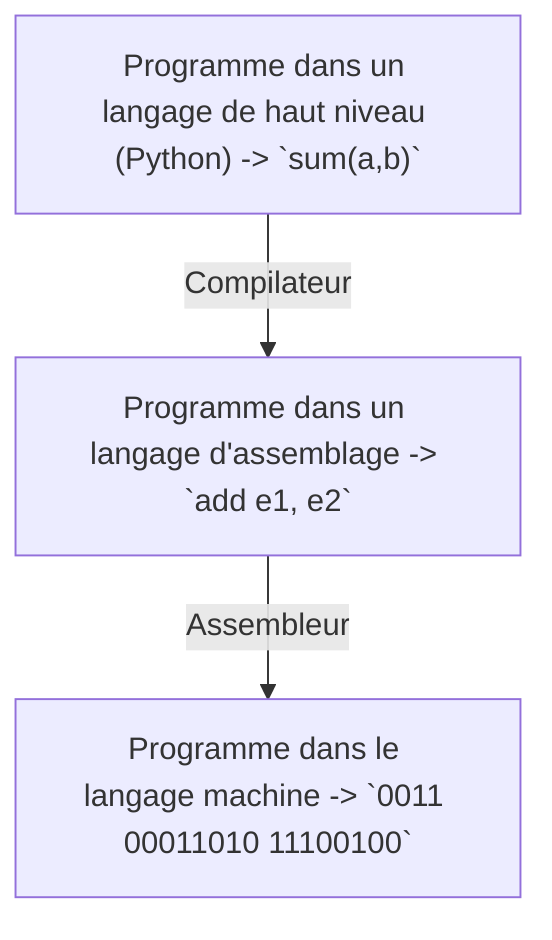

# Langage machine

## I. Introduction

Nous avons lu dans la leçon précédente que les instructions des programmes étaients stockées dans la mémoire sous forme de séquence de bits.

Or, lorsque nous écrivons des programmes, nous le faisons dans un langage de haut niveau et non en binaire.

Il y a donc une traduction de notre programme écrit en Python en langage machine.

## II. Chaîne de production d'un programme

### a) Définitions

> [!IMPORTANT]
> Le *langage machine* est l'unique langage compréhensible directement par l'ordinateur. Ce langage de bas niveau est écrit en binaire.

En réalité, il existe un troisième langage appelé *langage d'assemblage* qui joue l'intermédiaire dans la traduction du langage de haut niveau à bas niveau.

> [!IMPORTANT]
> La *chaîne de production d'un programme* décrivent les étapes consécutives de la traduction d'un programme écrit dans un langage de haut niveau à bas niveau.

### b) Schéma

______________

[Sommaire](./../../README.md)

___________

<a property="dct:title" rel="cc:attributionURL" href="https://github.com/boddaert/nsi">Cours NSI</a> by <a rel="cc:attributionURL dct:creator" property="cc:attributionName" href="https://github.com/boddaert">Théo Boddaert</a> is licensed under <a href="https://creativecommons.org/licenses/by/4.0/?ref=chooser-v1" target="_blank" rel="license noopener noreferrer" style="display:inline-block;">CC BY 4.0</a>    

