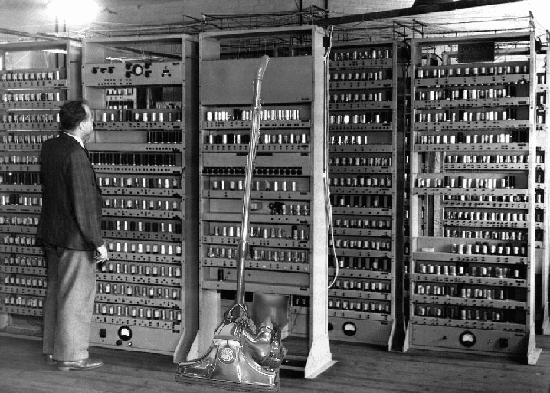
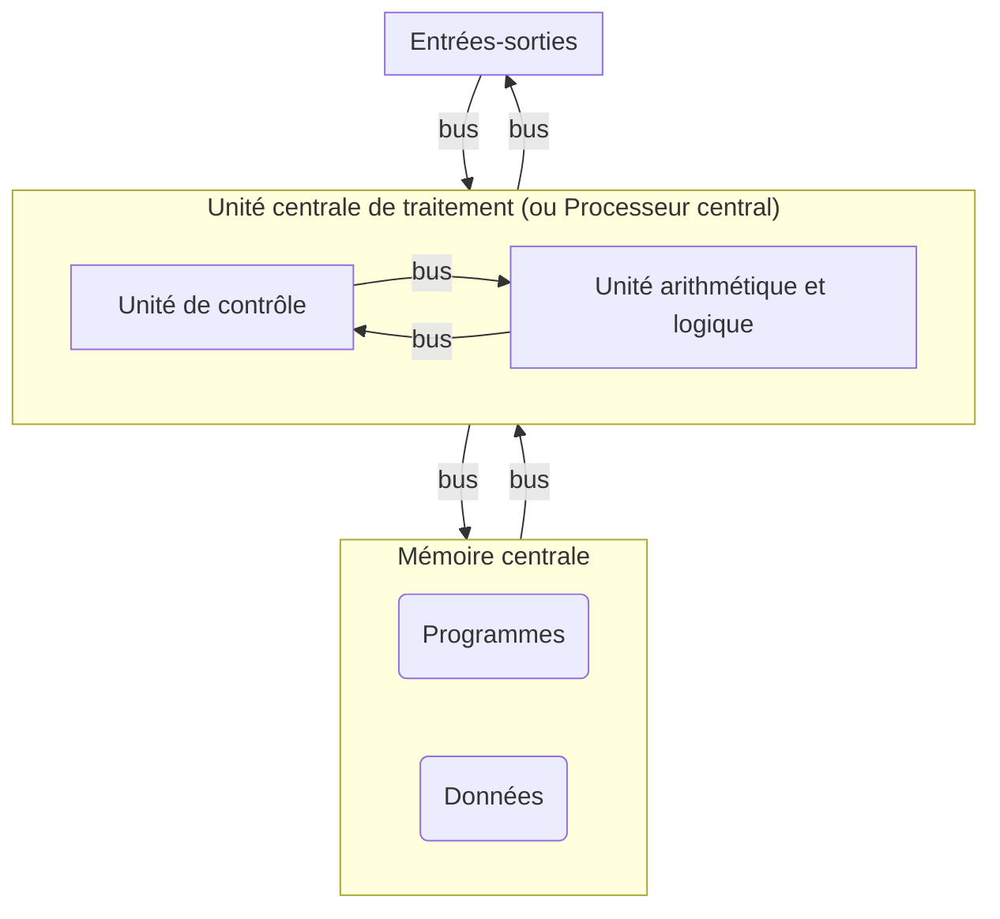

# Architecture Von Neumann

## I. Histoire

Une très grande majorité des ordinateurs d'aujourd'hui fonctionnent selon une architecture bien spécifique : celle de John Von Neumann qui lui donna son nom.

Elle a été conçue au milieu des années quarante par une équipe de chercheurs de l'Université de Pennsylvanie dirigée par Von Neumann.

Le monde découvre en 1945 le nouvel ordinateur basé sur cette architecture : l'EDVAC.

Le monstre occupe une surface de quarante-cinq mètres carré et pèse sept mille huit-cent kilos. Il dispose d'une mémoire de mille mots de quarante-quatre bits soit cinq kilo-octet.

Il pouvait réaliser automatiquement en binaire les additions, les soustractions, les multiplications et les divisions.

Malgré une avancée fulgurante de la puissance et de la mémoire jusqu'à aujourd'hui, l'architecture, elle est restée inchangée tant elle est efficace.

## II. Définitions

> [!IMPORTANT]
> Une *machine informatique* est une machine pouvant traiter de l'information.

> [!IMPORTANT]
> Un *ordinateur* est une machine informatique pouvant exécuter des opérations logiques.

> [!IMPORTANT]
> Une *opération logique* est une opération relevant de l'algèbre de Boole, c'est-à-dire une opération sur des booléens.

> [!IMPORTANT]
> Un *booléen* est une valeur qui est soit vraie, soit fausse, qui vaut soit $0$, soit $1$.

## III. Modèle Von Neumann

### a) Schéma

### b) Légende

Dans le modèle Von Neumann, les composants d'un ordinateur sont les suivants :

#### 1. L'unité centrale de traitement

L'unité centrale de traitement ou processeur central (*CPU* en anglais pour *Control Processing Unit*) rassemble dans un ensemble de circuits électroniques l'unité arithmétique et logique et l'unité de contrôle.

#### 2. L'unité arithmétique et logique

L'unité arithmétique et logique (*ALU* en anglais pour *Arithmetic Logic Unit*) est un circuit électronique qui effectue les opérations arithmétiques sur les entiers et les flottants, et les opérations logiques sur les bits.

Il a deux entrées $e1$ et $e2$ (les opérandes) et une sortie (le résultat) $S$.

Le circuit électronique effectuant les calculs repose sur les circuits combinatoires (cf Leçon 3 :[Circuits combinatoires](./Circuits_combinatoires.md)).

#### 3. L'unité de contrôle

L'unité de contrôle (*CU* en anglais pour *Control Unit*) joue le rôle de chef d'orchestre de l'ordinateur.

C'est ce composant qui se chargera d'aller récupérer en mémoire la prochaine instruction à exécuter et les données sur lesquelles elle doit opérer, pour les envoyer à l'unité arithmétique et logique.

#### 4. Mémoire centrale

La mémoire centrale est l'endroit où est stocké les données de l'ordinateur.

Les programmes, étant également des données, sont stockés au même endroit.

Les données et les instructions des programmes constituent des *mots mémoires*.

Les mots mémoires sont écrits en binaire et possèdent une adresse appelée *adresse mémoire*.

Lorsque l'unité de contrôle a besoin d'une donnée particulière, il l'a retrouve à l'aide de son adresse.

#### 5. Entrées-sorties

Les périphériques d'entrées-sorties sont des composants externes à l'ordinateur.

Il y a les périphériques d'entrées : souris, clavier, manettes de jeu, webcams, etc ...

Et les périphériques de sorties : écrans, hauts-parleurs, vidéo-projecteurs, etc ...

Les périphériques d'entrées-sorties communiquent avec le processeur ou la mémoire pour entrer des données ou faire sortir des données.

#### 6. Bus de communication

Les bus de communication sont des circuits électroniques permettant simplement l'échange de données entre les composants de l'ordinateur.

## IV. Cycle d'exécution d'une instruction

Pour que l'unité arithmétique et logique puisse exécuter une instruction se trouvant dans la mémoire, l'unité de contrôle effectue trois tâches qu'il répète à chaque nouvelle exécution d'instruction.

Nous l'appelons le *cycle d'exécution d'instruction* et consiste à :

1. Chargement

Grâce à l'adresse mémoire stockée dans l'un de ses registres, l'unité de contrôle va récupérer le mot mémoire associée à cette adresse et la charger dans le processeur.

2. Décodage

Le mot mémoire est décodé afin de savoir de quel type d'instruction il s'agit et de quelles données (opérandes) l'instruction a besoin pour s'exécuter.

3. Exécution

Le mot mémoire est confié à l'unité arithmétique et logique pour être exécutée.

## V. Mémoires

### a) Types de mémoire

Nous distinguons plusieurs types de mémoire :

- La mémoire *vive* ou *volatile* (*RAM* en anglais pour *Random-Access Memory*) est celle qui dispaît une fois l'ordinateur hors-tension. L'accés à ses données y est très rapide.

- La mémoire *non volatile* est celle qui ne disparaît pas lors de la mise hors-tension de l'ordinateur. L'accès à ses données est beaucoup plus lente. Il y a plusieurs mémoires dites non volatiles :

    + La mémoire *morte* (*ROM* en anglais pour *Read-Only Memory*) est une mémoire non volatile et non modifiable. Elle contient toutes les données nécessaires au démarrage de l'ordinateur.

    + La mémoire *flash* est une mémoire non volatile mais contrairement à la mémoire morte, elle est modifiable. Nous parlons de mémoire flash pour les disques durs, les clés USB ou encore les cartes mémoires.

- La mémoire *cache* enregistre temporairement des données et disparaît au bout d'un certain temps. Située dans le processeur, cette mémoire est la plus rapide mais également la plus limitée. Elle permet d'éviter un deuxième aller-retour à la mémoire lorsque des données doivent être réutilisées.

### b) Hierarchie

| Type de la mémoire | Temps d'accès | Capacité |
| :---: | :---: | :---: |
| Mémoire cache | $2-3 ns$ | $2-3 Mo$ |
| Mémoire vive | $5-10 ns$ | $5-60 Go$ |
| Mémoire flash (disques durs) | $3-20 ms$ | $3-20 To$ |

___________________

[Sommaire](./../../README.md)

___________

<a property="dct:title" rel="cc:attributionURL" href="https://github.com/boddaert/nsi">Cours NSI</a> by <a rel="cc:attributionURL dct:creator" property="cc:attributionName" href="https://github.com/boddaert">Théo Boddaert</a> is licensed under <a href="https://creativecommons.org/licenses/by/4.0/?ref=chooser-v1" target="_blank" rel="license noopener noreferrer" style="display:inline-block;">CC BY 4.0</a>    
 