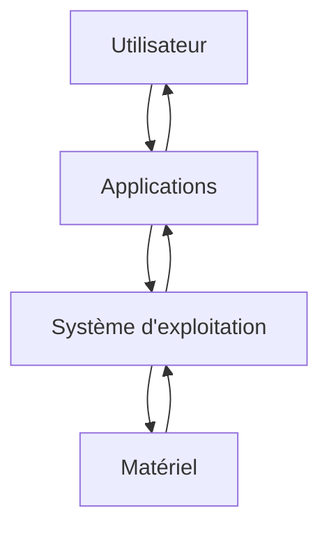

# Systèmes d'exploitation

## I. Définition

Un *système d'exploitation* (ou *OS* pour *Operating System*) est un ensemble de programmes qui réalise l'interface entre l'utilisateur et le matériel.

L'utilisateur utilise des applications qui communiquent avec le système d'exploitation, ce dernier fournit les ressources matérielles necéssaires à leur bon fonctionnement.

Un système d'exploitation a deux objectifs :

- La construction d'une interface visuelle facile d'emploi et conviviale.

- La gestion des ressources :

    + La gestion de la mémoire : Où stocker les données ?

    + La gestion du processeur : Quel programme exécuter ?

    + La gestion des fichiers : Comment organiser la mémoire ?

    + La gestion des entrées/sorties : Comment gérer l'accès aux périphériques ?