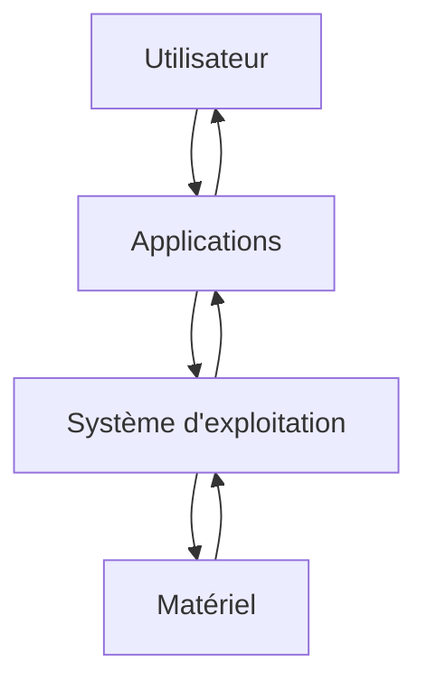
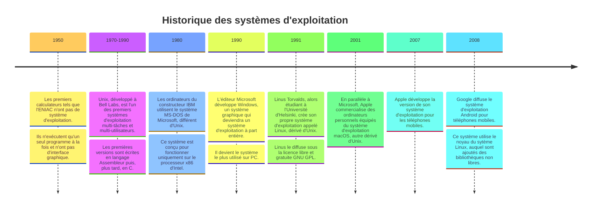

# Systèmes d'exploitation

## I. Définitions

Un *système d'exploitation* (ou *OS* pour *Operating System*) est un ensemble de programmes qui réalise l'interface entre l'utilisateur et le matériel.

L'utilisateur utilise des applications communiquant avec le système d'exploitation, ce dernier fournit les ressources matérielles necéssaires à leur bon fonctionnement.

Un système d'exploitation a deux objectifs :

- La construction d'une interface visuelle facile d'emploi et conviviale.

- La gestion des ressources :

    + La gestion du processeur et de l'ordonnancement des programmes : Quel programme exécuter à chaque instant $t$ ?

    + La gestion de la mémoire vive : Où stocker les programmes en cours d'exécution ?

    + La gestion des fichiers : Comment stocker et organiser les données ?

    + La gestion du réseau.

    + La gestion des périphériques d'entrées/sorties : Comment gérer l'accès aux périphériques ?

## II. Historique

## III. Généralités

*Noyau* : C'est le cœur du système d'exploitation fournissant les fonctionnalités basiques aux programmes. Un ordinateur ne possèdant qu'un noyau n'a ni de programme utilisateur ni d'interface (graphique ou textuelle) et n'est donc pas utilisable en l'état.

*Standard POSIX* : Malgré la grande diversité des systèmes d'exploitation, il existe un ensemble de standards, regoupés sous le nom de POSIX (*Portable Operating System Interface*). Ils définissent les fonctionnalités et les programmes de base permettant d'utiliser le système. Le standard POSIX est largement inspiré du système d'exploitation Unix, c'est pourquoi, à l'inverse de Linux, Android, macOS et IOS, le système Windows de Microsoft n'est pas compatible avec ce standard.

*Distribution logicielle* : C'est un ensemble de logiciels associés à un noyau. Debian, Fedora, Ubuntu, Arch Linux sont, par exemples des distributions du noyau Linux.

*Logiciel libre* : Un logiciel est dit libre si l'accès public au code source (*open source*), sa modification et la rediffusion publique de ses modifications est autorisée. Linux est libre.

*Interface système* : L'interface système (*Terminal* ou *Console*) est une interface textuelle permettant à l'utilisateur d'interragir avec le système d'exploitation à l'aide de *commandes systèmes* :

Par le `$`, le terminal attend une nouvelle saisie de commande système.

##### Application 1

a) Ouvrir le terminal Windows appelé *cmd* de votre machine et effectuer la commande `dir`.

b) Que fait la commande `dir` ?
___________

[Sommaire](./../README.md)