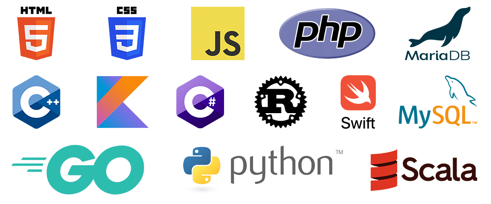
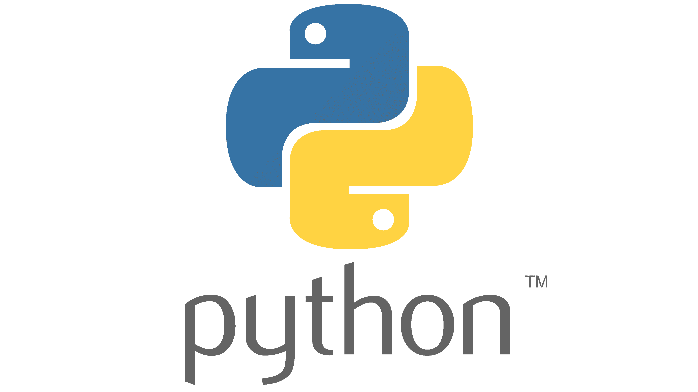
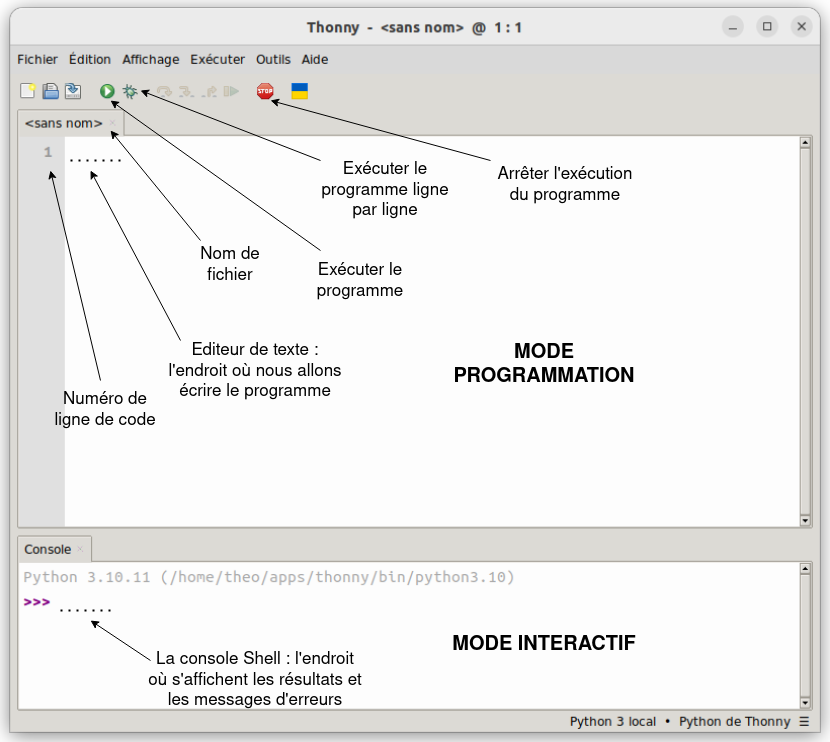

# Prise en main

## I. L'informatique

En Numérique et Sciences Informatiques, nous allons être amenés à écrire des programmes informatiques.

> [!IMPORTANT]
> Un *programme informatique* est un texte composé d'instructions et d'opérations écrit dans un certain langage de programmation et destiné à être exécuté par un ordinateur.

> [!IMPORTANT]
> L'*informatique* est la science des données, les programmes informatiques que nous écrivons nous permettent de manipuler ces données et d'effectuer des calculs sur celles-ci.

Pour nous aider à écrire des programmes informatiques, les informaticiens utilisent des algorithmes. Un algorithme est une suite d'instructions écrit en Français. Il sert à résoudre un problème.

Un algorithme est comparable à une recette de cuisine, par exemple :

```
Recette Mayonnaise
- Mettre un jaune d'oeuf dans un bol.
- Y ajouter une cuillière de moutarde.
- Tant que la préparation est liquide :
    - Ajouter une cuillière à soupe d'huile.
    - Fouetter la préparation.
```

L'objectif de construire un algorithme est qu'il soit compris par tous et qu'on puisse le traduire dans n'importe quel langage de programmation.

## II. Langage de programmation

> [!IMPORTANT]
> Un *langage de programmation* est un langage dans lequel nous allons écrire notre programme.

Comme nos langues naturelles, un langage de programmation est composé d'un alphabet et de règles.

Nous distinguons une multitude de langages comme le **Java**, le **C++**, le **HTML**, le **CSS**, le **SQL**, etc ...



## III. Le Python

En NSI, nous travaillerons avec le langage Python principalement.

Il a été inventé en 1989 par le néerlandais Guido Van Rossum et est aujourd'hui l'un des lagages les plus utilisés au monde.



## IV. Environnement de développement
> [!IMPORTANT]
> Un *IDE* (ou environnement de développement) est un logiciel permettant d'écrire et de faire exécuter des programmes. 

Nous utiliserons pour cela le logiciel Thonny :



Sur Thonny, il y a un **mode programmation** et un **mode interactif**.

### a) Mode programmation

Le mode programmation de Thonny est l'endroit où l'on va écrire nos programmes.

C'est ces lignes de code qui seront enregistrés sur le fichier.

### b) Mode interactif

La console, situé en bas de la page, se présente comme une calculatrice. Les trois chevrons `>>>` indique que la console attend une ligne de code.

Cette ligne de code est éphémère et ne sera pas enregistrée sur le fichier.

> [!NOTE]
> Nous utilisons généralement le mode interactif pour tester les programmes.

________

[Sommaire](./../../README.md)

___________

<p xmlns:cc="http://creativecommons.org/ns#" xmlns:dct="http://purl.org/dc/terms/"><a property="dct:title" rel="cc:attributionURL" href="https://github.com/boddaert/nsi">Cours NSI</a> by <a rel="cc:attributionURL dct:creator" property="cc:attributionName" href="https://github.com/boddaert">Théo Boddaert</a> is licensed under <a href="https://creativecommons.org/licenses/by/4.0/?ref=chooser-v1" target="_blank" rel="license noopener noreferrer" style="display:inline-block;">CC BY 4.0</a>    </p> 