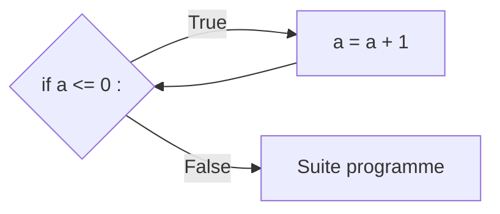

# Boucle non bornées

## I. Définition

Une *boucle* est une construction élémentaire qui permet de répéter une séquence d'instruction.

Nous appelons le *corps de boucle* la séquence d'instruction qui sera répétée.

Il s'agit d'une *boucle non bornée* lorsque nous ne connaissons pas à l'avance combien de fois le corps de boucle sera exécuté.

En Python, les boucles non bornées s'écrivent en utilisant le mot-clé `while` (*Tant que* en Français) suivi d'une condition.

## II. Répéter à l'aide d'une condition

La boucle non bornée permet de répéter l'exécution du corps de boucle si la condition est remplie.

Comme nous l'avons vu dans la leçon précédente, une condition vaut soit $True$ soit $False$.

La condition est remplie si elle vaut $True$.

### a) Syntaxe

En Python, nous pouvons répéter un corps de boucle si une condition est remplie :

```python
a = 0
while a < 3 :
    a = a + 1
```

A l'issue de l'exécution du programme précédent, la valeur affectée à la variable `a` est $3$.

En Français,cela se traduirait par :

- La valeur affectée à la variable `a` est $0$.
- Tant que `a` est inférieur à $3$, j'ajoute $1$ à `a`.

Et son schéma de branchement donnerait :



##### Application 1

Traduire en Français les programmes suivants :

a) Programme 1

```python
a = 0
while a < 6 :
    a = a + 1
```

b) Programme 2

```python
a = 10
while a > 0 :
    a = a - 1
```

c) Programme 3

```python
a = 0
while a <= 10 :
    a = a + 2
```

##### Application 2

Ecrire les programmes Python correspondant aux phrases suivantes :

a) Phrase 1

- La valeur affectée à la variable `a` est $0$.
- Tant que `a` est inférieur à $12$, j'ajoute $1$ à `a`.

b) Phrase 2

- La valeur affectée à la variable `a` est $0$.
- Tant que `a` est inférieur à $12$, j'ajoute $5$ à `a`.

c) Phrase 3

- La valeur affectée à la variable `a` est $-2$.
- Tant que `a` est supérieur à $-7$, je retire $1$ à `a`.
_______

[Feuille d'exercice](./Exercices/Exercices_boucles_non_bornees.md)

_______

Leçon 8 : [Boucles bornées](./Boucles_bornées.md)