# Conditions

## I. Définitions

Une *instruction conditionnelle* est une instruction permettant d'exécuter certaines instructions uniquement si la condition est remplie.

Une *condition* est le résultat d'une comparaison ou d'une expression booléenne, elle vaut soit $True$, soit $False$.

Une condition est remplie si elle vaut $True$.

Si la condition n'est pas remplie, la suite du programme est exécutée normalement.

### a) Schéma de branchement

Nous pouvons visualiser comment se comporte l'exécution d'un programme en dessinant son schéma de branchement :

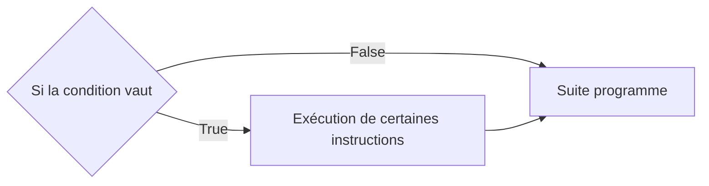

### b) En Python

En Python, l'instruction conditionnelle s'écrit par le mot-clé ``if`` (*Si* en Français):

```python
if a == 0 :
    a = a + 1
b = a
```

Suite à cet exemple, nous constatons plusieurs choses :

- Premièrement, la condition est ici le résultat d'une comparaison (cf [Opérateurs](./Opérateurs.md)).

- Deuxièmement, la séquence d'instruction, exécutée si la condition est vraie, est indentée.

En Français, cela se traduirait :

- *Si* `a` est égal à 0, alors nous ajoutons $1$ à `a`.

- Nous affectons à la variable `b` la valeur de `a`.

Son schéma de branchement donnerait :

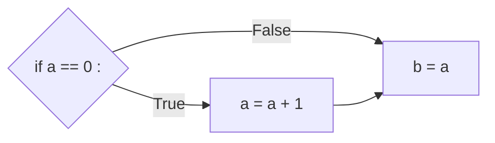

### c) Expressions booléennes

Les expressions booléennes seront plus appronfondies dans un prochain chapitre dédié.

Ici, nous ne parlerons que des opérateurs booléens $AND$ (: $ET$) et $OR$ (: $OU$).

| $A$ | $B$ | $A AND B$ | $A OR B$ | $NOT A$ | $NOT B |
|---|---|---|---|---|---|
| $False$ | $False$ | $False$ | $False$ | $True$ | $True$ |
| $False$ | $True$ | $False$ | $True$ | $True$ | $False$ |
| $True$ | $False$ | $False$ | $True$ | $False$ | $True$ |
| $True$ | $True$ | $True$ | $True$ | $False$ | $False$ |


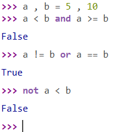

______________

Si nous reprenons notre exemple d'introduction, une fonction ``divise( a : int, b : int )-> float`` prenant en paramètres deux entiers *a* et *b* et permettant d'effectuer l'opération de division lorsque *b* ne vaut pas 0 s'écrit : 

```python
def divise( a : int, b : int)-> float:
    if b != 0 :
        res = a / b
    return res
```

Cette fonction peut être représentée par le schéma de branchement suivant :

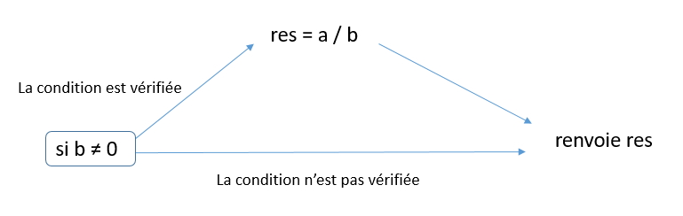

Par contre, nous n'avons pas contrôler tous les différents cas possibles, notre fonction ``divise`` ne gère pas le cas lorque *b* vaut effectivement 0.

C'est pourquoi on a besoin, selon les programmes, d'une alternative.

## II. Instructions *Sinon*

### a) Principe

L'instruction conditionnelle **Si** peut introduire une séquence d'instruction **alternative**, à **n'exécuter que dans le cas où la condition n'est pas vérifiée**.

Voici le schéma de branchement représentant les cas où la condition est vérifiée et d'une alternative lorsque la condition n'est pas vérifiée :

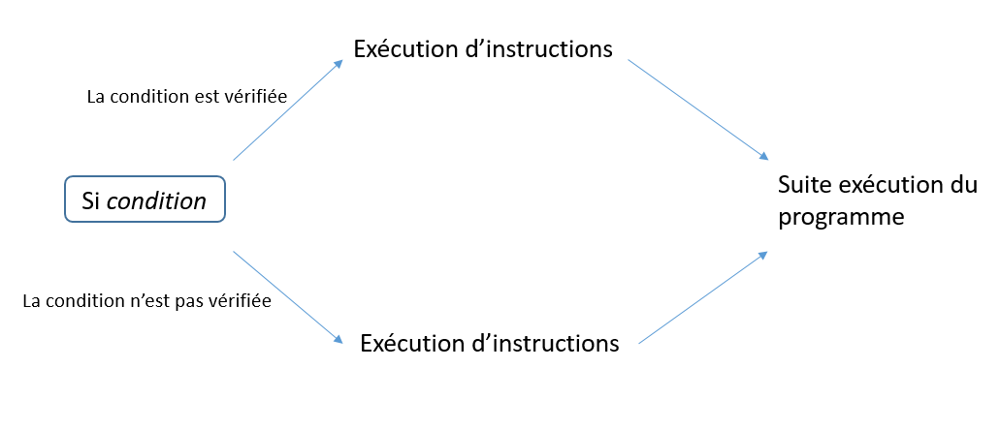

On a donc une instruction constituée de deux **branches**, dont **une seule sera choisie**.

Pour faire la distinction entre les deux séquences d'instructions, on utilise l'instruction **Sinon** :

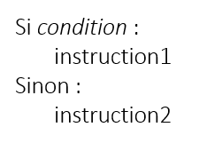

L'**instruction1** est exécutée si *condition* est vérifié sinon c'est l'**instruction2** qui est exécutée.

### b) Syntaxe en Python

En Python, l'instruction **Sinon** s'écrit avec le mot-clé ``else`` :

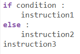

- Si la condition est vérifiée, les instructions **1** et **3** sont exécutées

- Si la condition n'est pas vérifiée, les instructions **2** et **3** sont exécutées

Comme pour la séquence d'instructions du ``if``, la séquence d'instructions du ``else`` est **indentée**.

____________

On peut donc désormais améliorer notre fonction ``divise``. On décide, dans le cas où *b* vaut 0, d'afficher un message dans la console :

```python
def divise2( a : int, b : int)-> float:
    if b != 0 :
        res = a / b
    else :
        res = "Division par 0 impossible"
    return res
```

Cela donne comme schéma de branchement :

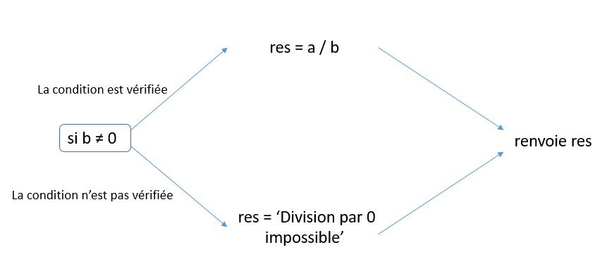

## Applications

#### Application 1

Donner pour le programme suivant, 

- Les instructions qui sont exécutées dans le cas où *n* est égal à 1

- Les instructions qui sont exécutées dans le cas où *n* est égal à 3

```python
if n > 2 :
    n = n + 10
    res = (n // 2) + n
else :
    res = n * n
res = res - n
```

Puis donner la valeur de la variable *res* 

- Lorsque *n* vaut 1

- Lorsque *n* vaut 3

Enfin, dessiner son schéma de branchement.

#### Application 2

- Ecrire une fonction `plus_grand_que( a : int, b : int )-> bool` prenant en paramètres deux entiers *a* et *b* et renvoie `True` si $`a > b`$, `False`sinon.

- Ecrire une fonction `superieur_ou_egal( a : int, b : int )-> bool` prenant en paramètres deux entiers *a* et *b* et renvoie `True` si $`a \geq b`$ , `False`sinon.

- Ecrire une fonction `plus_petit_que( a : int, b : int )-> bool` prenant en paramètres deux entiers *a* et *b* et renvoie `True` si $`a < b`$, `False`sinon.

- Ecrire une fonction `inferieur_ou_egal( a : int, b : int )-> bool` prenant en paramètres deux entiers *a* et *b* et renvoie `True` si $`a \leq b`$, `False`sinon.

- Ecrire une fonction `different_de( a : int, b : int )-> bool` prenant en paramètres deux entiers *a* et *b* et renvoie `True` si $`a \ne b`$, `False`sinon.

- Ecrire une fonction `egal_a( a : int, b : int )-> bool` prenant en paramètres deux entiers *a* et *b* et renvoie `True` si $`a = b`$, `False`sinon.

- Tester pour chacune de ces fonctions les différents cas possibles pour les valeurs de *a* et *b*.

#### Application 3

- Ecrire une fonction ``a_plus_grand_que_b_et_c_plus_grand_que_d( a : int, b : int, c : int , d: int )-> bool`` prenant en paramètre 4 entiers *a*, *b*, *c* et *d* et renvoie ``True`` si $`a > b`$ *et* $`c > d`$, ``False`` sinon.

- Modifier la fonction précédente en utilisant la fonction ``plus_grand_que`` à la place de l'opérateur de comparaison ``>``.

- Ecrire une fonction `not_a_different_de_b_ou_c_egal_a_d( a : int, b : int, c : int , d: int )-> bool` prenant en paramètre 4 entiers *a*, *b*, *c* et *d* et renvoie `True` si *not*$`(a \ne b)`$*ou*$`c = d`$, `False` sinon.

- Modifier la fonction précédente en utilisant les fonctions ``different_de`` et ``egal_a`` à la place des opérateurs de comparaison ``!=`` et ``==``.

#### Application 4

Ecrire une fonction ``test_pythagore( a : int, b : int, c : int )-> bool`` prenant en paramètre 3 entiers *a*, *b* et *c* et renvoie ``True`` si $`a^2 + b^2 = c^2`$, et ``False`` sinon.

## III. Ajouter des branches

### a) Enchaîner les *Si*

On peut ajouter autant de branches que l'on veut avec sa propre condition en enchaînant les instructions conditionnelles ``if`` :

```python
def sisisi( n : int )-> None :
    if n < 2 :
        print("Bit")
    if n < 256 :
        print("Octet")
    if n < 65536 :
        print("2 octets")
```

Voici une procédure ```sisisi( n : int )-> None``` prenant en paramètre un entier *n* et effectue 3 tests sur cet entier.

Attention cependant, une suite d'instructions ``if`` **ne définit pas une alternative entre plusieurs branches**, mais simplement plusieurs conditions qui seront testées et exécutées **indépendamment l'une de l'autre**.

Ainsi, la fontion ```sisisi``` va tester les 3 conditions dans tous les cas, et est susceptible d'afficher les 3 résultats si par exemple *n* vaut 1 :

```python
>>> sisisi(1)
Bit
Octet
2 octets
```

Pour obtenir une alternative entre ces 3 possibilités, c'est-à-dire n'avoir qu'un résultat, on devra recourir à ``else`` qu'on a déjà vu ou ``elif``.

### b) Instructions *Sinon Si*

Pour ajouter des branches après une première branche conditionnelle **Si**, chaque branche suivante peut être ajoutée avec sa propre condition avec l'instruction **Sinon Si** ( ``elif`` en Python, qui est la contraction de ``else`` et ``if`` ).

Chaque branche ajoutée avec **Sinon Si** représente une **alternative** :

```python
def sisisi2( n : int )-> None:
    if n < 2 :
        print("Bit")
    elif n < 256 :
        print("Octet")
    elif n < 65536 :
        print("2 octets")
```

Par exemple en testant plusieurs valeurs :

```python
>>> sisisi2(1)
Bit
>>> sisisi2(255)
Octet
>>> sisisi2(65535)
2 octets
```

Attention, l'ordre dans lequel sont écrits les conditions est importante. **Seule la première branche dont la condition est vérifiée est exécutée**.

## Applications

#### Application 5

- Dessiner un schéma de branchement représentant le fonctionnement de la procédure `sisisi`.

- Dessiner un schéma de branchement représentant le fonctionnement de la procédure `sisisi2`.

#### Application 6

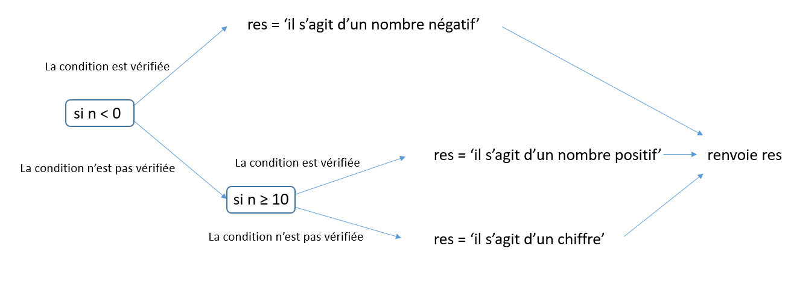

D'après le schéma de branchement précédent, écrire la fonction ``quoi_n( n : int )-> str`` associée.

## IV. Conditions imbriquées

Chaque instruction conditionnelle contient des instructions à exécuter. Et ces instructions peuvent aussi être des instructions conditionnelles.

Il est ainsi possible de créer des **cascades de conditions** menant à de multiples branches.

Le mot-clé `elif` a le même effet qu'une combinaison de `else` et `if`.

Considérons le problème suivant : sur trois entiers *a*, *b* et *c*, on doit distinguer les cas où *b* est compris entre *a* et *c*. C'est-à-dire lorsque $`a \leq b < c`$ ou $`a > b \geq c`$.

Afin de mieux comprendre comment écrire un tel programme, on peut s'aider d'un schéma représentant les différents cas:

 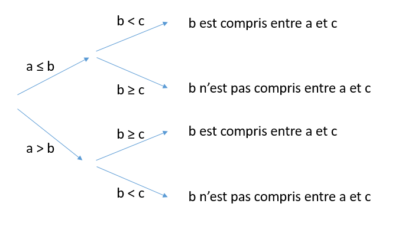

On peut modifier un peu le schéma ci-dessus pour le faire correspondre à notre future fonction en y ajoutant les instructions conditionnelles et ainsi obtenir notre schéma de branchement :

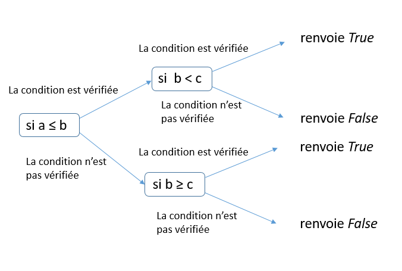

En suivant les conditions et les branchements du schéma, on peut écrire notre fonction ``b_compris_entre_a_et_c( a : int, b : int, c : int ) -> bool``:

```python
def b_compris_entre_a_et_c( a : int, b : int, c : int)-> bool:
    if a <= b :
        if b < c :
            res = True
        else :
            res = False
    else :
        if b >= c :
            res = True
        else :
            res = False
    return res
```

ou

```python
def b_compris_entre_a_et_c( a : int, b : int, c : int)-> bool:
    if a <= b :
        if b < c :
            res = True
        else :
            res = False
    elif b >= c :
         res = True
    else :
         res = False
    return res
```

__________________________

## A retenir

*L'instruction conditionnelle ``if`` permet d'exécuter certaines instructions selon une condition.*

*L'instruction ``else`` est une alternative dans le cas où la condition a échoué.*

*Les conditions sont vérifiées ou non, vraies ou fausses et sont le résultat d'une comparaison ou d'une expression booléenne.*

*On peut ajouter autant de fois que l'on veut les instructions conditionnelles ou les imbriquer.*

______________________

## Exercices

### Exercice 1 : Le max

On souhaite connaître l'entier le plus grand entre plusieurs variables.

- Ecrire une fonction ``max( a : int, b : int)-> int`` prenant en paramètres deux entiers *a* et *b* et renvoie l'entier le plus grand entre *a* et *b*.

- Ecrire une fonction ``max2( a : int, b : int, c : int )-> int`` prenant en paramètres 3 entiers *a*, *b* et *c* et renvoie l'entier le plus grand.

- Ecrire une fonction ``max3( a : int, b : int, c : int )-> int`` prenant en paramètres 3 entiers *a*, *b* et *c* et renvoie l'entier le plus grand. Cette fonction doit utiliser uniquement l'appel à la fonction ``max``.

### Exercice 2 : Après-midi Bowling

Au bowling, on a deux chances pour faire tomber un total de 10 quilles. 

- Ecrire une fonction ``score_bowling( premiere_boule : int, deuxieme_boule : int )-> str`` prenant en paramètres le nombre de quille tombées pour chaque boule lancée. Cette fonction renvoie ``"X"`` si toutes les quilles sont tombées à la première boule, ``"/"`` si toutes les quilles sont tombées au bout de la deuxième boule et sinon, renvoie le nombre de boules renversées.

- Modifier la fonction ``score_bowling`` en affichant ``"!"`` si les scores passés en argument sont impossibles ( par exemple *a = 5* et *b = 6* )

### Exercice 3 : Une affaire de triangles

Il est possible de savoir si un triangle est équilatéral ou isocèle si l'on connaît ses 3 longueurs.

- Ecrire une fonction ``test_triangle( a : int, b : int, c : int )-> str`` prenant en paramètres 3 entiers représentant à priori les longueurs d'un triangle et renvoie comme résultat une chaîne de caractères.

       La fonction indique s'il s'agit d'un triangle équilatéral ou d'un triangle isocèle ou s'il        ne s'agit pas d'un triangle.

       On rappelle que pour les longueurs d'un triangle, aucune n'est strictement                    supérieure à la somme des deux autres.

       On rappelle également qu'un triangle équilatéral possède 3 même longueurs et        qu'un triangle isocèle en possède 2 mêmes.

- Modifier la fonction ``test_triangle`` en ajoutant le fait qu'il peut s'agir d'un triangle rectangle, on pourra utiliser la fonction ``test_pythagore`` pour cela.

### Exercice 4 : Croissants

Ecrire une procédure ``ordre_croissant( a : int, b : int, c : int )-> None`` prenant en paramètre 3 entiers *a*, *b* et *c* et les affiche dans l'ordre croissant.

__________________________

Leçon 6 : [Boucles bornées](./Boucles bornées.md)
