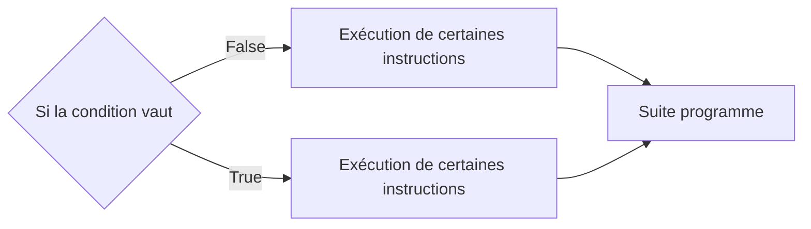
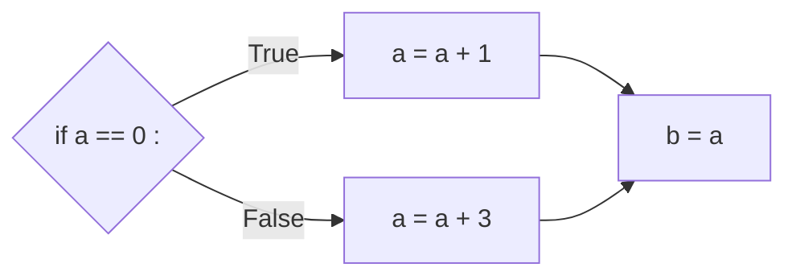
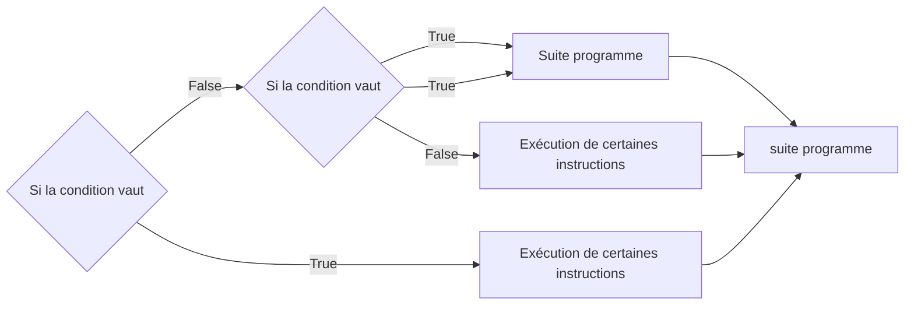
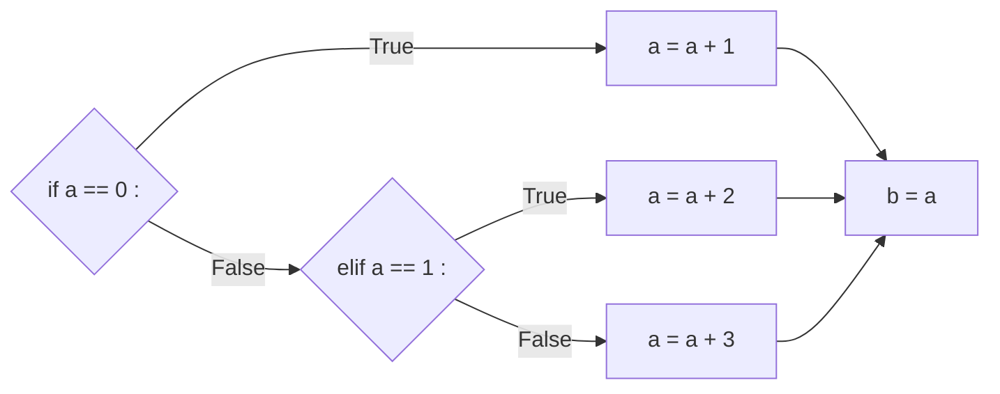

# Conditions

## I. Définitions

Une *instruction conditionnelle* est une instruction permettant d'exécuter certaines instructions uniquement si la condition est remplie.

Une *condition* est le résultat d'une comparaison (Opérateurs de comparaison et opérateurs booléens dans le chapitre cf [Opérateurs](./Opérateurs.md)), elle vaut soit $True$, soit $False$.

Une condition est remplie si elle vaut $True$.

Si la condition n'est pas remplie, la suite du programme est exécutée normalement.

### a) Schéma de branchement

Nous pouvons visualiser comment se comporte l'exécution d'un programme en dessinant son schéma de branchement :


### b) Syntaxe en Python

En Python, l'instruction conditionnelle s'écrit par le mot-clé ``if`` (*Si* en Français):

```python
if a == 0 :
    a = a + 1
b = a
```

Nous constatons que la séquence d'instruction, exécutée si la condition est vraie, est indentée.

En Français, cela se traduirait :

- *Si* `a` est égal à 0, alors nous ajoutons $1$ à `a`.

- Nous affectons à la variable `b` la valeur de `a`.

Son schéma de branchement donnerait :


## II. Alternative

L'instruction conditionnelle peut introduire une séquence d'instruction alternative, à n'exécuter que lorsque la condition est fausse.

### a) Schéma de branchement



### b) Syntaxe en Python

En Python, l'instruction d'alternative s'écrit avec le mot-clé ``else`` (*Sinon* en Français) :

```python
if a == 0 :
    a = a + 1
else :
    a = a + 3
b = a
```

En Français, cela se traduirait :

- *Si* `a` est égal à 0, alors nous ajoutons $1$ à `a`.

- *Sinon*, nous ajoutons $3$ à `a`.

- Nous affectons à la variable `b` la valeur de `a`.

Son schéma de branchement donnerait :



## III. Autre alternative

Il est possible, après une instruction conditionnelle, d'écrire une alternative comportant une condition.

### a) Schéma de branchement



### b) Syntaxe en Python

Cette alternative est la combinaison d'un *Si* et d'un *Sinon* et s'écrit en Python à l'aide du mot-clé : `elif`.

```python
if a == 0 :
    a = a + 1
elif a == 1 :
    a = a + 2
else :
    a = a + 3
b = a
```

En Français, cela se traduirait :

- *Si* `a` est égal à 0, alors nous ajoutons $1$ à `a`.

- *Sinon Si* `a` est égal à 1, alors nous ajoutons $2$ à `a`.

- *Sinon*, nous ajoutons $3$ à `a`.

- Nous affectons à la variable `b` la valeur de `a`.

Son schéma de branchement donnerait :


## Applications

#### Application 1

Donner pour le programme suivant, 

- Les instructions qui sont exécutées dans le cas où *n* est égal à 1

- Les instructions qui sont exécutées dans le cas où *n* est égal à 3

```python
if n > 2 :
    n = n + 10
    res = (n // 2) + n
else :
    res = n * n
res = res - n
```

Puis donner la valeur de la variable *res* 

- Lorsque *n* vaut 1

- Lorsque *n* vaut 3

Enfin, dessiner son schéma de branchement.

#### Application 2

- Ecrire une fonction `plus_grand_que( a : int, b : int )-> bool` prenant en paramètres deux entiers *a* et *b* et renvoie `True` si $`a > b`$, `False`sinon.

- Ecrire une fonction `superieur_ou_egal( a : int, b : int )-> bool` prenant en paramètres deux entiers *a* et *b* et renvoie `True` si $`a \geq b`$ , `False`sinon.

- Ecrire une fonction `plus_petit_que( a : int, b : int )-> bool` prenant en paramètres deux entiers *a* et *b* et renvoie `True` si $`a < b`$, `False`sinon.

- Ecrire une fonction `inferieur_ou_egal( a : int, b : int )-> bool` prenant en paramètres deux entiers *a* et *b* et renvoie `True` si $`a \leq b`$, `False`sinon.

- Ecrire une fonction `different_de( a : int, b : int )-> bool` prenant en paramètres deux entiers *a* et *b* et renvoie `True` si $`a \ne b`$, `False`sinon.

- Ecrire une fonction `egal_a( a : int, b : int )-> bool` prenant en paramètres deux entiers *a* et *b* et renvoie `True` si $`a = b`$, `False`sinon.

- Tester pour chacune de ces fonctions les différents cas possibles pour les valeurs de *a* et *b*.

#### Application 3

- Ecrire une fonction ``a_plus_grand_que_b_et_c_plus_grand_que_d( a : int, b : int, c : int , d: int )-> bool`` prenant en paramètre 4 entiers *a*, *b*, *c* et *d* et renvoie ``True`` si $`a > b`$ *et* $`c > d`$, ``False`` sinon.

- Modifier la fonction précédente en utilisant la fonction ``plus_grand_que`` à la place de l'opérateur de comparaison ``>``.

- Ecrire une fonction `not_a_different_de_b_ou_c_egal_a_d( a : int, b : int, c : int , d: int )-> bool` prenant en paramètre 4 entiers *a*, *b*, *c* et *d* et renvoie `True` si *not*$`(a \ne b)`$*ou*$`c = d`$, `False` sinon.

- Modifier la fonction précédente en utilisant les fonctions ``different_de`` et ``egal_a`` à la place des opérateurs de comparaison ``!=`` et ``==``.

#### Application 4

Ecrire une fonction ``test_pythagore( a : int, b : int, c : int )-> bool`` prenant en paramètre 3 entiers *a*, *b* et *c* et renvoie ``True`` si $`a^2 + b^2 = c^2`$, et ``False`` sinon.

## Applications

#### Application 5

- Dessiner un schéma de branchement représentant le fonctionnement de la procédure `sisisi`.

- Dessiner un schéma de branchement représentant le fonctionnement de la procédure `sisisi2`.

#### Application 6


D'après le schéma de branchement précédent, écrire la fonction ``quoi_n( n : int )-> str`` associée.

______________________

## Exercices

### Exercice 1 : Le max

On souhaite connaître l'entier le plus grand entre plusieurs variables.

- Ecrire une fonction ``max( a : int, b : int)-> int`` prenant en paramètres deux entiers *a* et *b* et renvoie l'entier le plus grand entre *a* et *b*.

- Ecrire une fonction ``max2( a : int, b : int, c : int )-> int`` prenant en paramètres 3 entiers *a*, *b* et *c* et renvoie l'entier le plus grand.

- Ecrire une fonction ``max3( a : int, b : int, c : int )-> int`` prenant en paramètres 3 entiers *a*, *b* et *c* et renvoie l'entier le plus grand. Cette fonction doit utiliser uniquement l'appel à la fonction ``max``.

### Exercice 2 : Après-midi Bowling

Au bowling, on a deux chances pour faire tomber un total de 10 quilles. 

- Ecrire une fonction ``score_bowling( premiere_boule : int, deuxieme_boule : int )-> str`` prenant en paramètres le nombre de quille tombées pour chaque boule lancée. Cette fonction renvoie ``"X"`` si toutes les quilles sont tombées à la première boule, ``"/"`` si toutes les quilles sont tombées au bout de la deuxième boule et sinon, renvoie le nombre de boules renversées.

- Modifier la fonction ``score_bowling`` en affichant ``"!"`` si les scores passés en argument sont impossibles ( par exemple *a = 5* et *b = 6* )

### Exercice 3 : Une affaire de triangles

Il est possible de savoir si un triangle est équilatéral ou isocèle si l'on connaît ses 3 longueurs.

- Ecrire une fonction ``test_triangle( a : int, b : int, c : int )-> str`` prenant en paramètres 3 entiers représentant à priori les longueurs d'un triangle et renvoie comme résultat une chaîne de caractères.

       La fonction indique s'il s'agit d'un triangle équilatéral ou d'un triangle isocèle ou s'il        ne s'agit pas d'un triangle.

       On rappelle que pour les longueurs d'un triangle, aucune n'est strictement                    supérieure à la somme des deux autres.

       On rappelle également qu'un triangle équilatéral possède 3 même longueurs et        qu'un triangle isocèle en possède 2 mêmes.

- Modifier la fonction ``test_triangle`` en ajoutant le fait qu'il peut s'agir d'un triangle rectangle, on pourra utiliser la fonction ``test_pythagore`` pour cela.

### Exercice 4 : Croissants

Ecrire une procédure ``ordre_croissant( a : int, b : int, c : int )-> None`` prenant en paramètre 3 entiers *a*, *b* et *c* et les affiche dans l'ordre croissant.

__________________________

Leçon 6 : [Boucles bornées](./Boucles bornées.md)
