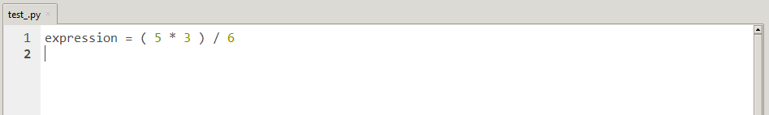
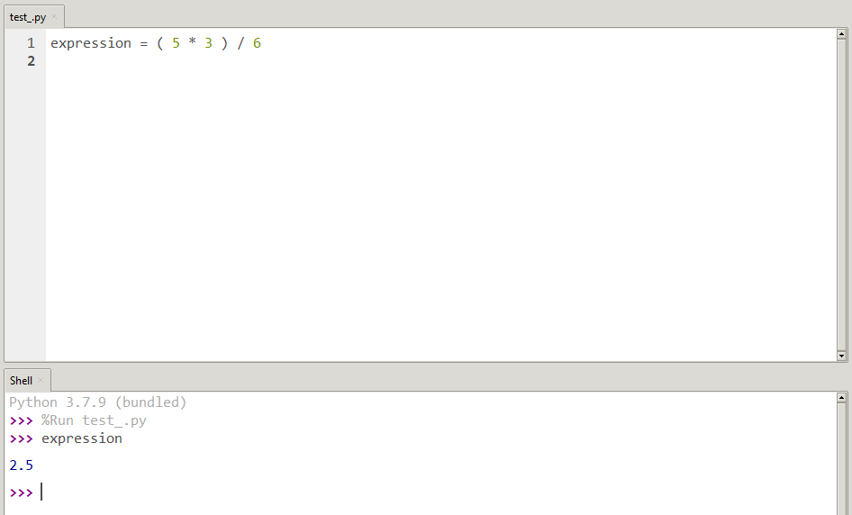
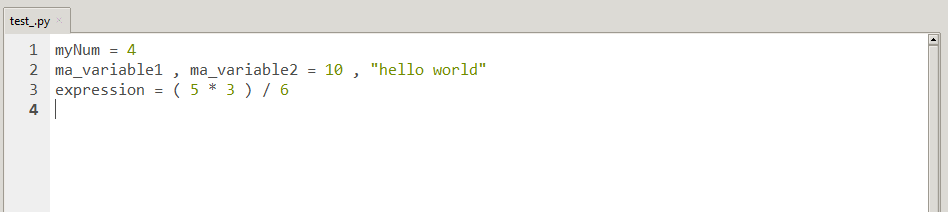
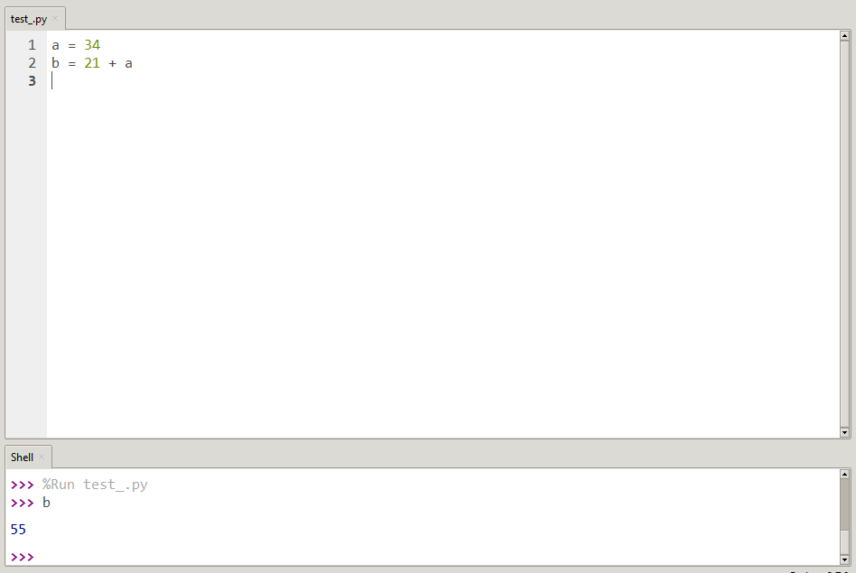
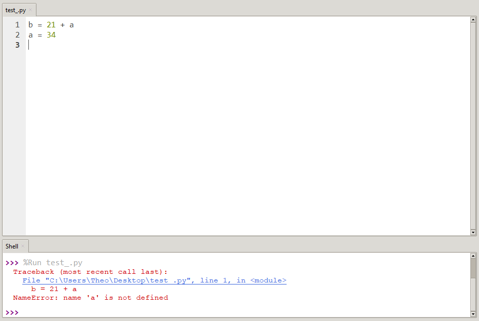
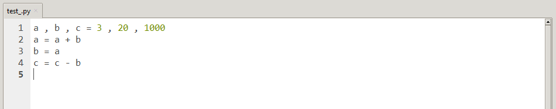

# Ecrire un programme

Jusqu'a maintenant, nous n'avons utilisé que le mode interractif de Thonny ( la console ) mais il ne nous permet pas d'écrire ou d'enregistrer des programmes même si l'on sauvegarde le fichier.

Pour rappel, le mode programmation se situe sur le coin supérieur de Thonny :


On va donc utiliser l'éditeur de texte pour écrire dès à présent nos programmes. C'est la partie qui va être **enregistrée** lorsqu'on sauvegardera le fichier.

## I. Exécution

Toutes les règles, notions que nous venons de voir dans les leçons précédentes ( Types et variables ) s'appliquent de la même manière pour l'écriture d'un programme :



Nous avons désormais un programme qui déclare une variable ``expression``.

Ce programme est écrit dans un fichier *test_.py* et est **exécutable**, c'est-à dire que l'on peut l'exécuter ( avec le petit bouton vert ).

Lorqu'on exécute un programme, l'ordinateur va **réaliser les instructions** écrites dans ce programme.

Ainsi, après avoir exécuté notre programme, la variable ``expression`` existe. Nous pouvons le vérifier en l'appelant dans la console :



## II. Séquences d'instructions

Dans la leçon sur les variables, on a été amené à écrire plusieurs instructions dans la console.

Un programme est généralement constitué de plusieurs instructions, ce qu'on appelle **séquence d'instructions**.

Chaque instruction est écrite sur une ligne ( le numéro de ligne est marqué à gauche de l'instruction ) :



Voici, par exemple, une séquence d'instructions reprenant les exemples de la leçon sur les variables.

L'exécution des instructions se fait les **unes après les autres dans l'ordre des lignes** du programme.



Ici, l'exécution de la seconde instruction se fait après la première puisqu'on déclare la variable ``a`` avant de l'utiliser dans la déclaration de la variable ``b``.

Si l'on utilise une variable sans l'avoir au préalable déclarée, on tombe naturellement sur une erreur :



L'erreur ``NameError: name 'a' is not defined`` nous indique que la variable ``a`` n'existe pas lors de l'exécution de la première instruction.

____________

### A retenir

*Exécuter un programme, c'est demander à l'ordinateur de réaliser toutes les instructions demandées dans ce programme.*

*L'exécution d'une séquence d'instructions se fait les unes après les autres dans l'ordre des instructions.*

_________________

## Applications

#### Application 1

Réécrire tous les exemples vus précédemment.

#### Application 2

Réécrire le programme suivant :



- **Question 1 :** Vérifier dans la console la valeur des variables ``a , b , c`` après exécution du programme.

- **Question 2 :** Noter la suite des états de ces variables à chaque lignes du programme.

- **Question 3 :** Echanger les lignes 2 et 3 du programme puis refaire les questions 1 et 2.

- **Question 4 :** Echanger les lignes 3 et 4 du programme puis refaire les questions 1 et 2.

#### Application 3

Que fait la séquence d'instructions suivante ?

```python
a , b = 10 , 20
tmp = a
a = b
b = tmp
```

#### Application 4

Ecrire un programme correspondant à l'algorithme suivant :

> Algorithme :
> 
> - On met la valeur 55 dans *a*
> 
> - On met la valeur 89 dans *b*
> 
> - On remplace le contenu de *a* par la somme de celui de *a* et de *b*
> 
> - On remplace le contenu de *b* par le contenu de *a* moins le contenu de *b*
> 
> - On remplace le contenu de *a* par son contenu moins celui de *b*

Que contiennent *a* et *b* à la fin de ces opérations ?

____________

Leçon 4 : [Fonctions](./Fonctions.md)
