# Fonctions

Les fonctions sont des constructions élémentaires très importantes dans la programmation. Si on écrit un programme qui nécessite à **plusieurs reprises** d'exécuter les mêmes séquences d'instructions, on peut alors **définir une fonction** qui évitera de réecrire les mêmes instructions et de rendre le programme plus lisible.

Par exemple, imaginons que dans notre programme, on souhaite à plusieurs reprises faire une quelconque opération, on aurait alors plusieurs mêmes instructions de cette opération.

En définissant une fonction ``opération()`` et en l'appelant à chaque fois qu'on en a besoin, on évite de répéter l'instruction.

## I. Définition

### a) Principe

Une fonction **associe** une séquence d'instructions **à un nom**. 

Une fonction réalise une **tâche donnée**.

Elle est **réutilisable** autant de fois que l'on veut dans le programme.

Par exemple, définissons une fonction ``somme``, elle a pour **signature**  ``somme( a : int, b : int)-> int`` :

- Elle a pour nom ``somme`` 

- Elle permet de faire la somme de deux nombres entiers

- Dès que nous avons besoin d'additionner deux nombres dans notre programme, on pourra faire appel à la fonction ``somme``

### b) Paramètres

Une fonction peut avoir **zéro** ou **plusieurs** paramètres.

Les paramètres sont écrits entre les parenthèses et sont séparés par des virgules.

Les paramètres ont des **types** désignés par la notation ``paramètre : type``

Un paramètre est utilisé dans le **corps de la fonction** de la même manière qu'une variable. On appele corps d'une fonction, la séquence d'instructions qui la compose.

Les paramètres désignent une **valeur qui n'est pas connue** et qui pourra être **différente** à chaque utilisations de la fonction.

Par exemple :

```python
nom_de_la_fonction()-> type
```

ou

```python
nom_de_la_fonction( paramètre1 : type , paramètre2 :type )-> type
```

Si l'on reprend la signature de la fonction ``somme( a : int, b :int )-> int`` :

- La fonction ``somme`` a deux paramètres : *a* et *b* de type entier

- Les paramètres *a* et *b* sont comme des variables que l'on utilisera dans le corps de la fonction

- On ne connaît pas les valeurs de *a* et *b* 

### c) Syntaxe en Python

Pour écrire des fonctions en Python, on utilise le mot-clé ``def`` :

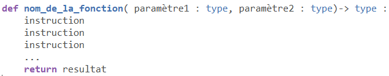

On repère la zone des paramètres, le corps de la fonction ainsi qu'une valeur renvoyée grâce au mot-clé ``return`` :

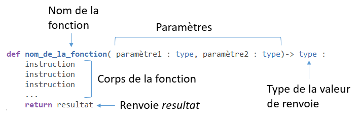

On remarque également que le corps de la fonction est décalé vers la droite, ce qui signifie qu'il s'agit bien du corps de cette fonction. On appelle ce décalage **l'indentation**.

Voici, en Python, la fonction ``somme`` :

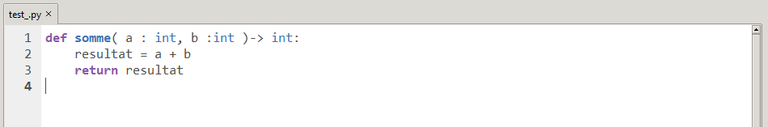

- Je déclare une variable ``resultat`` dans laquelle je met le résultat de l'addition de mon paramètre *a* et de mon paramètre *b*

- Puis je renvoie la valeur de ma variable ``resultat``

### d) Appels de fonction

Une fois qu'on a écrit la fonction, on va pouvoir l'utiliser. Lorsqu'on utilise une fonction, on réalise un **appel** à cette fonction.

Pour appeler une fonction, il suffit de taper son nom avec les **arguments** que l'on souhaite :

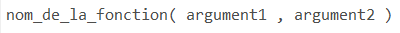

Un argument est une **valeur** ou une **variable contenant une valeur** que prendra le paramètre situé à sa place.

Par exemple, l'*argument1* représente la valeur que prendra *paramètre1* lors de l'exécution du corps de la fonction.

L'argument doit être une valeur du **type du paramètre**.

Maintenant que l'on a écrit la fonction ``somme``, appelons-la dans la console pour faire la somme de 2 et 5 :

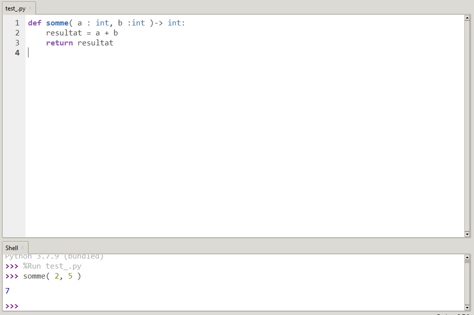

Pour faire la somme de 2 et 5, j'ai appelé la fonction ``somme`` en mettant comme arguments 2 et 5. Le paramètre *a* prendra la valeur 2 et le paramètre *b* prendra la valeur 5.

Puis dans le corps de la fonction, j'additionne les variables *a* et *b* soit 2 et 5 respectivement. Et je retrouve bien comme résultat à mon programme 7, la somme de 2 et 5.

On peut bien sûr utiliser notre fonction dans notre programme :

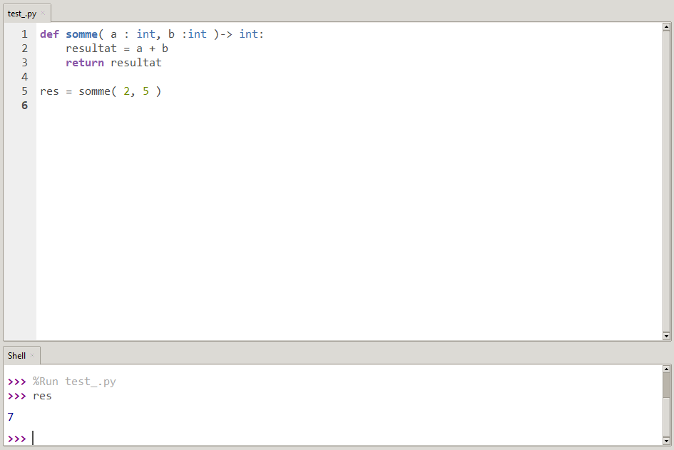

________________

## Applications

#### Application 1

Donner, pour les signatures suivantes, les **noms** de fonctions, leurs **paramètres** et les **types des paramètres** ainsi que le **type de la valeur de renvoie** :

- ``somme( a : int, b : int )-> int``

- ``est_premier( n : int )-> bool``

- ``test_pythagore(  a : float, b : float, c : float )-> bool``

- ``nombre_caracteres( chaine : str )-> int``

#### Application 2

- Ecrire la signature d'une fonction ``maximum``prenant en paramètres *a* et *b*, deux entiers et renvoie comme résultat un entier.

- Ecrire la signature d'une fonction ``nb_jour_annee`` prenant en paramètre une année *a* un entier et renvoie comme résultat le nombre de jour de dans l'année *a*.

#### Application 3

Ecrire, en Python, la fonction ``produit`` prenant en paramètres deux entiers *a* et *b* et renvoie le produit de ces deux entiers.

#### Application 4

Ecrire, en Python, la fonction ``f`` prenant en paramètre un entier *x* et renvoie la valeur $`3*x+4`$.

#### Application 5

Tester les fonctions ``produit`` et ``f`` pour vérifier qu'elles renvoient le bon résultat :

- En appellant dans la console les fonctions avec des arguments différents.

- Dans le programme, en mettant dans une variable les appels des fonctions avec des arguments différents puis en appellant les variables dans la console.

#### Application 6

Appeler la fonction ``produit`` avec des arguments de type ``str``.

Pourquoi cette erreur ?

Noter l'importance que l'argument doit être du type du paramètre.

____________________________

## II. Renvoyer un résultat

### a) Fonctions et Procédures

Les fonctions renvoient une **valeur** en utilisant le mot-clé ``return``. Le mot-clé ``return`` est situé principalement à la fin de la fonction, lorsque son instruction est réalisée, elle **met fin à l'exécution** de la fonction. Attention à ne pas confondre la fonction ``print`` qui **affiche** un resultat et l'instruction ``return`` qui **renvoie** un resultat.

La valeur renvoyée **possède un type** comme n'importe quelle autre valeur que l'on a pu voir.

Lors de l'écriture de la définition de la fonction, on précise le type de la valeur renvoyée par la notation : `-> type`.

Par exemple, la fonction ``somme`` renvoie un entier.

Une fonction peut ne pas renvoyer de résultat, on appelle cette fonction spéciale : une **procédure**. 

La procédure n'a donc pas d'instruction ``return``, son exécution prend fin lorsque **toutes les instructions** du corps de la fonction ont été exécutées.

Le type de la valeur renvoyée par une procédure est `-> None`.

Objectifs :

- Une fonction a pour objectif de faire un calcul et de renvoyer une valeur.

- Une procédure réalise une action, par exemple un affichage, une écriture dans un fichier, etc...

### b) Expressions

L'appel d'une fonction **représente** une valeur et qui constitue une expression qu'on peut réutiliser dans nos programmes. Par exemple, l'affecter à une variable :

```python
res = somme( 2, 5 )
```

ou l'afficher grâce à la fonction ``print()`` :

```python
print(somme( 2, 5 ))
```

ou encore créer une expression plus complexe en imbriquant mes appels de fonctions :

```python
res = somme(somme( 3, 7 ), somme( 2, 5 ))
```

Ici, j'additionne le résultat de la somme de 3 et 7 avec le résultat de la somme de 2 et 5, ce qui fait 17. 

On peut représenter les appels de fonctions par un schéma :

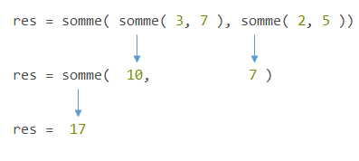

Mais cela implique que la valeur renvoyée par ``somme( 2, 5 )`` soit du même type que le paramètre de ma fonction ``somme``. Ce qui est le cas, car ``somme( 2, 5 )`` renvoie un nombre entier et mes paramètres à ma fonction ``somme`` sont de type ``int``.

### c) Décomposer un problème avec des fonctions

Considérons le problème suivant :

On souhaite calculer le carré de la distance d'un point de coordonnées *( x, y )* à l'origine d'un repère orthonormal. Il se calcule $`x^2 + y^2`$.

Pour ce faire, nous pouvons définir une fonction ``carre( n : int)-> int`` permettant de calculer le carré d'un entier passé en paramètre :

```python
def carre( n : int)-> int :
    resultat = n ** 2
    return resultat
```

Puis, une fonction ``carre_distance_origine( x : int, y : int )-> int`` en utilisant la fonction ``somme``et la fonction ``carre`` :

```python
def carre_distance_origine( x : int, y : int )-> int :
    resultat = somme( carre(x), carre(y))
    return resultat
```

________________________

## Applications

#### Application 7

- Ecrire la signature d'une procédure ``nsi`` ne prenant aucun paramètre.

- Ecrire la procédure ``nsi`` qui ne prend pas de paramètres et affiche avec la fonction ``print`` la chaine de caractères ``"trop bien la nsi"``.

#### Application 8

- Ecrire une fonction ``incremente`` prenant en paramètre un entier *n* et renvoie $`n+1`$.

- Déterminer le résultat de l'appel suivant :

```python
incremente( incremente ( incremente ( -3 )))
```

- Déssiner le schéma représentant les appels succéssifs de l'instruction précédente.

#### Application 9

L'énergie cinétique d'un objet de masse *m* et de vitesse *v* est : $`Ec=\frac{1}{2}mv^2`$.

Ecrire une fonction ``energie_cinetique`` prenant en paramètre une masse *m* et une vitesse *v*,deux entiers et renvoie la valeur de l'énergie cinétique d'un objet en utilisant la fonction ``produit`` et la fonction ``carre`` vus précédemment.

________________________

## III. Portée des variables

### a) Définition

La **portée** d'une variable désigne la zone de code dans le programme dans laquelle elle est accessible. Toutes nos variables ne sont pas nécessairement accessibles à n'importe quel endroit dans un programme et on ne va donc pas toujours pouvoir les utiliser.

On distingue les variables **globales** et **locales** qui possèdent une portée différente.

### b) Variables globales

Toutes les variables déclarées **hors de toute fonctions** sont les variables globales.

Une fonction peut accéder à une variable globale :

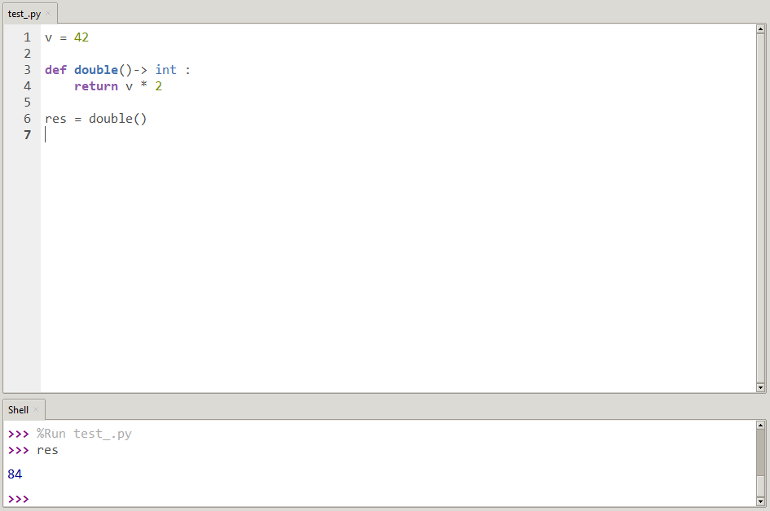

Ici, on a déclarer une variable globale ``v = 42`` et une fonction ``double()-> int`` qui multiplie par 2 notre variable ``v`` déclarée hors de la fonction ``double()``.

On obtient comme résultat 84, ce qui prouve bien que notre fonction ``double()`` a accès à notre variable ``v``.

Lorsqu'une fonction accède à une variable globale, elle accède à sa valeur courante :

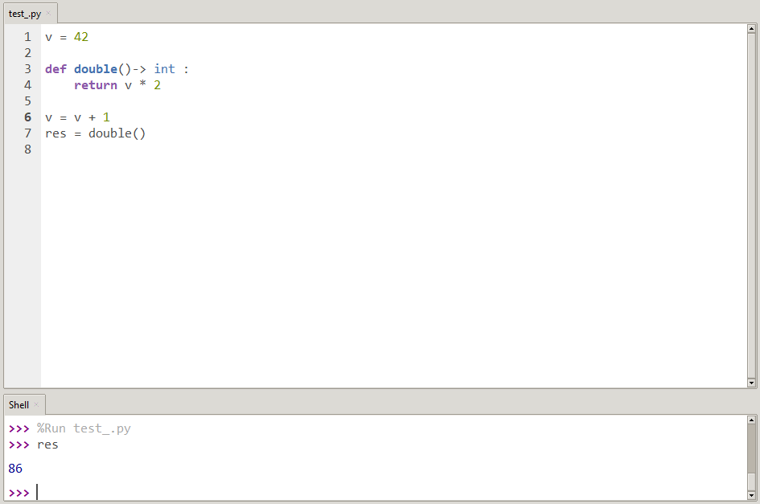

Ici, avant d'appeler ma fonction ``double()``, on a augmenté la valeur de ``v`` de 1 et on obtient donc comme résultat 86.

### c) Variables locales

Le corps d'une fonction peut introduire des variables pour ses calculs intermédiaires, on appelle ces variables : les variables locales et **ne sont accessibles que dans le corps de cette fonction**.

On peut le vérifier en définissant une fonction ``creer_variable()`` qui crée une variable locale, en appellant cette fonction et en vérifiant dans la console si la variable existe :

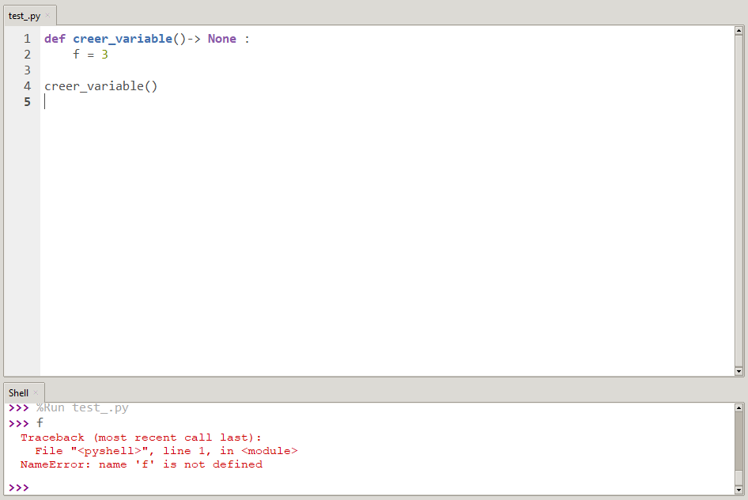

On remarque que j'obtiens bien une erreur ``NameError: name 'f' is not defined``lorsque je demande la valeur de ``f`` dans la console, même après avoir appelé la fonction ``creer_variable()``. Ce qui nous prouve que la variable ``f`` existe uniquement dans la fonction et n'est accessible que depuis cette fonction.

La variable locale ``f`` **disparaît après l'exécution de la fonction**.

Si je déclare une variable globale ``f`` avant l'appel à la fonction :

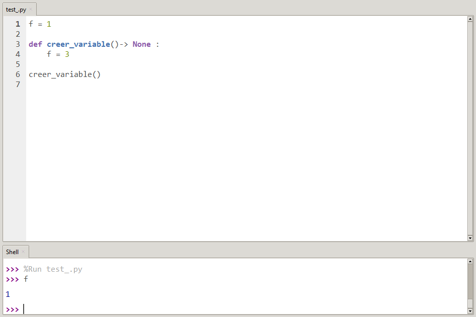

Pendant l'exécution de ``creer_variable()``, il existe simultanément deux variables qui s'appellent ``f`` : la variable globale et la variable locale. Dans ce cas, seule la variable locale est utilisée, on dit qu'elle *masque* la variable globale.

## Applications

#### Application 10

Réécrire les fonctions ``double`` et ``creer_variable`` et refaire les situations vues dans le cours.

#### Application 11

Voici une procédure ``suivant`` prenant en paramètre un entier *n* et ajoute 1 à n mais ne renvoie rien :

```python
def suivant(x : int)-> None:
    x = x + 1
```

Puis une suite d'instructions dans la console :

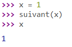

Expliquer pourquoi *x* vaut toujours 1 après l'appel à ``suivant``.

## IV. Fonctions natives

Les fonctions natives sont des fonctions qui existent déjà. La fonction d'affichage ``print()`` ou la fonction ``type()`` sont des fonctions natives.

Elles appartiennent à la bibliothèque Python.

___________

## A retenir

*Les fonctions permettent d'éviter d'écrire plusieurs fois le même bloc d'instructions dans le programme.*

*Les fonctions ont un nom, des paramètres et une valeur de renvoie. On peut les écrire en Python avec ``def``.*

*On peut utiliser ces fonctions en les appelant et en leur mettant des arguments.*

_____________

## Exercices

### Exercice 1

*Dans cet exercice, on utilisera la division entière notée ``//``*

Dans cet exercice, on souhaite faire la somme de tous les entiers multiples de 3 et 5 inférieurs à 1000.

Commençons avec la somme des entiers des multiples de 3, c'est-à-dire :

$`3+6+9+12+...+999`$

On peut mettre 3 en facteur :

$`3 * (1+2+3+4+...+333)`$

Par chance, on sait que la somme des entiers de $`1`$ à $`n`$ est égale à $`n*(n+1)/2`$.

Donc $`1+2+3+4+...+333= 333 * \frac{(333+1)}{2}`$

- Ecrire une fonction ``somme_entier`` prenant en paramètre un entier *n* et renvoie la somme des entiers de 1 à *n* 

La somme des entiers multiples de 3 est donc ``3 * somme_entier(333)``.

On peut également l'écrire comme ``3 * somme_entier(999 // 3)``, ce qui nous permet d'écrire une fonction ``multiples`` permettant  d'obtenir la somme des entiers multiples de n'importe quel entier puisqu'il suffira de remplacer 3 par l'entier que l'on veut.

- Ecrire une fonction ``multiples`` prenant en paramètre un entier *i* et renvoie la somme des entiers multiples de *i*

La somme de tous les entiers multiples de 3 et 5 inférieurs à 1000 sera donc 

```python
multiples(3) + multiples(5)
```

____________

Leçon 5 : [Conditions](./Conditions.md)
