# Instructions conditionnelles

## I. Définitions

Une *instruction conditionnelle* est une instruction permettant d'exécuter certaines instructions uniquement si la condition est remplie.

Une *condition* est un booléen, elle peut être le résultat d'une comparaison ou le résultat d'une opération booléenne (cf [Opérateurs](./Opérateurs.md)).

Une condition vaut donc soit $True$, soit $False$.

Une condition est remplie si elle vaut $True$.

Si la condition n'est pas remplie, la suite du programme est exécutée normalement.

### a) Schéma de branchement

Nous pouvons visualiser comment se comporte l'exécution d'un programme en dessinant son schéma de branchement :

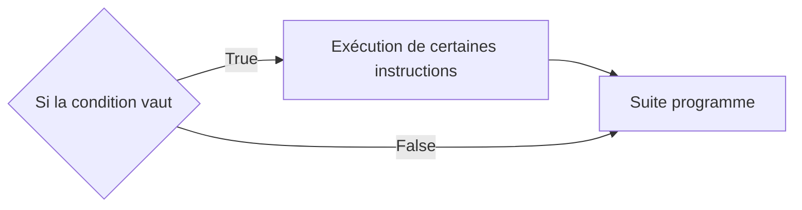

### b) Syntaxe en Python

En Python, l'instruction conditionnelle s'écrit par le mot-clé ``if`` (*Si* en Français):

```python
if a == 0 :
    a = a + 1
b = a
```

Nous constatons que la séquence d'instruction, exécutée si la condition est vraie, est indentée.

En Français, cela se traduirait :

- *Si* `a` est égal à 0, alors nous ajoutons $1$ à `a`.

- Nous affectons à la variable `b` la valeur de `a`.

Son schéma de branchement donnerait :

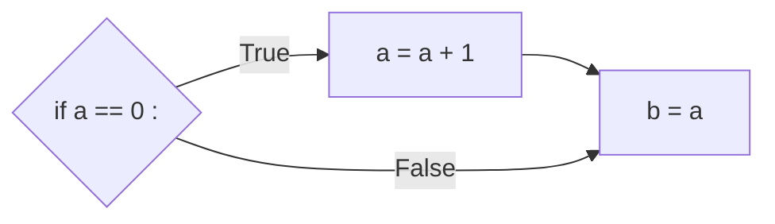


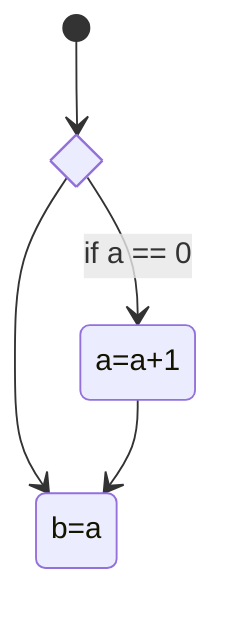

##### Application 1

Donner, pour chaque programme suivant, son schéma de branchement :

a) Programme 1

```python
if a != b :
    a = b
a = a * 2
```

b) Programme 2

```python
if a or b :
    a = True
    b = True
```

c) Programme 3

```python
if a < b and b < c :
    b = c -1
    c = a + 1
```

##### Application 2

Retrouver, pour chaque schéma de branchement suivant, le programme correspondant :

a) Schéma de branchement 1

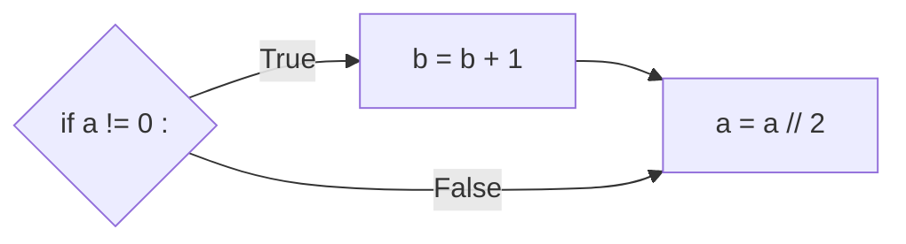

b) Schéma de branchement 2

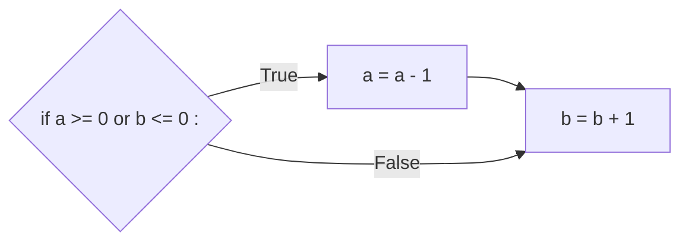

c) Schéma de branchement 3

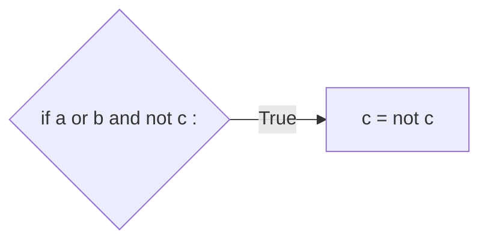

## II. Alternative

L'instruction conditionnelle peut introduire une séquence d'instruction alternative, à n'exécuter que lorsque la condition est fausse.

### a) Schéma de branchement

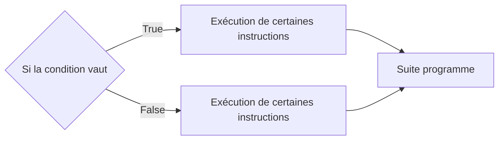

### b) Syntaxe en Python

En Python, l'instruction d'alternative s'écrit avec le mot-clé ``else`` (*Sinon* en Français) :

```python
if a == 0 :
    a = a + 1
else :
    a = a + 3
b = a
```

En Français, cela se traduirait :

- *Si* `a` est égal à 0, alors nous ajoutons $1$ à `a`.

- *Sinon*, nous ajoutons $3$ à `a`.

- Nous affectons à la variable `b` la valeur de `a`.

Son schéma de branchement donnerait :

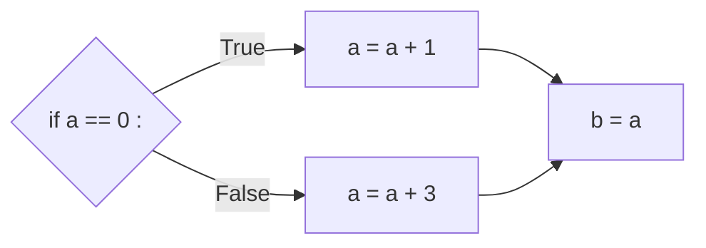
##### Application 3

Donner, pour chaque programme suivant, son schéma de branchement :

a) Programme 1

```python
if a == b :
    a = a // 2
else :
    b = b // 2
```

b) Programme 2

```python
if a < b :
    b = b - 1
else :
    a = a - 1
a = a * 2
b = b * 2
```

c) Programme 3

```python
if a < b and c != 0 :
    c = a
else :
    c = b
```

##### Application 4

Retrouver, pour chaque schéma de branchement suivant, le programme correspondant :

a) Schéma de branchement 1

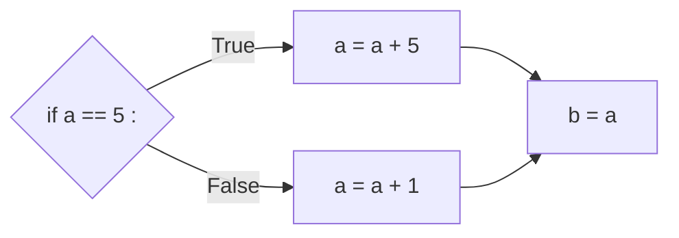

b) Schéma de branchement 2

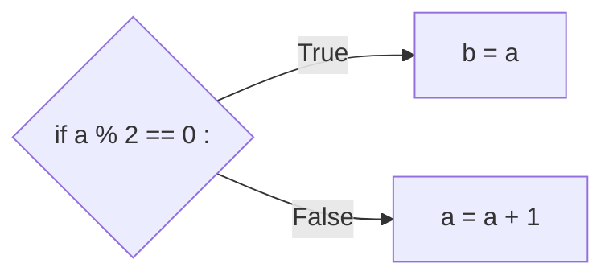

c) Schéma de branchement 3

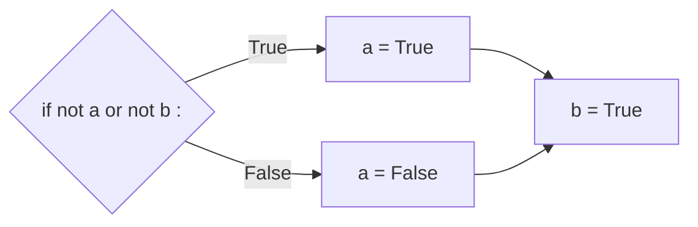

_________________________

[Feuille d'exercices](./Exercices/Exercices_instructions_conditionnelles.md)

__________________________

Leçon 7 : [Boucles non bornées](./Boucles_non_bornées.md.md)
