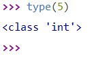
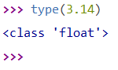
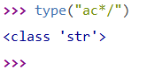
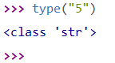
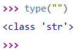
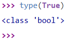
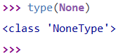
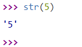
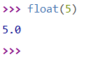
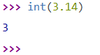

# Types

En Python, comme dans d'autres langages, les valeurs ont des types. Chaque valeur a un type qui la **caractérise**. On peut distinguer, parallèlement aux mathématiques, les nombres entiers et les réels par exemple, qui sont deux types distincts en Python : les entiers et les flottants. 

Il existe bien sûr beaucoup d'autres types.

A quoi sert un type ?

Attribuer un type à une valeur nous sert à **classer nos données** et donc à savoir si telle ou telle opération est possible sur la donnée. Par exemple, il est impossible d'additionner un nombre et une phrase.

## I. Les nombres

### a) Les entiers naturels

On peut, dans la console, utiliser la fonction `type()` pour afficher le type d'une valeur mise entre les parenthèses :

Par exemple, si je demande le type de la valeur 5 en écrivant `type(5)`, l'interprète Python me donne comme réponse `<class 'int'>`.

Pour l'instant, il est inutile de s'attarder sur le mot-clé `class`, concentrons nous sur le mot-clé `int` qui nous indique qu'il s'agit du type `int` ou `integer` soit le type **d'entier naturel**.

### b) Les réels

Les nombres réels sont des nombres à virgule et possèdent un type différent des entiers naturels en Python :

Le type des réels en Python est le type ``float`` pour **nombres flottants**.

## II. D'autres types

### a) Les chaînes de caractères

Une chaîne de caractère est une valeur encadrée par des **guillemets** ( ou des guillemets simples ) : ``"a"``  ou ``'a'``.  Une chaîne de caractère peut contenir plusieurs caractères : ``"ac*/"``.

En Python, les chaînes de caractère sont représentés par le type ``str``  :

Une chaîne de caractère contenant une valeur d'un autre type reste une chaîne de caractère et donc du type ``str`` :

Et une chaîne de caractère vide reste également de type ``str`` :

### b) Les booléens

Les booléens sont un type bien particulier de la programmation, présents dans l'algèbre de Bool inventé par un mathématicien du même nom dans les années 1860.

Les booléens sont des types pouvant contenir seulement deux valeurs : **Vrai** ou **Faux**. En Python, ces valeurs sont ``True`` et ``False`` respectivement. 

Ces booléens servent notemment dans les conditions que l'on verra plus tard.

### c) NoneType

Voici un type encore plus particulier : ``NoneType`` 

Une seule valeur possède ce type, c'est ``None`` et comme son nom l'indique, c'est une valeur qui ne représente ... rien !

## III. Conversion de type

Il est possible, avec une fonction, de changer le type de nos valeurs.

### a) En chaîne de caractère

Avec la fonction ``str()`` , nous pouvons convertir la valeur mise en parenthèses en une valeur dont le type devient ``str`` :

Ici, nous avons converti l'entier ``5`` en chaîne de caractère ``"5"``.

### b) Entier en réel

De la même manière que pour convertir en une chaîne de caractère, nous allons utiliser une fonction : ``float()`` pour convertir un nombre entier en nombre réel :

### c) Réel en entier

Puis pour convertir un nombre réel en nombre entier en utilisant la fonction ``int()`` :

______________

### A retenir

*Le type `int` représente les entiers.*

*Le type ``float`` représente les réels.*

*Le type ``str`` représente les chaînes de caractères.*

*Le type ``bool``  représente les booléens.*

*Les fonctions ``str()``, ``int()`` et ``float()`` permettent de changer le type des valeurs passées en paramètres.*

___________________

## Applications

#### Application 1

Réécrire dans la console, tous les exemples vus précédemment.

#### Application 2

A l'aide de la fonction ``type()``, vérifier dans la console le type du résultat de l'expression ``5 + 3.14`` sur une seule ligne.

# 

__________

Leçon 2 : [Variables](./Variables.md)
