# Variables

Une variable est un espace mémoire dans lequel il est possible de **stocker** une valeur.

Il faut imaginer pour chaque variable, une boîte avec une valeur à l'intérieur :

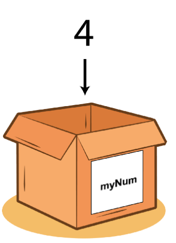

Par exemple ici, nous avons une variable ayant pour **étiquette** ( ou pour nom ) ``myNum`` contenant la valeur ``4``.

## I. Notation

### a) Affectation

On peut **affecter** une valeur à une variable en Python avec l'opérateur d'affectation ``=`` .

Affecter une valeur à une variable revient à dire "mettre la valeur dans la boîte" :

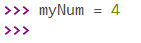

Ici, je viens de mettre la valeur ``4`` dans la boîte d'étiquette ``myNum``, autrement dit, j'ai affecté la valeur ``4`` à ma variable ``myNum``.

*On dit également **déclarer** une variable.*

Maintenant, si je veux afficher la valeur contenue dans une variable, il suffit de **l'appeler** :

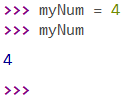

### b) Ré-affectation

Que se passe t-il si je ré-affecte une valeur à ma variable ?

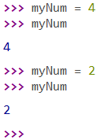

L'ancienne valeur ( ``4`` ) est **écrasée** par la nouvelle valeur ( ``2`` ). Une variable ne peut contenir qu'une seule valeur, c'est pourquoi il faut faire attention lors de la manipulation de variables.

### c) Affectation multiple

Il est possible d'affecter plusieurs valeurs à plusieurs variables sur une seule ligne en les séparant d'une virgule :

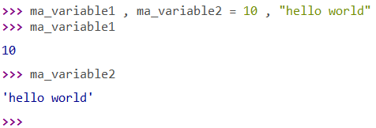

### d) Type d'une variable

Le type d'une variable est le **type de la valeur qu'elle contient**. On peut, comme pour les valeurs, connaître le type des variables en utilisant la fonction ``type()`` :

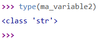

Sans surprise, on retrouve le type ``str`` pour la variable ``ma_variable2`` contenant la valeur ``"hello world"``.

On peut également utiliser les fonctions de conversion sur les variables tel que ``int()`` ou ``float()``.

### e) Utilisation de variables

On peut affecter à une variable une expression :

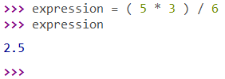

Et à une variable une autre variable :

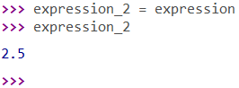

Ici, nous avons deux variables contenant la même valeur, mais il s'agit de **variables différentes**.

Ainsi, on peut stocker dans une variable une expression de variables et de valeurs :

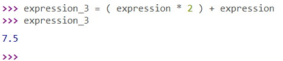

Pour éviter de déclarer beaucoup de variables inutiles, on peut réutiliser nos variables en écrasant les anciennes valeurs par les nouvelles en utilisant la ré-affectation ( sauf si nous avons besoin des anciennes valeurs car elles seront perdues ) :

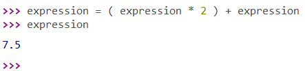

## II. Etat d'une variable

On appelle **état d'une variable**, la valeur qu'elle contient à un endroit donné dans le programme.

Considérons les instructions suivantes :

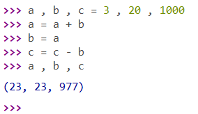

Nous pouvons déterminer qu'après la première instruction, l'état des variables est noté comme ``3 , 20 , 1000`` pour respectivement les variables ``a , b et c``.

L'état des variables change au fur et à mesure des instructions, par exemple, l'état de la variable ``a`` change après la seconde instruction, on a maintenant comme état des variables : ``23 , 20 , 1000``.

____________

### A retenir

*Une variable est une boîte contenant une unique valeur.*

*L'affectation d'une valeur à une variable se fait grâce à l'opérateur ``=``.*

*Le type d'une variable est le type de la valeur qu'elle contient.*

____________

## Applications

#### Application 1

Réécrire tous les exemples vus précédemment dans la console.

#### Application 2

Ecrire la suite des états des variables du **II. Etat d'une variable** 

#### Application 3

Quelle est la valeur affichée dans la console après les instructions suivantes ?

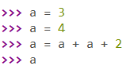

#### Application 4

Quelle est la valeur affichée dans la console après les instructions suivantes ?

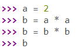

__________

Leçon 3 : [Ecrire un programme](./Ecrire un programme.md)
