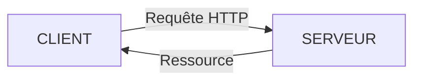

# Modèle Client-Serveur

## I. Rappels de Seconde

Le *web* (ou *World Wide Web*) est un ensemble de documents reliés entre eux par des liens hypertextes.

Un *document* est une page web, ils peuvent être de tout types : un texte, une image, une vidéo, un son, ...

Un lien *hypertexte* (ou *hyperlien*) est un lien cliquable menant vers un autre document sur le web. Il est souvent représenté en bleu souligné : [Exemple](./Introduction.md).

Le langage informatique permettant d'écrire des documents hypertexte est le HTML (*HyperText Markup Language*).

Celui qui est utilisé pour le style est le CSS (*Cascading Style Sheets*).

Une *URL* (*Uniform Resource Locator*) ou *adresse web* en français est une adresse vers un document du web (texte, image, vidéo).

Nous l'écrivons ou elle s'affiche dans la barre d'adresse du navigateur.

Par exemple `https://www.wikipedia.org/wiki/Computer_science` est une adresse web menant vers la page `informatique` du site Wikipédia.

## II. Interraction Client-Serveur

### a) Introduction

Lorsque nous cliquons sur un lien hypertexte ou que nous entrons une adresse web sur la barre d'adresse, une page web s'affiche à l'écran.

- La page qui vient de s'afficher ne se trouve pas en réalité sur notre ordinateur, mais sur une autre machine appellée *serveur web*. Il y a donc eu une communication entre notre machine et le serveur pour récupérer les données de la page.

- Deuxièmement, notre machine n'est pas reliée directement au serveur : il n'y a pas de câble reliant directement notre ordinateur au serveur. Notre machine est en fait connectée à Internet.

- Troisièmement, si nous répétons l'expérience depuis des lieux différents avec des machines différentes, la page web s'affiche pareillement.

Il y a en fait un modèle de communication, des règles auquelles les deux entités (ordinateur et serveur) se sont mises d'accord pour communiquer efficacement.

Nous appelons ce modèle : le modèle Client-Serveur.

### b) Modèle

Le *client* (le navigateur) et le serveur sont deux entités qui communiquent.

Le client souhaite envoyer ou accèder à une ressource présente sur le serveur.

Le modèle Client-Serveur repose sur le protocole de communication HTTP (*HyperText Tansfer Protocol*) qui permet d'envoyer des requêtes HTTP et de recevoir une réponse du serveur :



### c) Requêtes HTTP

Pour obtenir ou envoyer des données, le client envoie une requête HTTP au serveur.

Une requête HTTP s'écrit avec le nom de la méthode suivi de l'adresse vers la ressource.

#### Méthode GET

Pour obtenir une ressource, le client utilise la méthode GET.

Par exemple, en naviguant vers l'URL `http://www.nsi-premiere.fr/test.html`, le navigateur souhaite obtenir la ressource `test.html` et envoie au serveur web la requête HTTP suivante :

```
GET /test.html HTTP/1.1
Host : www.nsi-premiere.fr
```

Avec cette requête, le passage des paramètres au serveur se fait directement dans l'URL.

L'intérêt de la méthode GET est que toute l'information nécessaire au serveur est contenue dans l'URL, ainsi il est possible de la mémoriser pour s'en servir plus tard.

##### Application 1

a) Sur Mozilla Firefox, taper sur la touche `f12` : il s'agit du panneau d'outils de développement.

b) Aller dans l'onglet `Réseau` puis sélectionner `HTML`.

c) Entrer dans la barre d'adresse l'adresse suivante : [https://www1.ac-lille.fr/](https://www1.ac-lille.fr/) et observer ce qu'il se passe.

d) En parcourant la requête HTTP et la réponse, trouver les informations suivantes :

1. Le code réponse.

2. Le type du document.

3. La taille de la ressource.

4. La langue utilisée.

5. La date de la requête.

#### Méthode POST

Il existe des situations où passer les paramètres via l'URL pose problème. Notamment, lorsque nous souhaitons par exemple nous connecter à un compte.

##### Application 2

a) Aller sur le site [http://glassus1.free.fr/ex_get.html](http://glassus1.free.fr/ex_get.html) et taper un mot de passe.

b) En observant l'URL, expliquer pourquoi la méthode GET n'est pas adaptée.

Étant donné que le passage des paramètre se fait via l'URL, le mot de passe est visible dans celui-ci.

C'est pourquoi il existe une autre méthode : la méthode POST.

À la différence de la requête GET, le passage des paramètre se fait dans le corps de la requête.

##### Application 3

a) Aller sur le site [http://glassus1.free.fr/cible2.php](http://glassus1.free.fr/ex_post.html) et taper un mot de passe.

b) Le mot de passe ne s'affiche plus dans l'URL, retrouver le contenu du mot de passe dans l'entête de la requête à l'aide du panneau d'outils de développement Firefox.

### d) Réponses HTTP

Le serveur, s'il possède la ressource, l'envoie comme réponse à celui qui l'a demandé.

Une réponse HTTP contient de nombreuses informations comme le code réponse, la langue dans laquelle a été écrit la ressource, le nom du serveur qui héberge la ressource, la taille de la ressource, la date de la requête, etc ...

Le code réponse indique l'état de la réponse : 

- $200$ pour `OK`.
- $403$ pour `Permission refusée`.
- $404$ pour `Ressource indisponible`.

________________

[Sommaire](./../README.md)