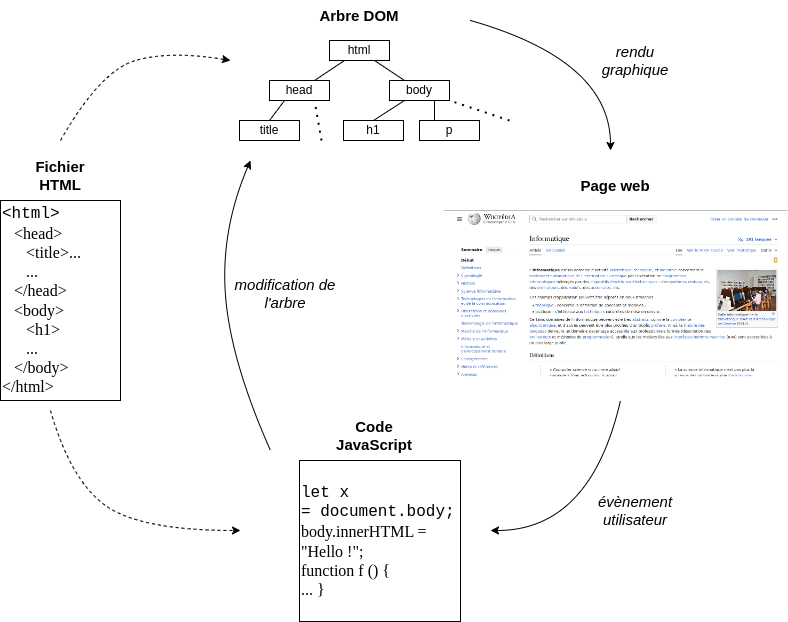
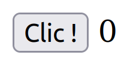

# Programmation évènementielle

L'interractivité sur les sites web est limitée : chaque évènement utilisateur nécessite l'envoi d'une requête HTTP au serveur qui recalcule toute la page.

Le langage JavaScript, qui est un langage évènementiel, permet l'interractivité des pages côté client : il n'y a donc plus besoin d'envoyer une requête HTTP.

## I. Définitions

Une page web *dynamique* est une page web générée à la demande, par opposition à une page web statique.

Le contenu d'une page web dynamique peut donc varier en fonction d'informations (heure, nom de l'utilisateur, formulaire rempli par l'utilisateur, etc.) qui ne sont connues qu'au moment de sa consultation.

À l'inverse, le contenu d'une page web *statique* est a priori identique à chaque consultation.

L'*interaction humain-machine* (ou *IHM*), repose sur la gestion d’événements associés à des
éléments graphiques.

Le langage *JavaScript* est un langage web côté client permettant de construire des interractions via les éléments graphiques d'une page web.

Un *langage de programmation côté client* est un langage de programmation ne nécessitant pas de communiquer avec le serveur web.

##### Application

a) Donner un exemple de page web statique.

b) Donner un exemple de page web dynamique.

## II. Langage JavaScript

### a) Principe de l'évènementiel

JavaScript est un langage qui a la possibilité de modifier dynamiquement et en temps réel le contenu d'une page web.

La figure ci-dessous décrit la conséquence d'un évènement utilisateur sur la page :



Un *arbre DOM* (pour *Document Object Model*) décrit la hiérarchie des éléments graphiques de la page et est consruit à partir du fichier HTML.

Par le biais d'un évènement utilisateur, le langage JavaScript agit dircetement sur l'arbre DOM afin de modifier graphiquement la page.

### b) Exemple simple

Nous souhaitons écrire une page web proposant un bouton à l'utilisateur et affiche, à côté, le nombre de clics sur ce bouton :



Commençons par coder l'élément graphique du bouton dans un fichier HTML :

```html
<!DOCTYPE html>
<html>
    <head>
        <title>Exemple</title>
        <script type="text/javascript" src="./script.js" defer="defer"></script>
    </head>
    <body>
        <button id="bouton">Clic !</button>
        <span id="valeur">0</span>
    </body>
</html>
```

L'identificateur `bouton` a été donné à l'élément du boutton et l'identificateur `valeur` a été donné à l'élément du texte.

Dans un second fichier `script.js`, récupérons premièrement dans une variable `b` l'élément graphique du bouton via son identificateur :

```js
let b = document.getElementById("bouton");
```

Puis, ajoutons-lui un évènement :

```js
b.addEventListener("click", suivant);
```

Lorsque l'utilisateur va cliquer sur le bouton, la fonction `suivant` va s'exécuter.

Écrivons maintenant la fonction `suivant` :

```js
let compteur = 0;

function suivant () {
    compteur = compteur + 1;
    let v = document.getElementById("valeur")
    v.innerHTML = compteur;
}
```

Lors de l'exécution de la fonction `suivant` :

- La valeur de `compteur` est incrémentée.

- L'élément de texte est récupérée via son identificateur.

- La valeur de ce texte est remplacée par le contenu de `compteur`.

##### Application 2

Télécharger les fichiers [index.html](./src/index.html) et [script.js](./src/script.js) et le tester sur le navigateur.

##### Application 3

Écrire le code HTML et JavaScript pour créer une page web dont le fond change de couleur à chaque clic sur un bouton.

__________________

[Sommaire](./../../README.md)
