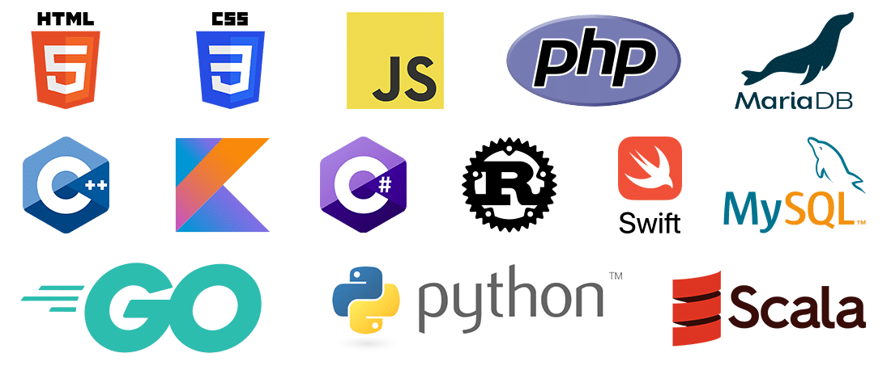
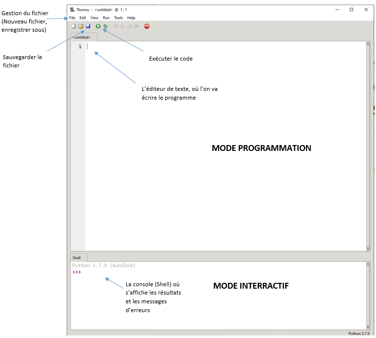
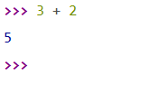
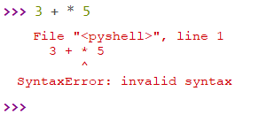
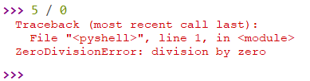
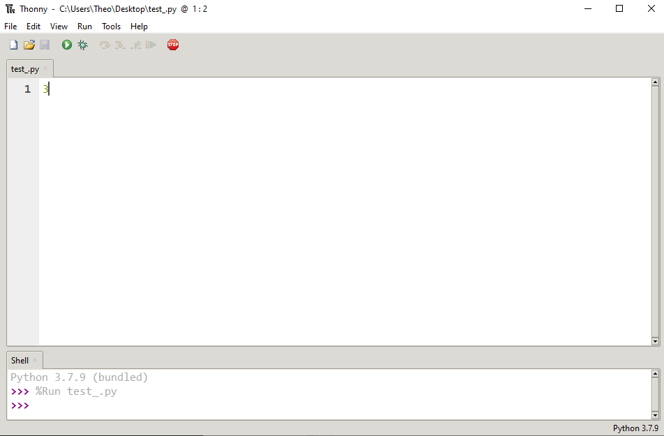
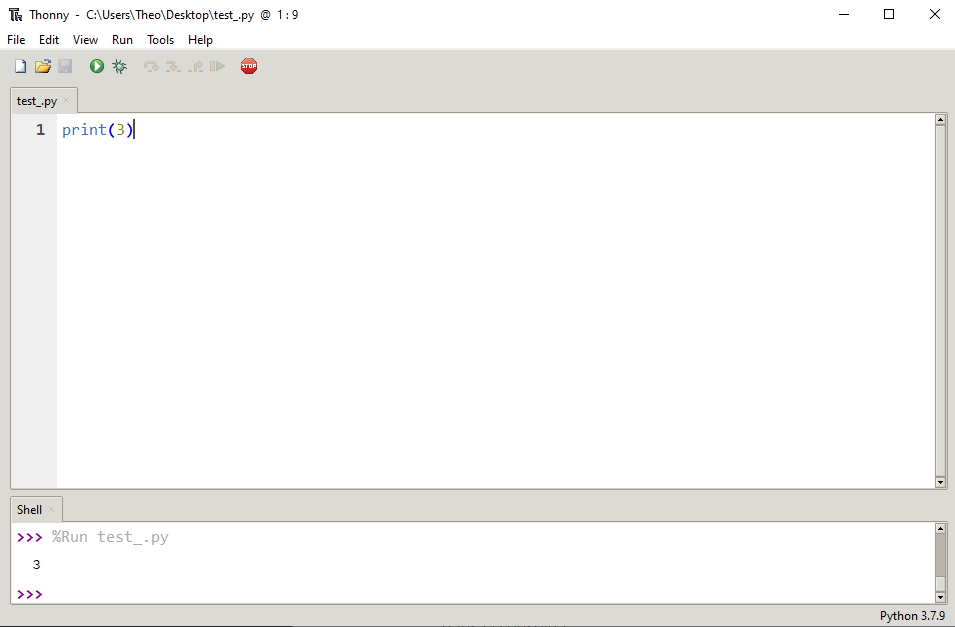
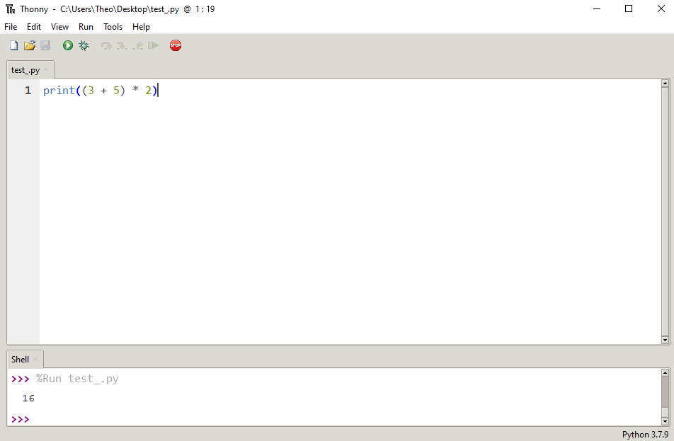

# Introduction à la programmation

Qu'est-ce qu'un programme informatique ?

Un programme est un ensemble **d'instructions** et **d'opérations** écrit dans un certain langage de programmation et destiné à être exécuté par un ordinateur.

Dans un programme informatique, on manipule des **données** sur lesquelles on effectue des **calculs**.

## I. Algorithme

Un algorithme est un ensemble d'instructions écrit en Français. Il sert à **résoudre un problème**, par exemple trouver la valeur minimale dans une liste. On l'utilise pour ensuite l'écrire dans un langage de programmation afin d'être exécuté.

L'objectif de construire un algorithme est qu'il soit compris par tous et qu'on puisse le traduire dans n'importe quel langage de programmation.

## II. Langages de programmation

Un langage de programmation est un langage dans lequel nous allons écrire notre programme. Notre programme doit respecter la notation du langage sinon l'ordinateur ne comprendra pas ce qu'il y est écrit ( comme deux individus ne parlant pas la même langue ).

Comme nos langues naturelles (Français, Anglais, ...) un langage de programmation est composé d'un alphabet, de règles, de significations.

On distingue plusieurs langages comme le Java, le C++, le HTML, le CSS, le SQL, etc ...

En NSI, nous travaillerons avec le langage Python principalement.

## III. IDE

Un IDE ( environnement de développement ) est un logiciel permettant d'écrire et d'exécuter des programmes. Nous utiliserons le logiciel Thonny :

Voici la page d'édition de Thonny :

Comme dans beaucoup d'autres IDE, on aperçoit un **mode interractif** et un **mode programmation**.

### a) Mode interractif

La console ( ou *interprète Python* ) situé en bas de la page se présente comme une calculatrice. Les trois chevrons **>>>** indique que la console attend une instruction.

Par exemple :

On remarque que la console affiche le résultat de l'instruction précédente et attend à nouveau une instruction.

En Python, nous pouvons saisir des **opérations** arithmétiques avec :

- **+** pour l'addition

- **-** pour la soustraction

- *pour la multiplication

- **/** pour la division

#### Application 1

Afficher le résultat, en utilisant la console, des expressions suivantes :

- 5 - 3 - 2

- 1 / 2 / 2

----------------------------

L'interprète affiche également lorsqu'une erreur survient, par exemple lorsque l'on écrit une mauvaise syntaxe de l'expression :

#### Application 2

Expliquer l'erreur suivante :

### b) Mode programmation

Le mode programmation de Thonny est l'endroit où l'on va écrire nos programmes. Dans ce mode, les résultats des expressions calculées ne sont pas affichées à l'écran.

Pour exécuter un code, il faut cliquer sur le bouton d'exécution.

On utilise alors la fonction ``print()`` pour afficher le résultat, par exemple :

On peut également afficher le résultat d'une expression arithmétique :

_________________________

#### A retenir

*L'éditeur est l'endroit ou l'on écrit nos programmes et la console affiche les résultats et les erreurs de ces programmes une fois exécutés.*

*On peut également se servir de l'interprète pour tester directement ( sans exécuter le programme ) des instructions.*
