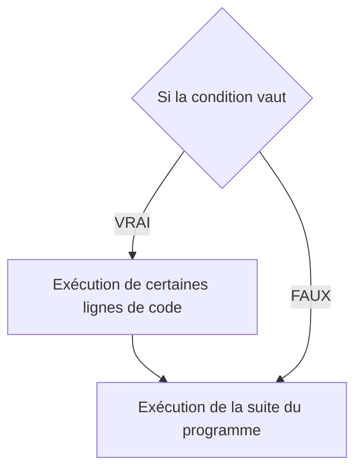
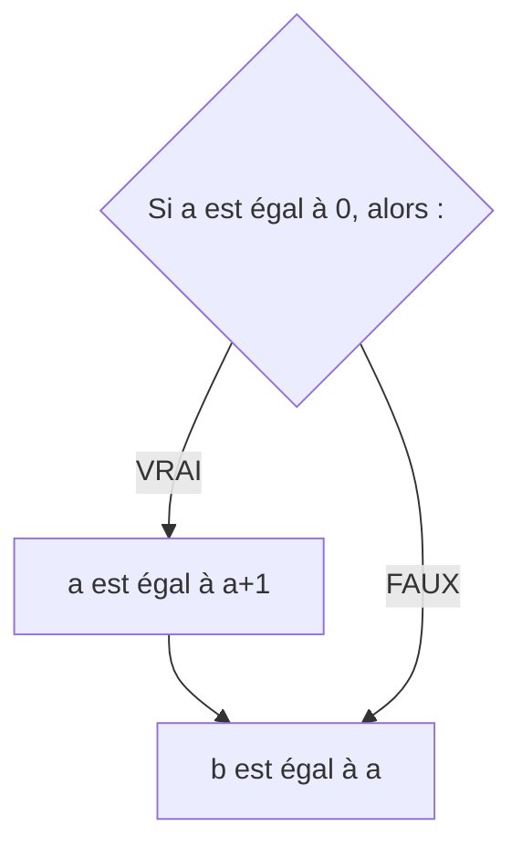
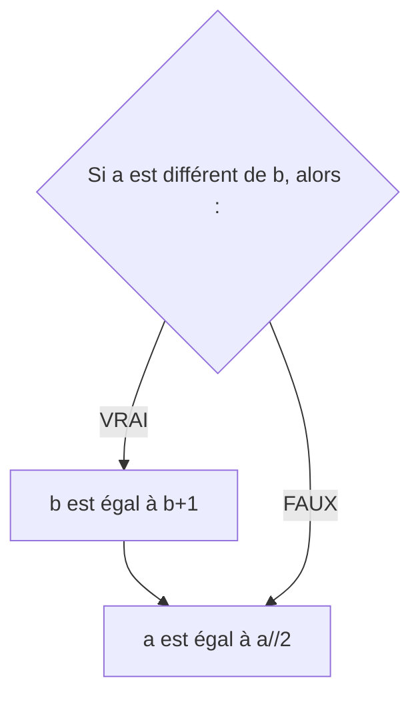
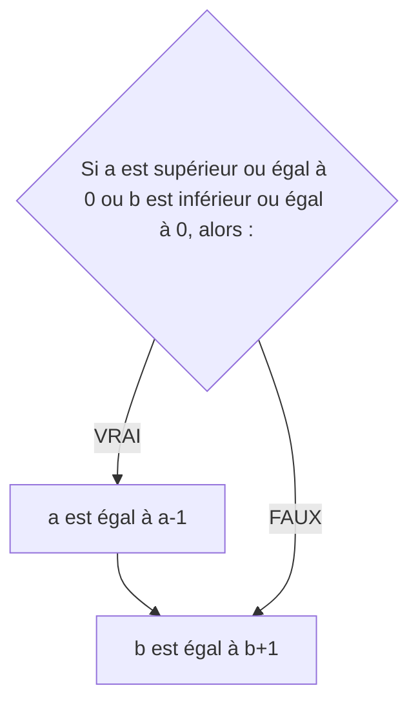
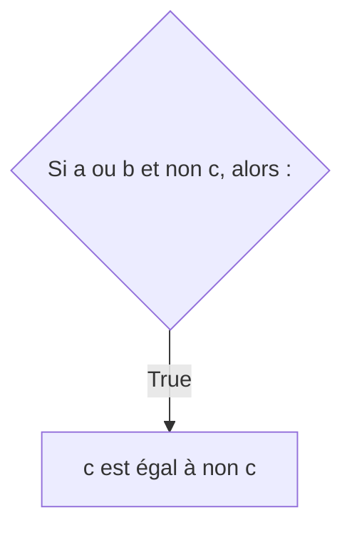
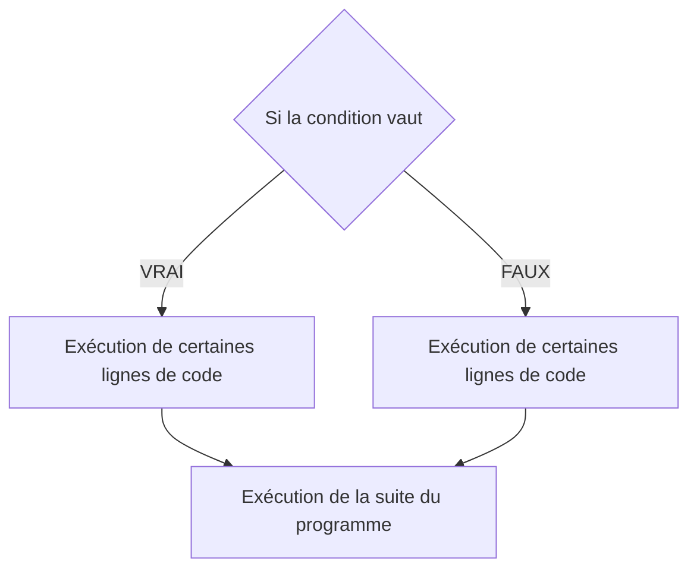
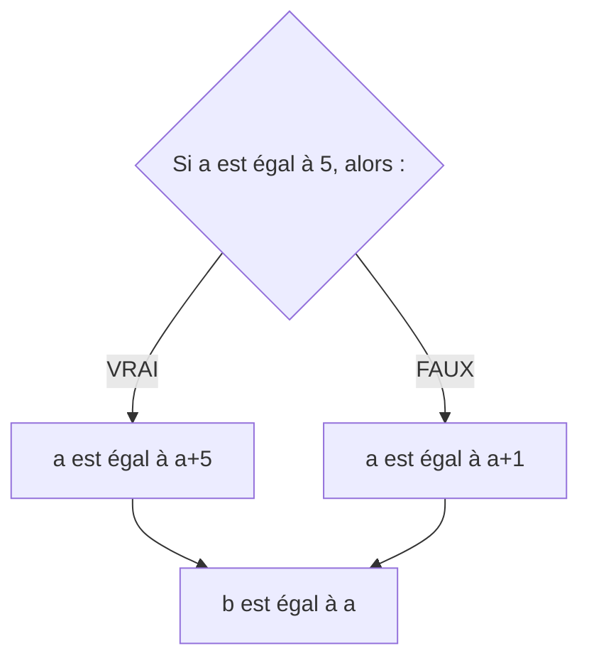
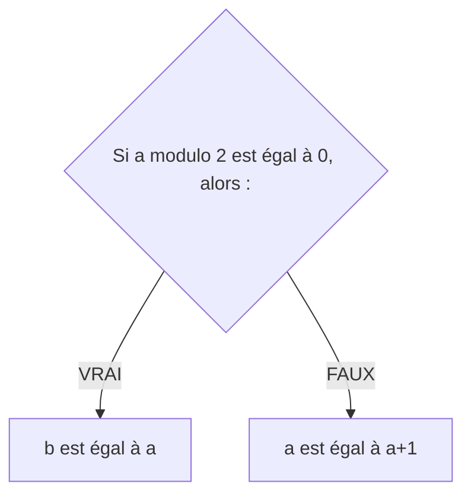
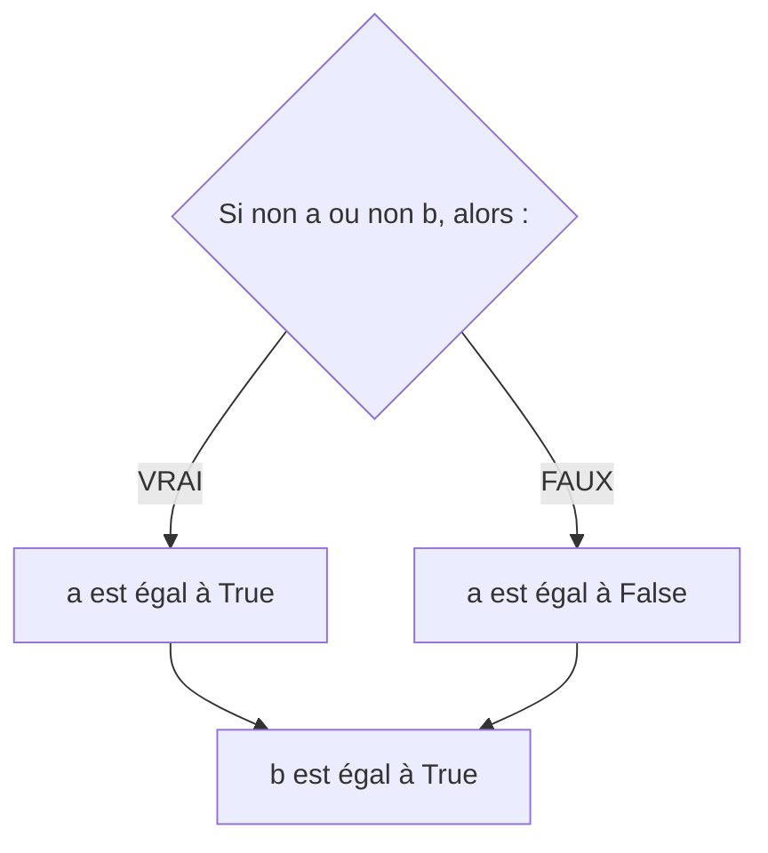

# Instructions conditionnelles

## I. Définitions

> [!IMPORTANT]
>Une *instruction conditionnelle* est une instruction permettant d'exécuter certaines lignes de code uniquement si la condition est remplie.

> [!IMPORTANT]
> Une *condition* est un booléen, elle peut être le résultat d'une comparaison ou le résultat d'une opération booléenne (cf [Opérateurs](./Opérateurs.md)).

Une condition vaut donc soit $VRAI$ respectivement `True`, soit $FAUX$ respectivement `False` et une condition est remplie si elle vaut $VRAI$.

Si la condition n'est pas remplie, le code inclus dans l'instruction conditionnelle n'est pas exécuté.

### a) Schéma de branchement

Nous pouvons visualiser comment se comporte l'exécution d'un programme en dessinant son **schéma de branchement** :



### b) Syntaxe en Python

En Python, l'instruction conditionnelle s'écrit par le mot-clé ``if`` (*Si* en français).

> [!TIP]
> Par exemple :
> ```python
> if a == 0 :
>     a = a + 1
> b = a
> ```

> [!NOTE]
> La séquence d'instruction, exécutée si la condition est vraie, est **indentée** : c'est-à-dire, qu'elle est décalée de trois espaces vers la droite.

Cela se traduit en français :

```
Si a est égal à 0, alors :
    a est égal à a+1
b est égal à a
```

Son schéma de branchement est :



#### <ins>Application 1</ins>

Donner, pour chaque programme suivant, son schéma de branchement :

1. Programme 1

```python
if a != b :
    a = b
a = a * 2
```

2. Programme 2

```python
if a or b :
    a = True
    b = True
```

3. Programme 3

```python
if a < b and b < c :
    b = c -1
    c = a + 1
```

#### <ins>Application 2</ins>

Retrouver, pour chaque schéma de branchement suivant, le programme correspondant :

1. Schéma de branchement 1



2. Schéma de branchement 2



3. Schéma de branchement 3



## II. Alternative

L'instruction conditionnelle peut inclure une **séquence d'instruction alternative**, à n'exécuter que lorsque la condition est fausse.

### a) Schéma de branchement



### b) Syntaxe en Python

En Python, l'instruction d'alternative s'écrit avec le mot-clé ``else`` (*Sinon* en français).

> [!TIP]
> Par exemple :
> ```python
> if a == 0 :
>     a = a + 1
> else :
>     a = a + 3
> b = a
> ```
>
> Cela se traduit en français :
>
> ```
> Si a est égal à 0, alors :
>     a est égal à a+1
> Sinon :
>     a est égal à a+3
> b est égal à a
> ```
>
> Son schéma de branchement est :
> 
> ```mermaid
>   graph TB;
>       A{Si a est égal à 0, alors :};
>       A--VRAI-->B[a est égal à a+1];
>       A--FAUX-->C[a est égal à a+3];
>       B-->D[b est égal à a];
>       C-->D[b est égal à a];
> ```

#### <ins>Application 3</ins>

Donner, pour chaque programme suivant, son schéma de branchement :

1. Programme 1

```python
if a == b :
    a = a // 2
else :
    b = b // 2
```

2. Programme 2

```python
if a < b :
    b = b - 1
else :
    a = a - 1
a = a * 2
b = b * 2
```

3. Programme 3

```python
if a < b and c != 0 :
    c = a
else :
    c = b
```

#### <ins>Application 4</ins>

Retrouver, pour chaque schéma de branchement suivant, le programme correspondant :

1. Schéma de branchement 1



2. Schéma de branchement 2



3. Schéma de branchement 3



_________________________

[Exercices](./Exercices/Exercices_instructions_conditionnelles.md)

__________________________

[Sommaire](./../../README.md)

___________

<p xmlns:cc="http://creativecommons.org/ns#" xmlns:dct="http://purl.org/dc/terms/"><a property="dct:title" rel="cc:attributionURL" href="https://github.com/boddaert/nsi">Cours NSI</a> by <a rel="cc:attributionURL dct:creator" property="cc:attributionName" href="https://github.com/boddaert">Théo Boddaert</a> is licensed under <a href="https://creativecommons.org/licenses/by/4.0/?ref=chooser-v1" target="_blank" rel="license noopener noreferrer" style="display:inline-block;">CC BY 4.0</a>    </p> 