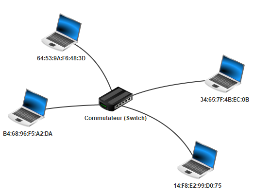
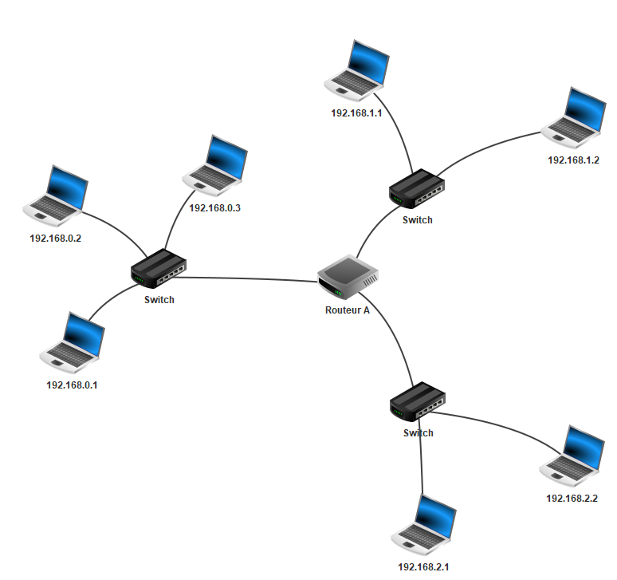

# Principe des réseaux informatiques

## Introduction

Considérons une action banale : la navigation sur un site Web. Par exemple, on souhaite accéder au site : [https://fr.wikipedia.org/wiki/Informatique](https://fr.wikipedia.org/wiki/Informatique)

Lorsque nous cliquons sur le lien, la page wikipédia sur l'informatique s'affiche à l'écran.

A partir de cette simple manipulation, nous pouvons déjà faire quelques observations :

- La page qui vient de s'afficher ne se trouve pas en réalité sur notre ordinateur, mais sur une autre machine appellée *serveur* (On dit que le serveur héberge ce site web). Il y a donc eu une communication entre notre machine et le serveur pour récupérer les données du site.

- Deuxièmement, notre machine n'est pas reliée directement au serveur : il n'y a pas de câble reliant directement notre ordinateur au serveur.

- Troisièmement, si nous répétons l'expérience depuis des lieux différents avec des machines différentes, la page web s'affiche pareillement.

**Comment notre machine communique t-elle sur le réseau informatique ?**

**Comment fonctionne un réseau informatique ?**

## I. Généralités

### a) Définitions

Un *réseau informatique* est un ensemble de noeuds (équipements informatiques) reliés entre eux par des liens. Les réseaux informatiques permettent l'échange de données entre les machines au moyen de protocoles.

Un *protocole* est un ensemble de règles permettant de standartiser la communication.

### b) Modèles en couches

Dans l'objectif de décrire le fonctionnement d'un réseau informatique, les informaticiens ont proposé dans les années 1980 deux modèles :


Ces modèles présentent les réseaux sous la forme d'un ensemble de couches superposées.

Chaque couche est définie par plusieurs protocoles permettant la transmission des données d'un certain niveau. Par exemple, la couche *Accès réseau* du modèle TCP/IP définit les protocoles s'occupant de transmettre les données au niveau d'un réseau local.

Chaque couche est indépendante des autres et communique uniquement avec une couche adjacente.

Les couches "hautes" gèrent plutôt la partie logicielle de la transmission de données tandis que les couches "basses" gèrent la partie physique.

> Le modèle TCP/IP étant plus proche de la réalité, c'est ce modèle qu'on utilisera pour la suite de la leçon.

### c) Types de réseaux

- Les *réseaux locaux* sont les réseaux de plus petite taille, ils contiennent au maximum une centaine d'ordinateurs. Les réseaux personnels, internes aux entreprises ou aux écoles sont des réseaux locaux. On parle alors de LAN (*Local Area Network*).

- Les MAN (*Metropolitan Area Network*) sont des réseaux locaux connectés entre eux et ont généralement la taille d'une ville.

- *Internet* est l'ensemble des réseaux mondiaux interconnectés.

## II. Couche 1 : Accès réseau

Ici, dans la couche 1 du modèle TCP/IP, on se place dans un réseau local où toutes les machines sont reliées directement entre elles par la même technologie. Il peut s'agir d'un réseau Wi-Fi ou d'un réseau câblé utilisant le protocole **Ethernet**.

### a) Adresses MAC

Dans un réseau local, les machines sont distinguées par leur adresse MAC.

Une *adresse MAC* est l'adresse physique supposée unique de la machine.

L'adresse MAC d'une machine est découpée en 6 octets représentés traditionnellement en hexadécimal : ``98:f3:96:d1:26:a8``.

> Dans la représentation d'une adresse MAC, les octets sont séparés par des ':'

### b) Représentation d'un réseau local



Ci-dessus, une représentation d'un réseau local. Chaque machine possède son adresse MAC et sont reliés par un équipement informatique appelé *Commutateur* (*Switch* en anglais).

Le commutateur, lorsqu'il reçoit des données, va lire l'adresse MAC inscrite dans les données et va transmettre à la machine concernée.

> Il existe un autre équipement, plus ancien, appelé *Concentrateur* (*Hub* en anglais) qui lui envoie les données à toutes les machines du réseau local.

----------

#### Application 1

La transmission de données à l'intérieur d'un réseau local peut être assimilée à la situation suivante :

Un colis est arrivé par voie postale dans la boîte aux lettres de votre maison.

Pour savoir à qui est destiné le colis parmi toutes les personnes qui habitent au même endroit : on regarde le nom auquel est adressé le colis.

Relier les éléments selon la correspondance de leur mission :

Boîte aux lettres  -                                             -  Réseau local

Colis                      -                                             -  Données

Nom/prénom      -                                             -  Commutateur

Maison                 -                                             -  Adresse MAC

------------

## III. Couche 2 : Internet

Imaginons désormais que l'on possède plusieurs réseaux locaux et qu'une machine du réseau A souhaite communiquer avec une machine du réseau B.

Le protocole **IP** (*Internet Protocol*) de la couche Internet permet de faire communiquer deux machines appartenant à des réseaux locaux différents.

Pour cela, il va, en premier lieu, associer une adresse IP à chaques machines.

### a) Adresses IP

Une *adresse IP* est un identifiant unique de réseau associée à une machine.

Nous utiliserons pour la suite de la leçon la version 4 du protocole IP (IPv4).

Elle est représentée sur 32 bits soit 4 octets et généralement notée en décimale.

Les octets étant séparés par des points : `172.16.254.1`

| Représentation décimale | 172      | 16       | 254      | 1        |
| ----------------------- | -------- | -------- | -------- | -------- |
| Représentation binaire  | 10101100 | 00010000 | 11111110 | 00000001 |

> Les adresses IP de version 6 (IPv6) sont représentées sur 128 bits.

---------

#### Application 2

Ouvrir l'invite de commandes sur Windows et exécuter :

- La commande ``ipconfig``.

- La commande ``ping google.com``.

Pour chacune des commandes exécutées, dire ce qu'elle fait.

------------

### b) Représentation de trois réseaux locaux interconnectés



Voici la figure représentant trois réseaux locaux interconnectés.

### c) Adresse et masque de réseau

Pour différencier les réseaux, on leur attribue à eux aussi une adresse. On appelle cette adresse : l'*adresse réseau*.

Ainsi, toutes les machines possèdant la même adresse réseau appartiennent au même réseau.

Pour obtenir l'adresse d'un réseau d'une machine, il suffit de réaliser l'opération AND bit à bit entre l'adresse IP de la machine et son masque.

Le *masque de réseau*, représenté sur 4 octets, est constitué d'une suite de bits à $1$ (représentant l'identifiant réseau) suivie d'une suite de bits à $0$ (représentant l'identifiant machine).

Par exemple, le masque de réseau pour toutes les machines de la figure ci-dessus est ``255.255.255.0``.

Ecrit en binaire : ``11111111.11111111.11111111.00000000``.

Cela veut dire, que pour toutes ces machines, les 24 premiers bits de leur adresse IP sont alloués à l'identifiant réseau et les 8 bits restants sont alloués à l'identifiant machine.

Calculons désormais l'adresse réseau de la machine ayant pour adresse IP ``192.168.0.1`` :

```
  11000000.10101000.00000000.00000001
& 11111111.11111111.11111111.00000000
= 11000000.10101000.00000000.00000000
```

L'adresse réseau de la machine d'adresse IP ``192.168.0.1`` est ``192.168.0.0``.

----------

#### Application 3

- Donner l'adresse réseau de la machine d'adresse IP ``192.168.0.2``.

- Donner l'adresse réseau de la machine d'adresse IP `192.168.2.1`.

- Expliquer pourquoi ces deux machines n'appartiennent pas au même réseau.

----------------

### d) Adresses IP réservées

- L'adresse réseau ne peut pas être donnée comme adresse IP à une machine.

- L'adresse de *Broadcast*, ayant tous les bits de l'identifiant machine à $1$, ne peut également pas être donnée à une machine.

### e) Nombre d'adresses disponibles

Soit $n$ le nombre de bits de l'identifiant machine et $p$ le nombre d'adresses déjà utilisées il est possible de savoir le nombre d'adresses encore disponibles dans un réseau en calculant $2^{n}-p$.

----------

#### Application 4

Combien de machines je peux encore mettre dans mon réseau d'adresse ``192.168.0.0`` ?

-----------

### f) Routage

Ces trois réseaux locaux sont connectés par le Routeur A.

Le travail d'un *Routeur* est d'assurer le routage (la redirection) des données vers le bon réseau.

Pour cela, le routeur, lorsqu'il recevra des données sur lesquelles est inscrite l'adresse IP de destination, devra renvoyer les données vers le réseau associé à l'adresse de destination.

Par exemple, si j'émet un message depuis la machine d'adresse IP ``192.168.0.1`` pour la machine de destination d'adresse IP ``192.168.1.2`` :

- Le message est émis depuis ``192.168.0.1``.

- Le commutateur, s'aperçevant que l'adresse de destination ne correspond à aucune des adresses dans le réseau local, envoie le message au routeur.

- Le routeur calcule l'adresse réseau de la machine destination et trouve ``192.168.1.0``.

- Grâce à sa table de routage, le routeur envoie le message sur le bon réseau.

> La notion de routage étant au programme de Terminale n'est pas abordée ici en profondeur.

## IV. Couche 3 : Transport


