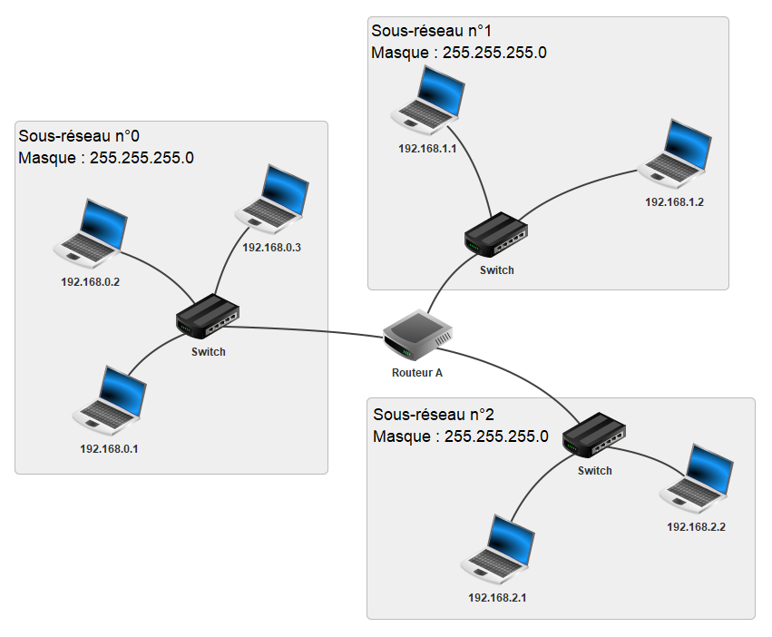

# Principe des réseaux

## Introduction

Considérons une action banale : la navigation sur un site Web. Par exemple, on souhaite accéder au site : [https://fr.wikipedia.org/wiki/Informatique](https://fr.wikipedia.org/wiki/Informatique)

Lorsque nous cliquons sur le lien, la page wikipédia s'affiche à l'écran.

A partir de cette simple manipulation, nous pouvons déjà faire quelques observations :

- La page qui vient de s'afficher ne se trouve pas en réalité sur notre ordinateur, mais sur une autre machine appellée *serveur* (On dit que le serveur héberge ce site web). Il y a donc eu une communication entre notre machine et le serveur pour récupérer les données du site.

- Deuxièmement, notre machine n'est pas reliée directement au serveur : il n'y a pas de câble reliant directement notre ordinateur au serveur.

- Troisièmement, si nous répétons l'expérience depuis des lieux différents avec des machines différentes, la page web s'affiche pareillement.

**Comment notre machine communique t-elle sur le réseau informatique ?**

**Comment les données sont-elles transmises depuis une machine source vers une machine de destination ?**

## I. Généralités

### a) Définitions

Un *réseau informatique* est un ensemble de noeuds (équipements informatiques) reliés entre eux par des liens. Les réseaux informatiques permettent l'échange de données entre les machines au moyen de protocoles.

Un *protocole* est un ensemble de règles permettant de standartiser la communication.

### b) Modèles en couches

Dans l'objectif de décrire le fonctionnement d'un réseau informatique, les informaticiens ont proposé dans les années 1980 deux modèles :


Ces modèles présentent les réseaux sous la forme d'un ensemble de couches superposées.

Chaque couche est définie par plusieurs protocoles permettant la transmission des données d'un certain niveau. Par exemple, la couche *Accès réseau* du modèle TCP/IP définit les protocoles s'occupant de transmettre les données au niveau d'un réseau local.

Chaque couche est indépendante des autres et communique uniquement avec une couche adjacente.

Les couches "hautes" gèrent plutôt la partie logicielle de la transmission de données tandis que les couches "basses" gèrent la partie physique.

> Le modèle TCP/IP étant plus proche de la réalité, c'est ce modèle qu'on utilisera pour la suite de la leçon.

### c) Types de réseaux

- Les *réseaux locaux* sont les réseaux de plus petite taille, ils contiennent au maximum une centaine d'ordinateurs. Les réseaux personnels, internes aux entreprises ou aux écoles sont des réseaux locaux. On parle alors de LAN (*Local Area Network*).

- Les MAN (*Metropolitan Area Network*) sont des réseaux locaux interconnectés et ont généralement la taille d'une ville.

- *Internet* est l'ensemble des réseaux mondiaux interconnectés.

## II. Couche 1 : Accès réseau

Ici, dans la couche 1 du modèle TCP/IP, on se place dans un réseau local où toutes les machines sont reliées directement entre elles par la même technologie. Il peut s'agir d'un réseau Wi-Fi ou d'un réseau câblé utilisant le protocole **Ethernet**.

### a) Adresses MAC

Dans un réseau local, les machines sont distinguées par leur adresse MAC.

Une *adresse MAC* est l'adresse physique unique de la machine.

L'adresse MAC d'une machine est découpée en 6 octets représentés traditionnellement en hexadécimal : ``98:f3:96:d1:26:a8``.

> Dans la représentation d'une adresse MAC, les octets sont séparés par des ':'

### b) Représentation d'un réseau local


Ci-dessus, une représentation d'un réseau local. Chaque machine possède son adresse MAC et sont reliés par un équipement informatique appelé *Commutateur* (*Switch*).

Le commutateur, lorsqu'il reçoit des données sur lesquelles est précisé l'adresse MAC de destination, va transmettre à la machine concernée.

> Il existe un autre équipement, plus ancien, appelé *Concentrateur* (*Hub*) qui lui envoie les données à toutes les machines du réseau local.

----------

#### Application 1

La transmission de données à l'intérieur d'un réseau local peut être assimilée à la situation suivante :

Un colis est arrivé par voie postale dans la boîte aux lettres de votre maison.

Pour savoir à qui est destiné le colis parmi toutes les personnes qui habitent au même endroit : on regarde le nom auquel est adressé le colis.

Relier les éléments selon la correspondance de leur mission :

Boîte aux lettres  -                                             -  Réseau local

Colis                      -                                             -  Données

Nom/prénom      -                                             -  Commutateur

Maison                 -                                             -  Adresse MAC

------------

## III. Couche 2 : Internet

Imaginons désormais qu'une machine d'un premier sous-réseau local souhaite communiquer avec une machine d'un autre sous-réseau local.

Pour la suite de ce chapitre, nous utiliserons le schéma suivant représentant un réseau constitué de trois sous-réseaux locaux interconnectés :


### a) Protocole IP

Le protocole **IP** (*Internet Protocol*) de la couche Internet permet de faire communiquer efficacement deux machines appartenant à des réseaux différents.

Pour cela, le protocole IP remplit trois missions :

- Sa première mission consiste à associer une adresse IP pour chaque machine.

- La seconde consiste à découper les données en paquets IP.

- Enfin, la dernière mission est d'acheminer ces paquets.

### b) Adresses IP

Une *adresse IP* est un identifiant de réseau associée à une machine.

Une *adresse IP* est constituée d'un *identifiant réseau* et d'un *identifiant machine* précisant respectivement l'identité du réseau et l'identité de la machine.

Elle est représentée sur 32 bits (IPv4) soit 4 octets et est usuellement notée en décimale.

Les octets étant séparés par des points : `192.168.2.1`.

En représentation binaire : ``11000000.10101000.00000010.00000001``

> Les adresses IP de version 6 (IPv6) sont représentées sur 128 bits.

### c) Masque de sous-réseau

Le *masque de sous-réseau*, représenté sur 4 octets, permet de <u>retrouver</u> l'*identifiant réseau* et l'*identifiant machine* d'une adresse IP.

Le masque est constitué d'une suite de bits à 1 (représentant l'identifiant réseau) suivie d'une suite de bits à 0 (représentant l'identifiant machine).

Par exemple, un masque de sous-réseau valide est `255.255.255.0`.

Soit écrit en représentation binaire : `11111111.11111111.11111111.00000000`.

Cela veut dire, que les 24 premiers bits de l'adresse IP sont alloués à l'*identifiant réseau* et les 8 bits restants sont alloués à l'*identifiant machine*.

En reprenant l'adresse IP ``192.168.2.1`` avec un masque de sous-réseau ``255.255.255.0`` :

- Les 24 premiers bits de l'adresse IP sont alloués à l'identifiant réseau : ``11000000.10101000.00000010.xxxxxxxx``

- Les 8 bits restants de l'adresse IP sont alloués à l'identifiant machine : ``xxxxxxxx.xxxxxxxx.xxxxxxxx.00000001``

---

#### Application 2

Pour chacun des adresses IP et masques suivants, retrouver l'identifiant réseau et l'identifiant machine :

- IP : ``192.166.0.254`` ; Masque : ``255.255.255.0``

- IP : ``192.168.0.2`` ; Masque : ``255.255.254.0``

- IP : ``192.168.1.6`` ; Masque : ``255.255.254.0``

------------

### d) <a name="schema"></a>Adressage des machines



### e) Adresse réseau

Pour différencier les sous-réseaux entre eux, on leur attribue à eux aussi une adresse : l'*adresse réseau*.

L'*adresse réseau* est la première adresse IP disponible du réseau : son identifiant machine vaut $0$.

Par exemple, l'adresse réseau du sous-réseau n°2 est ``192.168.2.0`` 

Pour obtenir l'adresse réseau d'une machine, il suffit de réaliser l'opération AND bit à bit entre l'adresse IP de la machine et son masque :

```
  11000000.10101000.00000010.00000001 -> 192.168.2.1
& 11111111.11111111.11111111.00000000 -> 255.255.255.0
= 11000000.10101000.00000010.00000000 -> 192.168.2.0
```

----------

#### Application 3

- Donner l'adresse réseau de la machine d'adresse IP ``192.168.0.2``.

- Donner l'adresse réseau de la machine d'adresse IP `192.168.1.1`.

- Expliquer pourquoi ces deux machines n'appartiennent pas au même réseau.

----------------

### f) Adresses IP réservées

- L'adresse réseau ne peut pas être donnée comme adresse IP à une machine.

- L'adresse de *Broadcast*, ayant tous les bits de l'identifiant machine à $1$, ne peut également pas être donnée à une machine.

### g) Nombre d'adresses disponibles

Soit $n$ le nombre de bits alloués à l'identifiant machine. Soit $p$ le nombre d'adresses déjà utilisées. 

Il est possible de savoir le nombre d'adresses encore disponibles dans un réseau en calculant $2^{n}-p$.

----------

#### Application 5

En reprenant le [schéma](#schema), combien de machines je peux encore mettre dans :

- Mon sous-réseau n°0 d'adresse réseau``192.168.0.0`` ?

- Mon sous-réseau n°1 d'adresse réseau ``192.168.1.0`` ?

-----------

### h) Découpage en paquets IP

La seconde mission du protocole IP est le découpage en paquets IP.

Internet est un endroit où chaque utilisateur peut envoyer des données. Il arrive que ces données soient trop lourdes et cela a pour conséquence de surcharger le réseau et d'empêcher l'acheminement des données d'autres utilisateurs :


Pour y remédier, le protocole IP "découpe" les données en paquets IP. Chaque paquet est ensuite envoyé sur le réseau puis les données sont reconstituées sur la machine de destination :


--------

#### Application 6

Par groupe de 2, simuler le découpage des données en paquets IP en découpant aux ciseaux en fines bandes une image imprimée.

Puis, à la façon du protocole IP, envoyer une par une les bandes à votre binôme qui devra reconstituer l'image.

----------

### i) Routage

La dernière mission du protocole IP est le routage des paquets.

Sur le [schéma](#schema), les trois sous-réseaux locaux sont connectés par le Routeur A.

Le travail d'un *Routeur* est d'assurer le routage (la redirection) des paquets vers le bon réseau.

Pour cela, le routeur, lorsqu'il recevra un paquet sur lequel est inscrit l'adresse IP de destination, devra rediriger ce paquet vers le réseau associé à cette adresse.

> La notion de routage, étant au programme de Terminale, sera enrichie ultérieurement.

## IV. Couche 3 : Transport

Les protocoles **TCP** (*Transmission Control Protocol*) et **UDP** (*User Datagram Protocol*) appartiennent tous les deux à la troisième couche du modèle TCP/UDP : la couche Transport.

En regardant d'un peu plus près le découpage en paquets effectués par le protocole IP, on remarque quelques soucis.

En effet, les paquets envoyés à priori dans l'ordre peuvent emprunter des chemins différents sur le réseau et par conséquent peuvent arriver dans le mauvais ordre à destination.

De plus, un paquet peut se "perdre" sur le réseau et peut ne jamais arriver à destination.

### a) Protocole TCP

Le protocole TCP permet, par une mise en place d'un système d'accusés de réception, de remettre dans l'ordre les paquets reçus et de réémettre les paquets perdus.

Ce protocole est constitué de trois phases :

- Etablissement d'*une session de connexion* afin de synchroniser l'émetteur et le récepteur pour l'échange de données qui suit.

- Les paquets sont numérotés puis envoyés et un accusé de réception est attendu pour chacun d'entre eux.

- Arrêt de la session.

### b) Etablissement d'une session de connexion TCP

L'établissement d'une session de connexion entre deux machines se réalise à l'aide de l'algorithme des trois poignées de mains (*Three-way Handshake*).


- SYN (*Synchronized*) : Synchronisation

- ACK (*Acknowledgement*) : Accusé de réception

### c) Transfert des paquets IP avec TCP

Les données étant trop lourdes, le protocole IP a découpé les données en 2 paquets IP respectivement de numéro 100 et 200.

Lors d'une situation sans problème :


Lorsque les paquets ont été reçus dans le mauvais ordre :


Lorsqu'un paquet a été perdu :


---------

#### Application 7

En reprenant les bandes précédemment coupées aux ciseaux, simuler l'échange des bandes en utilisant le protocole TCP. Pour cela, par groupe de deux :

- L'élève émetteur numérote dans l'ordre croissant les bandes en partant du haut et les envoie à l'élève récepteur.

- L'élève recepteur envoie un accusé de réception avec le numéro incrémenté de 1.

- L'élève émetteur vérifie, avec les acusés de réception, si toutes les bandes ont été reçues par le récepteur.

Afin de vérifier l'efficacité du protocole, répéter l'action une seconde fois avec les bandes reçues dans le désordre puis une troisième fois avec quelques bandes non reçues par le récepteur.

---------

### d) Protocole UDP

Le protocole TCP est efficace pour assurer l'arrivée des données, il est utilisé généralement lorsque l'on veut absolument que les données arrivent à destination : par exemple, lors de l'envoi d'un mail.

L'inconvénient d'un tel protocole est la surcharge toujours plus conséquente de paquets sur la ligne.

C'est pourquoi le protocole UDP existe, il arrive parfois que l'arrivée de toutes les données ne soit pas nécessaire : par exemple, lors d'un visionnage d'une vidéo en direct (*streaming*).

Le protocole UDP n'utilise pas les accusés de réception et ne surcharge pas le réseau.

Si un paquet est perdu, cela n'a pas de conséquence et le visionnage peut continuer avec les paquets suivants. 

## V. Encapsulation des données

En descendant les couches, les données sont encapsulées. C'est à dire que chaque couche ajoute de l'information à ce qui va être envoyé :


- La couche Transport ajoute aux données une en-tête TCP. On y retrouve les ports source et de destination, ces ports indiquent quelle application utiliser avec quel protocole (TCP ou UDP). Cela forme un *Segment TCP*.

- A ce segment, la couche Internet y ajoute l'en-tête IP. On y retrouve les adresses IP des machines source et de destination. Cela forme un *Paquet IP*.

- Enfin, la couche Accès réseau ajoute au paquet IP l'en-tête Ethernet. On y retrouve les adresses MAC des machines source et de destination. Cela forme une *Trame Ethernet*.

------

## Exercices

### Exercice 1 Commandes réseau

Dans cet exercice, nous allons manipuler l'interface en ligne de commande. Pour cela, il faut ouvrir l'application Windows **Invite de commandes**.

Exécuter la commande ``ipconfig`` et répondre aux questions suivantes :

a) Donner l'adresse MAC de votre machine.

b) Donner l'adresse IP (IPv4) de votre machine.

c) Donner le masque de sous-réseau et vérifier qu'il s'agit d'un masque valide.

d) Donner l'adresse réseau du lycée.

e) Combien de machines ce réseau peut-il contenir ?

f) Quelle est sa plage d'adresse possible ? (Première adresse à dernière adresse IP)

---------

Pour la suite des exercices, nous utiliserons le logiciel libre et gratuit : Filius.

Filius permet de construire et simuler un réseau. Une fois lancé, on dispose de plusieurs modes :

- *Mode simulation* : permet d'ajouter des légendes à nos réseaux.

- *Mode construction* : permet d'ajouter des composants réseaux, de les modifier et de les relier entre eux.

- *Mode simulation* : permet de lancer une simulation et de voir les paquets circuler dans le réseau.

En mode construction, on peut sélectionner un composant réseau et le faire glisser dans la zone de dessin. Pour relier deux éléments , on clique sur l'icône du câble, puis sur chacun des deux éléments à relier.

### Exercice 2 Réseau local


a) En mode construction, reproduire le réseau de la figure ci-dessus dans un fichier nommé ``reseau_ex2.fls``.

b) Avec un masque de sous-réseau de ``255.255.0.0`` et en supposant l'adresse réseau ``192.168.0.0``. Ecrire deux adresses IP valides appartenenant à ce réseau.

c) En cliquant sur ``configurer``, attribuer les adresses IP données à la question précédente aux deux ordinateurs du réseau. (Attention à modifier également le masque de sous-réseau.)

La commande ``ping`` permet d’envoyer un paquet IP "vide" vers une adresse IP. Si la
machine de destinatation reçoit ce paquet, elle répond avec un autre paquet IP comme accusé de réception. Cette commande permet de vérifier si deux machines peuvent communiquer entre-elles.

e) Passer en mode simulation. Cliquer sur l'un des deux ordinateurs, puis sur **Installation de logiciels** et installer le logiciel **Ligne de commande**.

Sur ce logiciel, exécuter la commande ``ping`` suivie de l'adresse IP du second ordinateur. Les deux machines sont-elles connectées ?

f) A quoi correspond le temps affiché à côté de chaque accusé de réception ?

### Exercice 3 Réseau de réseaux


a) En mode construction, reproduire le réseau de la figure ci-dessus dans un fichier nommé `reseau_ex3.fls`.

Les machines M1 et M2 ont respectivement les adresses IP ``192.168.10.1`` et ``192.168.30.5``.

Le serveur possède l'adresse IP ``8.8.8.1``.

b) Donner l'adresse réseau du réseau A et B.

c) Il faut désormais relier ces deux réseaux, pour cela configurer le routeur :

- L'adresse IP du routeur du port relié au réseau A est ``192.168.0.1``.

- L'adresse IP du routeur du port relié au réseau B est ``8.8.8.254``.

Attention à également modifier le masque de sous-réseau si cela est nécessaire.

d) Depuis M1, lancer un ``ping`` vers le serveur. Que se passe t-il ? Les machines sont-elles connectées ?

L'erreur survient du fait qu'il manque une information à M1, il ne sait pas où envoyer le paquet. La passerelle est l'interface qui permet aux paquets de sortir du réseau.

e) Dans la configuration de M1, ajouter dans Passerelle l'adresse IP du routeur relié au réseau A.

f) Dans la configuration du serveur, ajouter dans Passerelle l'adresse IP du routeur relié au réseau B.

g) Refaire la commande ``ping`` vers le serveur depuis M1. Les machines sont-elles connectées ?

La commande `traceroute`permet de visualiser quels équipements le paquet traverse.

h) Depuis M1, effectuer la commande ``traceroute`` suivie de l'adresse IP du serveur. A quoi correspondent les adresses affichées ?

On décide de faire héberger sur le serveur une page Web.

i) Pour cela, installer sur le serveur le logiciel **Serveur web** et sur M1 le logiciel **Navigateur web**.

S'assurer que le serveur web est bien démarré, puis faire clic droit sur M1 et choisir **Afficher les échanges de données**.

Enfin, sur M1, ouvrir le navigateur et à la suite de ``https://`` : écrire l'adresse IP du serveur.

j) En visualisant les échanges effectués entre le navigateur et le serveur web, donner en précisant les couches, les protocoles utilisés.

### Exercice 4 Mini Internet

a) Télécharger le fichier ``reseau_ex4.fls`` et ouvrir le fichier. Il contient un exemple de réseau plus complexe, contenant plusieurs routeurs, que l'on peut voir comme un *mini internet*.

b) Récupérer les adresses IP de M9 et M14, puis faire la commande ``ping`` afin de vérifier qu'elles sont bien connectées.

c) Exécuter la commande ``traceroute`` de M9 vers M14. Quels sont les routeurs traversés ?

d) Supprimer le câble reliant les routeurs E et F afin de simuler une panne. Puis réexécuter la commande ``traceroute`` de M9 vers M14. Que peut -on remarquer ?

e) Existe t-il encore un autre chemin ?
