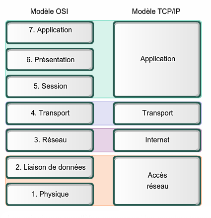
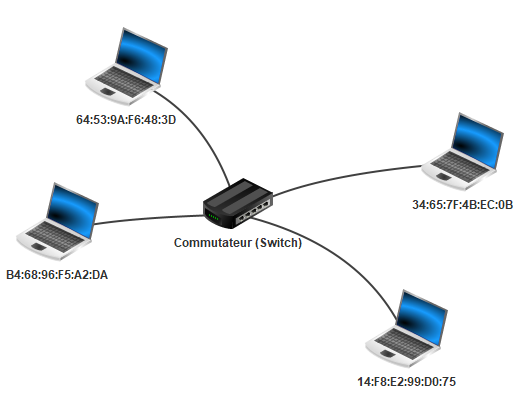
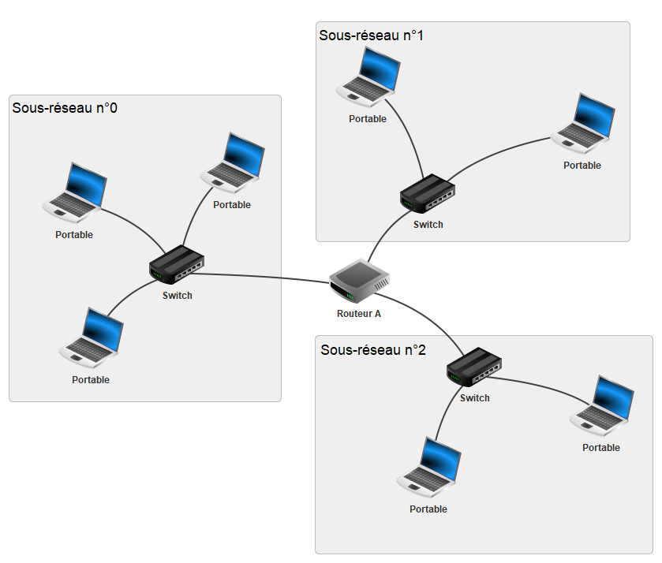

# Principe des réseaux

## I. Introduction

Considérons une action banale : la navigation sur un site Web.

Par exemple, nous souhaitons accéder au site : [https://fr.wikipedia.org/wiki/Informatique](https://fr.wikipedia.org/wiki/Informatique)

Lorsque nous cliquons sur le lien, la page wikipédia s'affiche à l'écran.

À partir de cette simple manipulation, nous pouvons déjà faire quelques observations :

1. La page qui vient de s'afficher ne se trouve pas en réalité sur notre ordinateur, mais sur une autre machine appellée *serveur* (Le serveur héberge ce site web). Il y a donc eu une communication entre notre machine et le serveur pour récupérer les données du site.

2. Deuxièmement, notre machine n'est pas reliée directement au serveur : il n'y a pas de câble reliant directement notre ordinateur au serveur.

3. Troisièmement, si nous répétons l'expérience depuis des lieux différents avec des machines différentes, la page web s'affiche pareillement.

Une question se pose alors :

- Comment notre machine communique t-elle sur le réseau informatique ?

## II. Généralités

### a) Définitions

> [!IMPORTANT]
> Un *réseau informatique* est un ensemble de noeuds (équipements informatiques) reliés entre eux par des liens.
>
> Les réseaux informatiques permettent l'échange de données entre les machines au moyen de protocoles.

> [!IMPORTANT]
> Un *protocole* est un ensemble de règles permettant de standartiser la communication.

### b) Modèles en couches

Dans l'objectif de décrire le fonctionnement d'un réseau informatique, les informaticiens ont proposé dans les années 1980 deux modèles :

> [!IMPORTANT]
> 
>
> Ces modèles présentent les réseaux sous la forme d'un ensemble de couches superposées.
>
> Chaque couche est définie par plusieurs protocoles permettant la transmission des données d'un certain niveau.

Par exemple, la couche *Accès réseau* du modèle TCP/IP définit les protocoles s'occupant de transmettre les données au niveau d'un réseau local.

Chaque couche est indépendante des autres et communique uniquement avec une couche adjacente.

Les couches "hautes" gèrent plutôt la partie logicielle de la transmission de données tandis que les couches "basses" gèrent la partie physique.

> Le modèle TCP/IP étant plus proche de la réalité, c'est ce modèle que nous utiliserons pour la suite de la leçon.

### c) Types de réseaux

- Les *LAN* (pour *Local Area Network*) sont des réseaux locaux personnels, internes aux entreprises ou aux écoles.

- Les *MAN* (pour *Metropolitan Area Network*) sont des réseaux de réseaux locaux interconnectés et ont généralement la taille d'une ville.

- *Internet* est l'ensemble des réseaux mondiaux interconnectés.

## III. Couche 1 : Accès réseau

Ici, dans la couche n°$1$ du modèle TCP/IP, toutes les machines sont reliées directement en réseau local.

Il peut s'agir d'un réseau Wi-Fi ou d'un réseau câblé utilisant le protocole *Ethernet*.

### a) Adresses MAC

Dans un réseau local, les machines sont distinguées par leur adresse MAC.

> [!IMPORTANT]
> Une *adresse MAC* est l'adresse physique unique de la machine.

L'adresse MAC d'une machine est découpée en six octets représentés traditionnellement en hexadécimal.

> [!TIP]
> Par exemple :
> ``98:f3:96:d1:26:a8``.

> Dans la représentation d'une adresse MAC, les octets sont séparés par des ':'

### b) Représentation d'un réseau local



Ci-dessus, une représentation d'un réseau local. Chaque machine possède son adresse MAC et sont reliés par un équipement informatique appelé commutateur (*Switch* en anglais).

> [!IMPORTANT]
> Le *commutateur*, lorsqu'il reçoit des données sur lesquelles est précisé l'adresse MAC de destination, va les transmettre à la machine concernée.

Il existe un autre équipement, plus ancien, appelé *Concentrateur* (*Hub* en anglais) qui lui envoie les données à toutes les machines du réseau local.

#### <ins>Application 1</ins>

La transmission de données à l'intérieur d'un réseau local peut être assimilée à la situation suivante :

Un colis est arrivé par voie postale dans la boîte aux lettres de votre maison.

Pour savoir à qui est destiné le colis parmi toutes les personnes qui habitent au même endroit : nous regardons le nom auquel est adressé le colis.

Relier les éléments selon la correspondance de leur mission :

Boîte aux lettres  -                         -  Réseau local

Colis  -                                             -  Données

Nom/prénom  -                             -  Commutateur

Maison  -                                        -  Adresse MAC

## IV. Couche 2 : Internet

Imaginons désormais qu'une machine d'un premier sous-réseau local souhaite communiquer avec une machine d'un autre sous-réseau local.

Pour la suite de ce chapitre, nous utiliserons le schéma suivant représentant un réseau constitué de trois sous-réseaux locaux interconnectés :



### a) Protocole IP

> [!IMPORTANT]
> Le *protocole IP* (pour *Internet Protocol*) de la couche Internet permet de faire communiquer efficacement deux machines appartenant à des réseaux différents.

Pour cela, le protocole IP remplit trois missions :

1. Associer une adresse IP pour chaque machine.

2. Découper les données en paquets IP.

3. Acheminer ces paquets à destination.

### b) Adresses IP

> [!IMPORTANT]
> Une *adresse IP* est un identifiant de réseau associée à une machine.

Elle est représentée sur trente-deux bits (IPv4) soit quatre octets et est usuellement notée en décimale.

> [!TIP]
> Par exemple :
> - En décimal : `192.168.2.1`.
> - En binaire : ``11000000.10101000.00000010.00000001``

> Les adresses IP de version six (IPv6) sont représentées sur cent vingt-huit bits.

### c) Identifiants d'une adresse IP

> [!IMPORTANT]
> Une *adresse IP* est constituée d'un *identifiant réseau* et d'un *identifiant machine* précisant respectivement l'identité du réseau et l'identité de la machine.

Si l'identifiant réseau est fixée à $x$ bits, alors les $x$ premiers bits de l'adresse représentent l'identité du réseau.

Et les $32-x$ bits suivants représentent l'identité de la machine.

> [!TIP]
> Par exemple avec $x=24$ pour l'identifiant réseau sur l'adresse `192.168.2.1` :
> 
> - L'identifiant réseau est : ``11000000.10101000.00000010.________``
>
> - L'identifiant machine est : ``________.________.________.00000001``

### d) Masque de sous-réseau

> [!IMPORTANT]
> Le *masque de sous-réseau*, représenté sur quatre octets, permet de retrouver l'*identifiant réseau* et l'*identifiant machine* d'une adresse IP.

Le masque est constitué d'une suite de bits à $1$ suivie d'une suite de bits à $0$.

> [!TIP]
> Par exemple :
> - En décimal :`255.255.255.0`
> - En binaire : `11111111.11111111.11111111.00000000`

Le nombre de $1$ consécutifs donne $x$, le nombre de premiers bits représentant l'identifiant réseau.

> [!TIP]
> Par exemple, le masque de sous-réseau `255.255.255.0` indique que les vingt-quatre premiers bits représentent l'identifiant réseau.

#### <ins>Application 2</ins>

Pour chacune des adresses IP et masques de sous-réseau suivants, retrouver l'identifiant réseau et l'identifiant machine :

1. IP : ``192.166.0.254`` ; Masque : ``255.255.255.0``

2. IP : ``192.168.0.2`` ; Masque : ``255.255.254.0``

3. IP : ``192.168.1.6`` ; Masque : ``255.255.254.0``

### e) <a name="schema"></a>Adressage des machines


### f) Adresse réseau

Pour différencier les sous-réseaux entre eux, nous leur attribuons à eux aussi une adresse : l'*adresse réseau*.

> [!IMPORTANT]
> L'*adresse réseau* est la première adresse IP disponible du réseau : son identifiant machine vaut toujours $0$.
>
> Cette adresse permet d'identifier un réseau et donc à le distinguer des autres.

> [!TIP]
> Par exemple, l'adresse réseau du sous-réseau n°1 est ``192.168.1.0``.

#### <ins>Application 3</ins>

Retrouver l'adresse réseau :

1. Du sous-réseau n°0.

2. Du sous-réseau n°2.

### g) Appartenance d'une machine à un réseau

Pour obtenir l'adresse réseau du sous-réseau dans lequel est présente une machine, il suffit de réaliser l'opération $ET$ bit à bit entre l'adresse IP de la machine et son masque.

> [!TIP]
> Par exemple :
> ```
>   11000000.10101000.00000010.00000001 -> 192.168.2.1
> & 11111111.11111111.11111111.00000000 -> 255.255.255.0
>   ___________________________________
> = 11000000.10101000.00000010.00000000 -> 192.168.2.0
> ```
>
> La machine d'adresse IP ``192.168.2.1`` appartient au sous-réseau d'adresse réseau `192.168.2.0` soit le sous-réseau n°2.

#### <ins>Application 4</ins>

Avec le masque suivant : `255.255.255.0`, donner :

a) L'adresse réseau de la machine d'adresse IP ``192.168.0.2``.

b) L'adresse réseau de la machine d'adresse IP `192.168.1.1`.

c) Expliquer pourquoi ces deux machines n'appartiennent pas au même réseau.

### h) Adresses IP réservées

- L'adresse réseau ne peut pas être donnée comme adresse IP à une machine.

- L'adresse de *Broadcast*, ayant tous les bits de l'identifiant machine à $1$, ne peut également pas être donnée à une machine.

### i) Nombre d'adresses disponibles

Soit $n$ le nombre de bits alloués à l'identifiant machine. Soit $p$ le nombre d'adresses déjà utilisées. 

Il est possible de connaître le nombre d'adresses encore disponibles dans un réseau en calculant $2^{n}-p-2$.

#### <ins>Application 5</ins>

En reprenant le [schéma](#schema), combien de machines je peux encore mettre dans :

1. Mon sous-réseau n°0 d'adresse réseau``192.168.0.0`` ?

2. Mon sous-réseau n°1 d'adresse réseau ``192.168.1.0`` ?

### j) Découpage en paquets IP

La seconde mission du protocole IP est le découpage en paquets IP.

Internet est un endroit où chaque utilisateur peut envoyer des données.

Il arrive que ces données soient trop lourdes et cela a pour conséquence de surcharger le réseau et d'empêcher l'acheminement des données d'autres utilisateurs :


Pour y remédier, le protocole IP "découpe" les données en paquets IP. Chaque paquet est ensuite envoyé sur le réseau puis les données sont reconstituées sur la machine de destination :


#### <ins>Application 6</ins>

Répondre aux questions suivantes :

1. Que faire s'il manque un paquet à destination ?

2. Que faire si les paquets reçus arrivent dans le désordre ?

### k) Routage

La dernière mission du protocole IP est le routage des paquets.

Sur le [schéma](#schema), les trois sous-réseaux locaux sont connectés par le Routeur A.

Le travail d'un *Routeur* est d'assurer le routage (la redirection) des paquets vers le bon réseau.

Pour cela, le routeur, lorsqu'il recevra un paquet sur lequel est inscrit l'adresse IP de destination, devra rediriger ce paquet vers le réseau associé à cette adresse.

La notion de routage, étant au programme de Terminale, sera enrichie ultérieurement.

## V. Couche 3 : Transport

Les protocoles *TCP* (pour *Transmission Control Protocol*) et *UDP* (pour *User Datagram Protocol*) appartiennent tous les deux à la troisième couche du modèle TCP/UDP : la couche Transport.

En regardant d'un peu plus près le découpage en paquets effectués par le protocole IP, quelques soucis subsistent.

En effet, les paquets envoyés à priori dans l'ordre peuvent emprunter des chemins différents sur le réseau et par conséquent peuvent arriver dans le mauvais ordre à destination.

De plus, un paquet peut se "perdre" sur le réseau et peut ne jamais arriver à destination.

### a) Protocole TCP

Le protocole TCP permet, par une mise en place d'un système d'accusés de réception, de remettre dans l'ordre les paquets reçus et de réémettre les paquets perdus.

Ce protocole est constitué de trois phases :

1. Etablissement d'*une session de connexion* afin de synchroniser l'émetteur et le récepteur pour l'échange de données qui suit.

2. Les paquets sont numérotés puis envoyés et un accusé de réception est attendu pour chacun d'entre eux.

3. Arrêt de la session.

### b) Etablissement d'une session de connexion TCP

L'établissement d'une session de connexion entre deux machines se réalise à l'aide de l'algorithme des trois poignées de mains (*Three-way Handshake* en anglais).


- SYN (*Synchronized*) : Synchronisation

- ACK (*Acknowledgement*) : Accusé de réception

### c) Transfert des paquets IP avec TCP

Les données étant trop lourdes, le protocole IP a découpé les données en deux paquets IP respectivement de numéro $100$ et $200$.

Lors d'une situation sans problème :


Les accusés de reception permettent le réenvoi des paquets perdus.

Le numéro des paquets permettent de les assembler dans le bon ordre lors de leur reception.

### d) Protocole UDP

Le protocole TCP est efficace pour assurer l'arrivée des données, il est utilisé généralement lorsque l'on veut absolument que les données arrivent à destination : par exemple, lors de l'envoi d'un mail.

L'inconvénient d'un tel protocole est la surcharge toujours plus conséquente de paquets sur la ligne.

C'est pourquoi le protocole UDP existe, il arrive parfois que l'arrivée de toutes les données ne soit pas nécessaire : par exemple, lors d'un visionnage d'une vidéo en direct (*streaming*).

Le protocole UDP n'utilise pas les accusés de réception et ne surcharge pas le réseau.

Si un paquet est perdu, cela n'a pas de conséquence et le visionnage peut continuer avec les paquets suivants. 

## VI. Encapsulation des données

En descendant les couches, les données sont encapsulées. C'est à dire que chaque couche ajoute de l'information à ce qui va être envoyé :


- La couche Transport ajoute aux données une en-tête TCP. On y retrouve les ports source et de destination, ces ports indiquent quelle application utiliser avec quel protocole (TCP ou UDP). Cela forme un *Segment TCP*.

- A ce segment, la couche Internet y ajoute l'en-tête IP. On y retrouve les adresses IP des machines source et de destination. Cela forme un *Paquet IP*.

- Enfin, la couche Accès réseau ajoute au paquet IP l'en-tête Ethernet. On y retrouve les adresses MAC des machines source et de destination. Cela forme une *Trame Ethernet*.

_______________

[Exercices](./Exercices/Exercices_principe_des_réseaux.md)

_______________

[Sommaire](./../README.md)

___________

<p xmlns:cc="http://creativecommons.org/ns#" xmlns:dct="http://purl.org/dc/terms/"><a property="dct:title" rel="cc:attributionURL" href="https://github.com/boddaert/nsi">Cours NSI</a> by <a rel="cc:attributionURL dct:creator" property="cc:attributionName" href="https://github.com/boddaert">Théo Boddaert</a> is licensed under <a href="https://creativecommons.org/licenses/by/4.0/?ref=chooser-v1" target="_blank" rel="license noopener noreferrer" style="display:inline-block;">CC BY 4.0</a>    </p> 