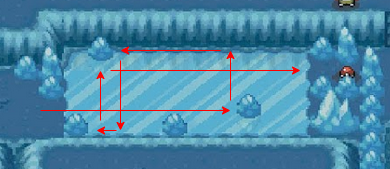

# Projet : Ice Walker

## I. Description

Le jeu du Ice Walker est un jeu à énigme sur une grille à deux dimensions vu du dessus.

En déplaçant un personnage via les quatres directions possibles (Nord, Est, Ouest et Sud), l'objectif du jeu est de faire parvenir le personnage jusqu'à une case finale.

Cependant, les autres cases du jeu sont faites de mur ou de glace qui ne facilitent pas la résolution de l'énigme. 

Le personnage ne peut évidemment pas traverser les murs.

Et le personnage, une fois lancé sur la glace, ne peut s'arrêter. A moins, bien sûr, d'arriver jusqu'à un mur.

Ce type de jeu a été repris plusieurs fois par la licence Pokémon. Voici ci-dessous un exemple de jeu Ice Walker avec sa résolution :

## II. Cahier des charges

Avec Python, vous devez programmer un niveau de jeu Ice Walker en respectant les contraintes suivantes :

1. La grille de jeu est modélisée par une liste de listes.

2. La position actuelle du personnage, de la case finale et des murs sont modélisés par un tuple de coordonnées.

3. Les mécaniques de jeu de sol glacé et de l'infranchissabilité des murs doivent être respectés.

4. A chaque tour de jeu, le joueur entre une direction (Nord, Est, Ouest ou Sud) et fais déplacer le personnage dans la direction donnée.

5. A l'issue de chaque action du joueur, la grille doit être affichée.

6. Le score final de la partie est calculé en fonction du nombre de déplacement effectués pour atteindre la case finale.

7. Chaque fonction écrite doit être documentée par une *DocString* complète.

_______________

[Sommaire](./../README.md)

