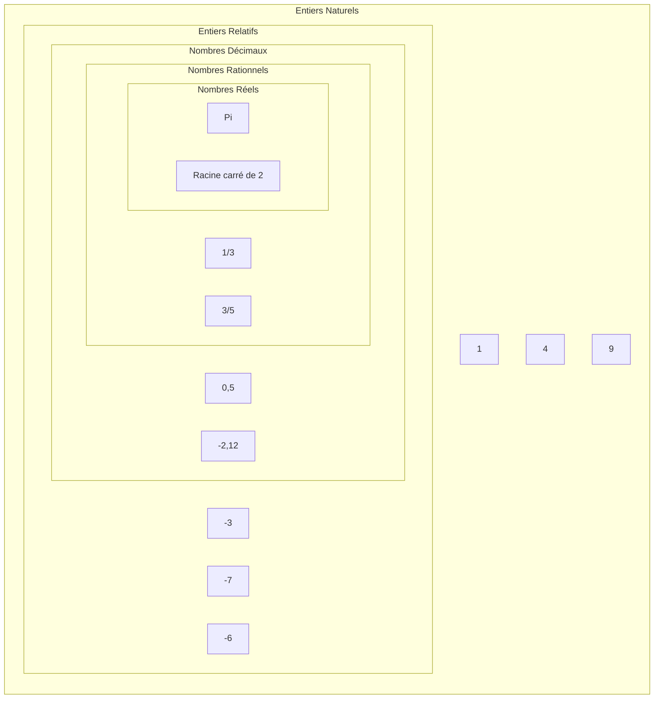

# Représentation des entiers naturels

## I. Les ensembles de nombres (Rappel)

## II. Définitions

Un *nombre* désigne une quantité.

La *représentation* d'un nombre est le symbole que nous lui associons.

Il existe plusieurs représentations pour un même nombre.

Par exemple le chiffre cinq peut s'écrire : $5$, $cinq$, $V$, ⚄, ...

## III. Représentations

### a) Représentation décimale

Nous, humains, utilisons la *représentation décimale* des nombres (Parce que nous avons dix doigts).

C'est-à-dire que, pour représenter un nombre, nous avons dix symboles dans cet ordre : $0$, $1$, $2$, $3$, $4$, $5$, $6$, $7$, $8$ et $9$.

Nous utilisons alors la *base dix*.

Dans cette représentation, les symboles sont organisés selon leur place : le chiffre des unités, le chiffre des dizaines, le chiffre des centaines ...

### b) Représentation binaire

Un ordinateur ne comprend que les $0$ (tension basse) et les $1$ (tension haute).

Un ordinateur utilise alors la *base deux* qui ne contient que deux symboles : $1$ et $0$.

Nous parlons alors de *représentation binaire*.

L'ordinateur, lorsqu'il doit effectuer des opérations sur les nombres, devra faire les calculs en base deux.

Dans cette représentation, les symboles sont appelés *bits* et sont également organisés selon leur place : le bit de poids zéro, le bit de poids un, le bit de poids deux ...

Comme pour la représentation décimale, le bit de poids le plus faible est situé à droite de la représentation.

Nous appelons *octet* un regroupement de huit bits.

### c) Représentation hexadécimale

Parfois, nous utilisons la représentation hexadécimale car elle correspond 