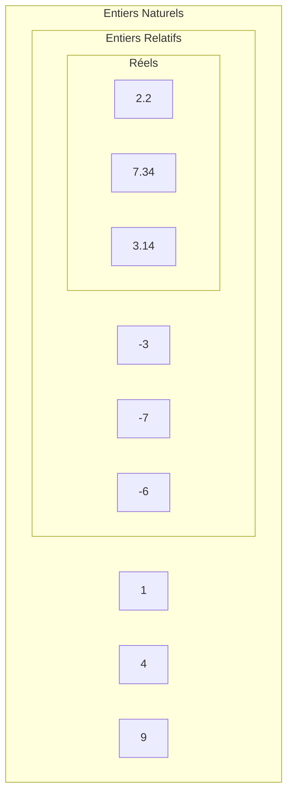

# Représentation des entiers naturels

## I. Définitions

Un *nombre* désigne une quantité.

La *représentation* d'un nombre est le symbole que nous lui associons.

Il existe plusieurs représentations pour un même nombre.

Par exemple le chiffre cinq peut s'écrire : $5$, $cinq$, $V$, ⚄, ...

## II. Les ensembles de nombre

