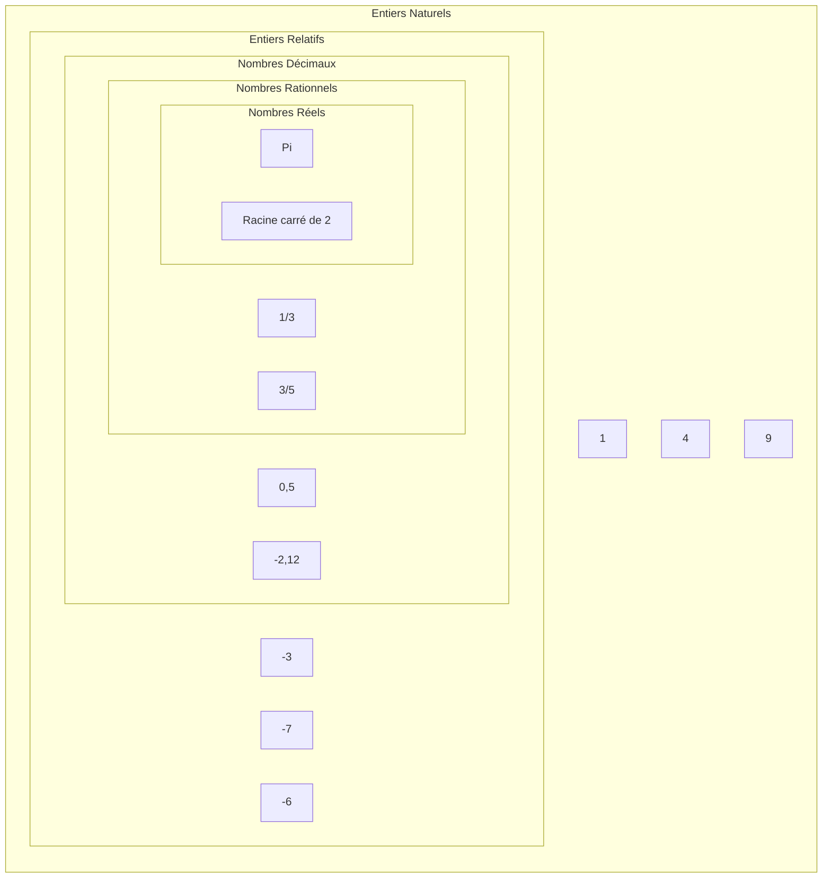

# Représentation des entiers naturels

## I. Les ensembles de nombres (Rappel)

## II. Définitions

Un *nombre* désigne une quantité.

La *représentation* d'un nombre est le symbole que nous lui associons.

Il existe plusieurs représentations pour un même nombre.

Par exemple le chiffre cinq peut s'écrire : $5$, $cinq$, $V$, ⚄, ...

## III. Représentations

### a) Représentation décimale

Nous, humains, utilisons la *représentation décimale* des nombres (Parce que nous avons dix doigts).

C'est-à-dire que, pour représenter un nombre, nous avons dix symboles dans cet ordre : $0$, $1$, $2$, $3$, $4$, $5$, $6$, $7$, $8$ et $9$.

Nous utilisons alors la *base dix*.

Dans cette représentation, les symboles sont organisés selon leur place : le chiffre des unités, le chiffre des dizaines, le chiffre des centaines ...

### b) Représentation binaire

Un ordinateur ne comprend que les $0$ (tension basse) et les $1$ (tension haute).

Un ordinateur utilise alors la *base deux* qui ne contient que deux symboles : $1$ et $0$.

Nous parlons alors de *représentation binaire*.

Dans cette représentation, les symboles sont appelés *bits* et sont également organisés selon leur place : le bit de poids zéro, le bit de poids un, le bit de poids deux ...

Comme pour la représentation décimale, le bit de poids le plus faible est situé à droite de la représentation.

Nous appelons *octet* un regroupement de huit bits.

### c) Représentation hexadécimale

Parfois, nous utilisons la représentation hexadécimale car elle correspond à la représentation binaire sur quatre bits et nous fais gagner ainsi de la place et du temps.

Nous parlons alors de *base seize* et ses symboles sont : $0$, $1$, $2$, $3$, $4$, $5$, $6$, $7$, $8$, $9$, $A$, $B$, $C$, $D$, $E$ et $F$.

### d) Récapitulatif des représentations

| Base deux | Base dix | Base seize |
| --- | --- | --- |
| $0$ | $0$ | $0$ |
| $1$ | $1$ | $1$ |
| $10$ | $2$ | $2$ |
| $11$ | $3$ | $3$ |
| $100$ | $4$ | $4$ |
| $101$ | $5$ | $5$ |
| $110$ | $6$ | $6$ |
| $111$ | $7$ | $7$ |
| $1000$ | $8$ | $8$ |
| $1001$ | $9$ | $9$ |
| $1010$ | $10$ | $A$ |
| $1011$ | $11$ | $B$ |
| $1100$ | $12$ | $C$ |
| $1101$ | $13$ | $D$ |
| $1110$ | $14$ | $E$ |
| $1111$ | $15$ | $F$ |

## VI. Changements de base

Lorsque nous programmons, nous écrivons les nombres dans notre représentation (décimale) or l'ordinateur ne comprend que la représentation binaire des nombres.

Il y a donc nécessairement un changement de base : de la base dix vers la base deux.

Et de la base deux vers la base dix lorsque nous lui demandons d'afficher un nombre.

### a) De la base dix vers la base deux

Nous pouvons bien sûr nous référer au tableau ci-dessus, mais il existe une méthode pour changer la représentation d'un nombre en base deux.

Cette méthode consiste à diviser euclidiennement et succéssivement le nombre par deux jusqu'à atteindre $0$ et de récupérer les restes.

### b) De la base deux vers la base dix

La méthode consiste à multiplier 

