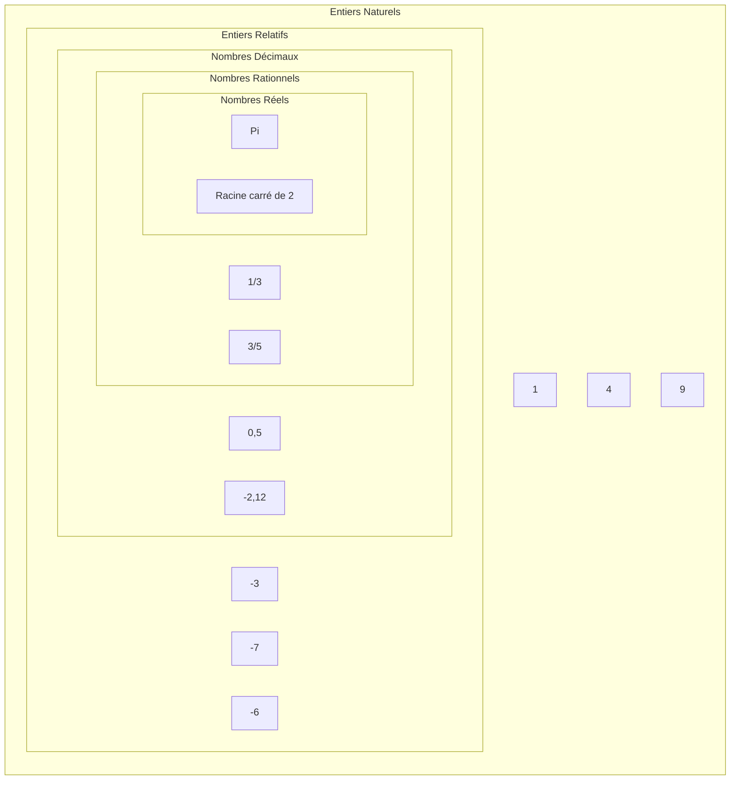
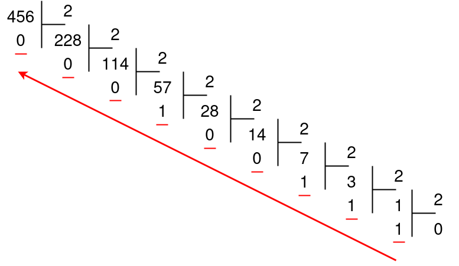

# Représentation des entiers naturels

## I. Les ensembles de nombres (Rappel)

## II. Définitions

Un *nombre* désigne une quantité.

La *représentation* d'un nombre est le symbole que nous lui associons.

Il existe plusieurs représentations pour un même nombre.

Par exemple le chiffre cinq peut s'écrire : $5$, $cinq$, $V$, ⚄, ...

## III. Représentation décimale

### a) Dix symboles

Nous, humains, utilisons usuellement la *représentation décimale* des nombres (Parce que nous avons dix doigts).

C'est-à-dire que, pour écrire un nombre dans cette représentation, nous avons à disposition dix symboles dans cet ordre : $0$, $1$, $2$, $3$, $4$, $5$, $6$, $7$, $8$ et $9$.

Ce qui correspond à la *base dix*.

### b) Séquence

Un nombre en base dix est une *séquence* de symboles compris entre $0$ et $9$.

Dans cette représentation, les symboles sont organisés selon leur poids : le chiffre de poids zéro appelé le chiffre des unités, le chiffre de poids un appelé le chiffre des dizaines, le chiffre de poids deux appelé le chiffre des centaines ...

| Séquence $456$ | $4$ | $5$ | $6$ |
| --- | --- | --- | --- |
| Poids des chiffres | Poids deux | Poids un | Poids zéro |

### c) Notation

Une nombre en base dix se note $456_{10}$

##### Application 1

Indiquer les poids de chacun des chiffres de la séquence $13098_{10}$.

## IV. Représentation binaire

### a) Deux symboles

Un ordinateur ne comprend que les $0$ (tension basse) et les $1$ (tension haute).

Un ordinateur utilise alors la *base deux* qui ne contient que deux symboles : $1$ et $0$.

Nous parlons alors de *représentation binaire*.

### b) Séquence

Un nombre en base deux est une *séquence* de symboles de $0$ et de $1$.

Dans cette représentation, les symboles sont appelés *bits* et sont également organisés selon leur place : le bit de poids zéro, le bit de poids un, le bit de poids deux ...

Comme pour la représentation décimale, le bit de poids le plus faible est situé à droite de la séquence.

| Séquence $101$ | $1$ | $0$ | $1$ |
| --- | --- | --- | --- |
| Poids des chiffres | Poids deux | Poids un | Poids zéro |

Nous appelons *octet* un regroupement de huit bits.

### c) Notation

Un nombre en base deux se note $101_2$

##### Application 2

Indiquer les poids de chacun des chiffres de la séquence $10101110_2$.

## V. Représentation hexadécimale

### a) Seize symboles

Parfois, nous utilisons la représentation hexadécimale car elle correspond à la représentation binaire sur quatre bits et nous fais gagner ainsi de la place et du temps.

Nous parlons alors de *base seize* et ses symboles sont : $0$, $1$, $2$, $3$, $4$, $5$, $6$, $7$, $8$, $9$, $A$, $B$, $C$, $D$, $E$ et $F$.

### b) Séquence

Un nombre en base seize est une *séquence* de symboles compris entre $0$ et $F$.

Comme pour les représentation précédentes :

| Séquence $A09$ | $A$ | $0$ | $9$ |
| --- | --- | --- | --- |
| Poids des chiffres | Poids deux | Poids un | Poids zéro |

### c) Notation

Un nombre en base seize se note $A09_{16}$

##### Application 3

Indiquer les poids de chacun des chiffres de la séquence $1AA910F_{16}$.

## VI. Récapitulatif des représentations

| Représentation binaire | Représentation décimale | Représentation hexadécimale |
| :---: | :---: | :---: |
| $0$ | $0$ | $0$ |
| $1$ | $1$ | $1$ |
| $10$ | $2$ | $2$ |
| $11$ | $3$ | $3$ |
| $100$ | $4$ | $4$ |
| $101$ | $5$ | $5$ |
| $110$ | $6$ | $6$ |
| $111$ | $7$ | $7$ |
| $1000$ | $8$ | $8$ |
| $1001$ | $9$ | $9$ |
| $1010$ | $10$ | $A$ |
| $1011$ | $11$ | $B$ |
| $1100$ | $12$ | $C$ |
| $1101$ | $13$ | $D$ |
| $1110$ | $14$ | $E$ |
| $1111$ | $15$ | $F$ |

## VII. Changements de base

Lorsque nous programmons, nous écrivons les nombres dans notre représentation (décimale) or l'ordinateur ne comprend que la représentation binaire des nombres.

Il y a donc nécessairement un changement de base : de la base dix vers la base deux.

Et de la base deux vers la base dix lorsque nous lui demandons d'afficher un nombre.

### a) De la base dix vers la base deux

Nous pouvons bien sûr nous référer au tableau ci-dessus, mais il existe une méthode pour changer la représentation d'un nombre en base deux.

Cette méthode consiste à diviser euclidiennement et succéssivement le nombre par deux jusqu'à atteindre $0$ et de récupérer les restes.

Ainsi $456_{10} = 111001000_2$ :

##### Application 4

Trouver la représentation binaire de $291_{10}$.

### b) De la base deux vers la base dix

La méthode consiste à multiplier chaque bit à un de la séquence par deux puissance son poids.

Ainsi : $111001000_2 = (1 * 2^8) + (1 * 2^7) + (1 * 2^6) + (1 * 2^3) = 456_{10}$

##### Application 5

Trouver la représentation décimale de $1011011_2$.

### c) De la base deux vers la base seize

La méthode consiste à regrouper les bits par bloc de quatre et de convertir chaque groupe en hexadécimal.

Ainsi : $111001000_2 = 1C8_{16}$

| $1$ | 1100 | $1000$ |
| --- | --- | --- |
| $1$ | $C$ | $8$ |

##### Application 6

Trouver la représentation hexadécimale de $1011011_2$.
_____________________

[Feuille d'exercices](./Exercices/Exercices_representation_des_entiers_naturels.md)

_____________________

[Sommaire](./../README.md)