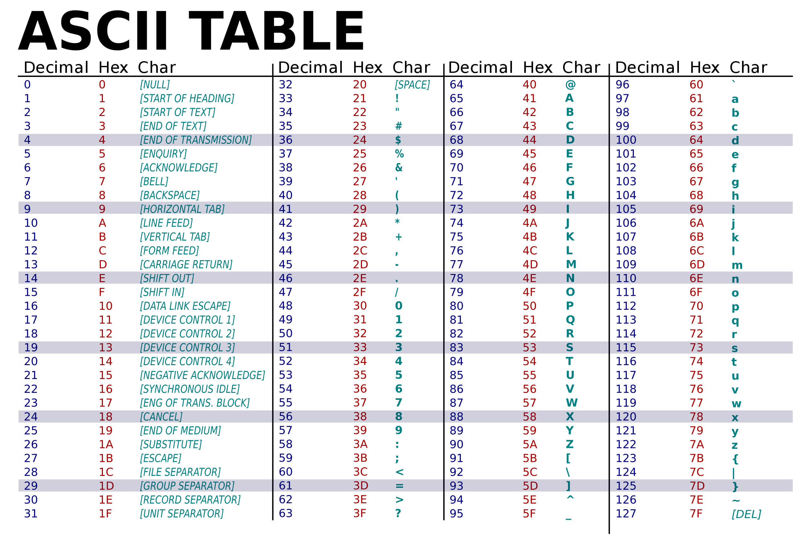

# Représentation des textes

Comment est représenté une chaîne de caractères ou même un caractère sur une machine ?

Nous savons que le langage compris par un ordinateur est le langage binaire, des 0 et des 1. En théorie, pour que l'utilisateur et la machine se comprennent, il suffirait d'associer chaque caractère avec une séquence unique de bits. Mais nous devons quand même respecter quelques contraintes :

- Toutes les machines doivent utiliser le même encodage
- Tous les caractères doivent être représentés y compris les caractères dits "non imprimables" comme le retour à la ligne
- L'encodage doit être le plus compact possible pour économiser la mémoire ou le volume des échanges sur le réseau

## I. Codage ASCII

Reprenant l'idée d'encoder chaque caractère associé à un numéro unique, l'ANSI ( *American National Standards Institute* ) propose au début des années 60 une norme de codage appelée ASCII ( *American Standard Code for Information Interchange* ). Ainsi, les utilisateurs pouvaient communiquer entre eux avec le même encodage !

Cette norme définit un jeu de 128 caractères où chaque caractère est représenté par un octet.



La table ASCII peut représenter :

- Toutes les lettres de l'alphabet latin en majuscule et minuscule
- Les chiffres de 0 à 9
- Quelques signes de ponctuation
- Des opérateur arithmétiques
- Des caractères spéciaux ( Espace, Retour à la ligne, etc...)

Un texte codé en ASCII est donc simplement une suite d'octets correspondants à cette séquence de caractères.

Sur la table ASCII, le caractère ``'a'`` correspond bien au nombre 97 en décimal et 61 en hexadécimal.

**Application 1** 

Sur feuille, traduire ci-dessous la séquence hexadécimale en texte grâce à la table ASCII :

*43 65 63 69 20 65 73 74 20 75 6E 20 74 65 78 74 65 21* 

En python, il est possible de faire traduire automatiquement un caractère en code ASCII :

```python
>>> ord('a')
97
>>> hex(ord('a'))
'0x61'
```

La fonction ``ord`` prend en paramètre un caractère et renvoie la valeur décimale correspondant à l'encodage ASCII.

La fonction ``hex`` prend en paramètre un nombre décimal et le traduit en nombre hexadécimal.

Il est également possible de traduire réciproquement un nombre décimal en son caractère correspondant :

```python
>>> chr(97)
'a'
```

> En python, une chaîne de caractères est de type ``str`` , il est possible d'effectuer un parcours par valeur sur cette chaîne comme pour une liste.

**Application 2**

En python, écrire une fonction ``printASCII(chaine)``  prenant en paramètre une chaîne de caractère en affiche son code ASCII décimal correspondant.

**Application 3** 

L'algorithme **rot13** est un algorithme de chiffrement qui consiste à décaler de 13 caractères chaque lettres d'un texte. Par exemple, le mot ``python`` est transformé en ``clguba`` . Cet algorithme ne décale pas les caractères "non imprimables" donc ne code pas les espaces.

Ecrire une fonction ``decode_rot13(chaine)`` permettant de décoder les chaînes de caractères chiffrés par l'algorithme de **rot13**. Essayez votre fonction en décodant : ``YbXR WR `bV` a\[ ]R_R`` 

**Application 4**

Ecrire une fonction ``change_casse(caractere)`` prenant en paramètre un caractère et renvoie ce même caractère dans l'autre casse.

```python
>>> change_casse('A')
'a'
>>> change_casse('z')
'Z'
```

## II. Normes ISO 8859

Malheureusement, l'encodage ASCII ne permet pas d'imprimer tous les caractères, il manque les caractères accentués, les symboles de monnaies et même les autres alphabets !

Pour remédier à ce problème, l'ISO ( *Organisation Internationale de Normalisation* ) a proposé la norme ISO 8859, une extension de l'ASCII qui utilise les huit bits de chaque octet pour représenter les caractères. Au total, on pourrait alors représenter 256 caractères, ce qui reste toujours insuffisant.

La norme ISO 8859 définit alors plusieurs pages de correspondances notées ISO 8859-*n* où *n* est le numéro de la page.

| Code ISO           | Zone                          |
| ------------------ | ----------------------------- |
| 8859-1 (latin-1)   | Europe Occidentale            |
| 8859-2 (latin-2)   | Europe Centrale ou de l'Est   |
| 8859-3 (latin-3)   | Europe du Sud                 |
| 8859-4 (latin-4)   | Europe du Nord                |
| 8859-5             | Cyrillique                    |
| 8859-6             | Arabe                         |
| 8859-7             | Grec                          |
| 8859-8             | Hébreu                        |
| 8859-9 (latin-5)   | Turc, Kurde                   |
| 8859-10 (latin-6)  | Nordique                      |
| 8859-11            | Thaï                          |
| 8859-12            | Devanagari (projet abandonné) |
| 8859-13 (latin-7)  | Balte                         |
| 8859-14 (latin-8)  | Celtique                      |
| 8859-15 (latin-9)  | Révision du latin-1 (avec €)  |
| 8859-16 (latin-10) | Europe du Sud-Est             |

## III. Unicode

Bien que les pages ISO 8859-*n* permettent l'encodage d'un grand nombre de caractères, elles ne conviennent pas par exemple quand on souhaite écrire un texte avec un mélange de caractères depuis différentes pages.

Pour remplacer l'utilisation de ces pages, l'ISO a définit un jeu universel de caractères. Il associe chaque caractère un nom unique ainsi qu'un numéro ( entier positif en base 10 appelé *point de code* ). On utilise la notation ``U+xxxx`` pour désigner les points de code où chaque x est un chiffre hexadécimal
