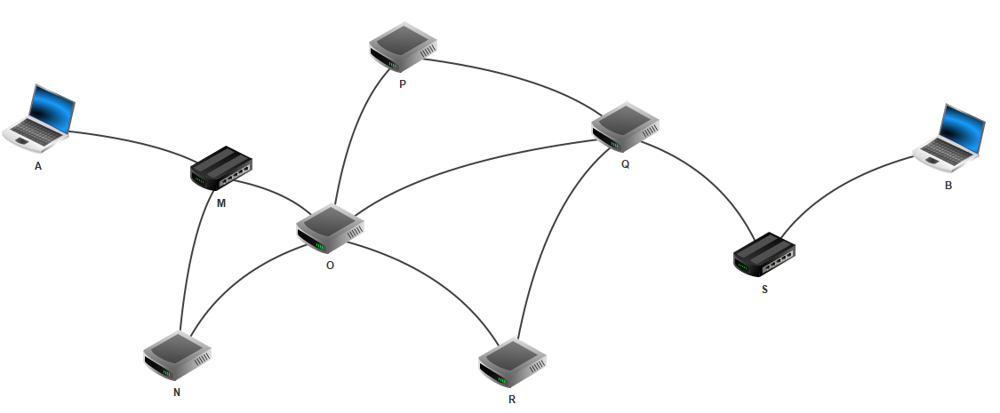

# Les Dictionnaires

## I. Définition

Les dictionnaires sont des structures de données **non ordonnées**. On n'accède donc pas aux valeurs via leurs indices (ou positions dans la structure).

On accède à une valeur via sa **clé**. Toutes les clés doivent donc être différentes.

Un dictionnaire est un ensemble de paires **clé / valeur**.

Les clés et les valeurs peuvent être de tout type.

## II. Créer, Ajouter, Accéder et Supprimer

### a) Créer

Un dictionnaire s'écrit en Python avec des accolades.

On peut créer un dictionnaire vide :

```python
>>> dico = {}
```

Ou le créer directement avec des clés et des valeurs :

```python
>>> dico = {'triangle' : 3, 'quadrilatère' : 4, 'pentagone' : 5}
>>> dico2 = {3 : 'triangle', 4 : 'quadrilatère', 8 : 'octogone'}
```

*Remarque : Les paires clé / valeur sont séparées par des virgules.*

*Les valeurs sont associées aux clés avec le deux points.*

*Les clés et valeurs peuvent être de n'importe quel type.*

### b) Ajouter

On ajoute dans un dictionnaire une paire clé / valeur avec l'affectation de la valeur à la clé  :

```python
>>> dico['octogone'] = 8
>>> dico2[5] = 'pentagone'
```

### c) Accéder

A partir d'une clé, on peut accéder à sa valeur correspondante :

```python
>>> dico['pentagone']
5
>>> dico2[8]
'octogone' 
```

### d) Supprimer

On supprime une paire clé / valeur d'un dictionnaire avec le mot ``del`` sur la clé :

```python
>>> del dico['triangle']
```

-------------

### Application 1

Sur Thonny, créer un dictionnaire vide `carte_id`.

### Application 2

A partir du dictionnaire vide ``carte_id``, écrire :

- l'instruction permettant d'ajouter au dictionnaire votre nom associé à la clé ``"nom"``.

- l'instruction permettant d'ajouter au dictionnaire votre prénom associé à la clé `"prenom"`.

- l'instruction permettant d'ajouter au dictionnaire votre âge associé à la clé `"age"`.

- l'instruction permettant d'ajouter au dictionnaire votre nationnalité associé à la clé `"nationnalite"`.

- l'instruction permettant d'ajouter au dictionnaire votre genre associé à la clé `"genre"`.

### Application 3

A partir du dictionnaire `carte_id`, écrire :

- l'instruction permettant d'afficher votre nom.

- l'instruction permettant d'afficher votre prénom.

- l'instruction permettant d'afficher votre l'âge.

### Application 4

Finalement, écrire :

- l'instruction permettant de supprimer le genre de ``carte_id``.

-----

## III. Parcourir un dictionnaire

Grâce aux méthode `keys()`, `values()` et `items()`. On peut parcourir un dictionnaire respectivement par ses clés, par ses valeurs ou par ses paires clé / valeur.

### a) Par les clés

Avec la méthode ``keys()``, on peut récupérer sous forme de séquence l'ensemble des clés du dictionnaire :

```python
>>> dico.keys()
dict_keys(['triangle', 'quadrilatère', 'pentagone', 'octogone'])
```

On parcourt simplement les éléments de la séquence renvoyée par la méthode `keys()` :

```python
for cle in dico.keys():
    print(cle)
```

### c) Par les valeurs

Avec la méthode `values()`, on peut récupérer sous forme de séquence l'ensemble des valeurs du dictionnaire :

```python
>>> dico.values()
dict_values([3, 4, 5, 8])
```

On parcourt simplement les éléments de la séquence renvoyée par la méthode `values()` :

```python
for val in dico.values():
    print(val)
```

### d) Par les paires clé / valeur

Avec la méthode ``items()``, on peut récupérer sous forme de séquence l'ensemble des paires clé / valeur (mis en tuple) du dictionnaire :

```python
>>> dico.items()
dict_items([('triangle', 3), ('quadrilatère', 4), ('pentagone', 5), ('octogone', 8)])
```

On parcourt simplement les éléments de la séquence renvoyée par la méthode `items()` :

```python
for cle, val in dico.items():
    print(cle)
    print(val)
```

*Remarque : Les éléments de la séquence renvoyée par la méthode `items()` étant des tuples, la variable `cle` et la variable `val` contiennent respectivement le premier élément et le second élément du tuple (le premier étant la clé et le second la valeur).*

-----------

### Application 5

A l'aide d'un parcours par clés, afficher toutes les clés du dictionnaire ``carte_id``.

### Application 6

A l'aide d'un parcours par valeurs, afficher toutes les valeurs du dictionnaire `carte_id`.

### Application 7

A l'aide d'un parcours par paires clé / valeur, afficher toutes les clés et les valeurs du dictionnaire `carte_id`.

------------------

## IV. Longueur et appartenance

### a) Longueur

La longueur d'un dictionnaire est le nombre de clé présentes dans le dictionnaire et se récupère avec la fonction ``len`` :

```python
>>> len(dico)
4
```

### b) Appartenance

Le test d'appartenance à un dictionnaire s'applique aux clés. Il se réalise avec le mot ``in`` et renvoie un booléen :

```python
>>> 'quadrilatère' in dico
True
```

 --------------------------

## Exercices

### Exercice 0 Dictionnaire Larousse (Facile)

Les dictionnaires en Python sont inspirés des dictionnaires papiers.

a) Ecrire, sur Thonny, un dictionnaire ``larousse`` contenant comme clé le mot ``téléphone`` et comme valeur sa définition : ``Dispositif qui permet de correspondre à distance par la voix.``

b) Accèder et afficher la définition de ``téléphone``.

c) A ce dictionnaire, ajouter le mot ``maison`` et sa définition.

d) A l'aide d'une boucle, afficher uniquement les mots.

e) A l'aide d'une boucle, afficher uniquement les définitions.

f) A l'aide d'une boucle, afficher les mots et leurs définitions.

g) Supprimer le mot ``maison`` et sa définition du dictionnaire.

### Exercice 1 Box Office

Le nombre d'entrées pour chaque film sorti cette année au cinéma est stocké dans un dictionnaire : ``box_office = {'avatar 2' : 7468558, 'top gun' : 6676052, 'jurassic world 2' : 3480898, 'the batman' : 3032965}`` 

a) Ecrire l'instruction permettant de récupérer le nombre d'entrées du film Top Gun.

b) Ecrire l'instruction permettant d'ajouter au box office le film Doctor Strange qui comptabilise 3 270 342 entrées.

c) Ecrire l'instruction permettant d'ajouter 256 entrées au film Avatar 2.

d) De deux façons différentes, écrire une fonction `affiche_box_office(box_office : dict)` permettant d'afficher proprement ligne par ligne les noms des films et leur nombre d'entrées :

```python
>>> affiche_box_office(box_office)
'Le film avatar 2 comptabilise 7468558 entrées'
'Le film top gun comptabilise 6676052 entrées'
'Le film jurassic world 2 comptabilise 3480898 entrées'
'Le film the batman comptabilise 3032965 entrées'
'Le film doctor strange comptabilise 3270342 entrées'
```

e) Ecrire une fonction ``nombre_entree_total(box_office : dict)->int`` qui prend en paramètre le dictionnaire du box office et renvoie la somme de toutes les entrées :

```python
>>> total = nombre_entree_total(box_office)
>>> total
23928815
```

f) Ecrire une fonction ``film_le_moins_vu(box_office : dict)->str`` qui prend en paramètre un dictionnaire et renvoie le nom du film ayant eu le moins d'entrées :

```python
>>> film = film_le_moins_vu(box_office)
>>> film
'the batman'
```

### Exercice 2 Inversion clé valeur

Ecrire une fonction ``inversion(dico : dict)->dict`` qui prend en paramètre un dictionnaire et renvoie un dictionnaire dont les clés sont devenus les valeurs et les valeurs, les clés :

```python
>>> dico = {'a' : 1, 'b' : 2, 'c' : 3}
>>> dico_inverse = inversion(dico)
>>> dico_inverse
{1 : 'a', 2 : 'b', 3 : 'c'}
```

### Exercice 3 Conversion

a) Ecrire une fonction `list_to_dico(liste : list)->dict` qui prend en paramètre une liste de tuples et renvoie un dictionnaire où les clés sont les premiers éléments des tuples et où les valeurs sont les deuxièmes éléments des tuples :

```python
>>> liste_de_tuples = [('lundi', 'monday'), ('mardi', 'tuesday'), ('mercredi', 'wednesday')]
>>> dico = list_to_dico(liste_de_tuples)
>>> dico
{'lundi' : 'monday', 'mardi' : 'tuesday', 'mercredi' : 'wednesday'}
```

b) Ecrire une fonction `dico_to_list(dico : dict)->list` qui prend en paramètre un dictionnaire et renvoie une liste de tuples dont les premiers éléments sont les clés et les deuxièmes éléments, les valeurs :

```python
>>> dico
{'lundi' : 'monday', 'mardi' : 'tuesday', 'mercredi' : 'wednesday'}
>>> liste_de_tuples = dico_to_list(dico)
>>> liste_de_tuples
[('lundi', 'monday'), ('mardi', 'tuesday'), ('mercredi', 'wednesday')]
```

### Exercice 4 Chiffrement

On dispose de la variable `caracteres = ['a','b','c','d','e','f','g','h','i','j','k','l','m','n','o','p','q','r','s','t','u','v','w','x','y','z']` contenant tous les caractères de l'alphabet.

Et de la variable ``caracteres_alea = random.sample(caracteres, len(caracteres))`` contenant tous les caractères de l'alphabet mais dans un ordre aléatoire.

L'objectif de cet exercice est de chiffrer un texte.

Pour celà, nous allons créer un dictionnaire de chiffrement où des caractères correspondent à d'autres caractères.

Nous allons faire correspondre, par exemple, le premier caractère de ``caracteres`` avec le premier de ``caracteres_alea``, puis le second de ``caracteres`` avec le seconde de ``caracteres_alea``, etc...

a) Ecrire une fonction ``creer_dico_chiffrement(caracteres : list, caracteres_alea : list)->dict`` qui prend en paramètres les listes des caractères et renvoie un dictionnaire où, dans l'ordre, les caractères de ``caracteres`` sont associés aux caractères de ``caracteres_alea`` :

```python
>>> caracteres
['a','b','c','d','e','f','g','h','i','j','k','l','m','n','o','p','q','r','s','t','u','v','w','x','y','z']
>>> caracteres_alea
['e','r','a','n','o','x','q','w','p','d','v','k','f','j','l','c','y','b','g','s','z','i','h','t','m','u']
>>> dico_chiffrement = creer_dico_chiffrement(caracteres, caracteres_alea)
>>> dico_chiffrement
{'a': 'e', 'b': 'r', 'c': 'a', 'd': 'n', 'e': 'o', 'f': 'x', 'g': 'q', 'h': 'w', 'i': 'p', 'j': 'd', 'k': 'v', 'l': 'k', 'm': 'f', 'n': 'j', 'o': 'l', 'p': 'c', 'q': 'y', 'r': 'b', 's': 'g', 't': 's', 'u': 'z', 'v': 'i', 'w': 'h', 'x': 't', 'y': 'm', 'z': 'u'}
```

Maintenant que nous avons crée le dictionnaire de chiffrement, nous allons pouvoir nous en servir pour chiffrer un texte.

b) Ecrire une fonction `chiffrer(dico_chiffrement : dict, chaine : str)->str` qui prend en paramètres le dictionnaire de chiffrement et une chaîne de caractères et renvoie sa chaîne chiffrée :

```python
>>> chaine = 'bonjour'
>>> chaine_chiffree = chiffrer(dico_chiffrement, chaine)
>>> chaine_chiffree
'rljdlzb'
```

c) Ecrire une fonction ``dechiffrer(dico_chiffrement : dict, chaine_chiffree : str)->str`` qui prend en paramètres le dictionnaire de chiffrement et une chaîne de caractères chiffrée et renvoie sa chaîne déchiffrée :

```python
>>> chaine_chiffree = 'rljdlzb'
>>> chaine_dechiffree = dechiffrer(dico_chiffrement, chaine_chiffree)
>>> chaine_dechiffree
'bonjour'
```

### Exercice 5 Occurences

Ecrire une fonction `occurences(chaine : str)->dict` qui prend en paramètre une chaîne de caractères et renvoie un dictionnaire dont les clés sont des caractères de la chaîne et les valeurs le nombre de fois qu'apparaissent ces caractères :

```python
>>> chaine = 'bienvenue'
>>> occ = occurences(chaine)
>>> occ
{'b' : 1, 'i' : 1, 'e' : 3, 'n' : 2, 'v' : 1, 'u' : 1}
```

### Exercice 6 Pew pew

L'univers de Star Wars est riche, on décide de stocker les informations des personnages dans un dictionnaire de dictionnaires pour faciliter l'accès aux informations.

a) Ecrire une fonction ``dico_star_wars(liste_personnages : list)->dict`` qui prend en paramètre une liste de listes contenant des informations sur les personnages de Star Wars et renvoie un dictionnaire de dictionnaires où les clés sont les noms des personnages et les valeurs les dictionnaires contenant les informations restantes :

```python
>>> personnages_star_wars = [['yoda','900','jedi'],
    ['dark vador','28','sith'],
    ['obi wan','35','jedi'],
    ['dark sidious','66','sith'],
    ['dark maul','23','sith'],
    ['luke','19','jedi']]
>>> dico_star_wars = dico_personnages(personnages_star_wars)
>>> dico_star_wars
{'yoda' : {'age': '900', 'ordre': 'jedi'}, 
'dark vador' : {'age': '28', 'ordre': 'sith'}, 
'obi wan' : {'age': '35', 'ordre': 'jedi'}, 
'dark sidious' : {'age': '66', 'ordre': 'sith'}, 
'dark maul' : {'age': '23', 'ordre': 'sith'}, 
'luke' : {'age': '19', 'ordre': 'jedi'}}
>>> dico_star_wars['yoda']
{'age': '900', 'ordre': 'jedi'}
```

b) A partir du dictionnaire ``dico_star_wars``, écrire l'instruction permettant d'afficher l'âge de Yoda.

c) Ecrire une fonction ``all_jedis(dico_personnages : dict)->list`` qui prend en paramètre le dictionnaire de tous les personnages et renvoie sous forme de liste le nom des personnages qui appartiennent à l'ordre Jedi :

```python
>>> jedis = all_jedis(dico_personnages)
>>> jedis
['yoda', 'obi wan', 'luke']
```

### Exercice 7 AZERTY

On peut voir un clavier d'ordinateur comme un tableau à deux dimensions dans lequel chaque case contient un caractère :

| **a** | **z** | **e** | **r** | **t** | **y** | **u** | **i** | **o** | **p** |
| ----- | ----- | ----- | ----- | ----- | ----- | ----- | ----- | ----- | ----- |
| **q** | **s** | **d** | **f** | **g** | **h** | **j** | **k** | **l** | **m** |
| **<** | **w** | **x** | **c** | **v** | **b** | **n** | **,** | **;** | **:** |

En Python, on peut modéliser ce tableau sous forme de liste de listes :

```python
>>> liste_clavier = [['a', 'z', 'e', 'r', 't', 'y', 'u', 'i', 'o', 'p'],
      ['q', 's', 'd', 'f', 'g', 'h', 'j', 'k', 'l', 'm'],
      ['<', 'w', 'x', 'c', 'v', 'b', 'n', ',', ';', ':']]
```

L'objectif de cet exercice est de réaliser une fonction permettant de calculer la distance entre deux touches du clavier.

a) Ecrire une fonction ``coord_clavier(liste_clavier : list)->dict`` qui prend en paramètre une liste de listes correspondant à un clavier et renvoie un dictionnaire dont les clés sont les caractères du clavier et les valeurs sont les coordonnées de la touche.

```python
>>> dico_clavier = coord_clavier(liste_clavier)
>>> dico_clavier
{'a': (0, 0), 'z': (0, 1), 'e': (0, 2), 'r': (0, 3), 't': (0, 4), 'y': (0, 5), 'u': (0, 6), 'i': (0, 7), 'o': (0, 8), 'p': (0, 9), 'q': (1, 0), 's': (1, 1), 'd': (1, 2), 'f': (1, 3), 'g': (1, 4), 'h': (1, 5), 'j': (1, 6), 'k': (1, 7), 'l': (1, 8), 'm': (1, 9), '<': (2, 0), 'w': (2, 1), 'x': (2, 2), 'c': (2, 3), 'v': (2, 4), 'b': (2, 5), 'n': (2, 6), ',': (2, 7), ';': (2, 8), ':': (2, 9)}
```

b) Ecrire une fonction ``distance_touches(dico_clavier : dict, caractere_1 : str, caractere_2)->int`` qui prend en paramètres le dictionnaire et deux caractères et renvoie la distance qui les sépare sur le clavier.

*Rappel : La distance entre deux points $A(x_1, y_1)$ et $B(x_2, y_2)$ se calcule : $\sqrt[]{(x_2 - x_1)^2 + (y_2 - y_1)^2}$*

```python
>>> distance_touches(dico_clavier, 'a', 'n')
6.324555320336759
>>> distance_touches(dico_clavier, 'a', 'b')
5.385164807134504
```

### Exercice 8 Fréquences (Difficile)

L'objectif est d'afficher la fréquence des mots pour un nombre de lettre donné.

Nous allons travailler dans cet exercice sur le texte d'Edmond Rostand : la célèbre Tirade du nez tiré de l'oeuvre de Cyrano de Bergerac :

```
Ah ! non ! c’est un peu court, jeune homme !
On pouvait dire… Oh ! Dieu ! … bien des choses en somme…
En variant le ton, – par exemple, tenez :
Agressif : « Moi, monsieur, si j’avais un tel nez,
Il faudrait sur-le-champ que je me l’amputasse ! »
Amical : « Mais il doit tremper dans votre tasse
Pour boire, faites-vous fabriquer un hanap ! »
Descriptif : « C’est un roc ! … c’est un pic ! … c’est un cap !
Que dis-je, c’est un cap ? … C’est une péninsule ! »
Curieux : « De quoi sert cette oblongue capsule ?
D’écritoire, monsieur, ou de boîte à ciseaux ? »
Gracieux : « Aimez-vous à ce point les oiseaux
Que paternellement vous vous préoccupâtes
De tendre ce perchoir à leurs petites pattes ? »
Truculent : « Ça, monsieur, lorsque vous pétunez,
La vapeur du tabac vous sort-elle du nez
Sans qu’un voisin ne crie au feu de cheminée ? »
Prévenant : « Gardez-vous, votre tête entraînée
Par ce poids, de tomber en avant sur le sol ! »
Tendre : « Faites-lui faire un petit parasol
De peur que sa couleur au soleil ne se fane ! »
Pédant : « L’animal seul, monsieur, qu’Aristophane
Appelle Hippocampéléphantocamélos
Dut avoir sous le front tant de chair sur tant d’os ! »
Cavalier : « Quoi, l’ami, ce croc est à la mode ?
Pour pendre son chapeau, c’est vraiment très commode ! »
Emphatique : « Aucun vent ne peut, nez magistral,
T’enrhumer tout entier, excepté le mistral ! »
Dramatique : « C’est la Mer Rouge quand il saigne ! »
Admiratif : « Pour un parfumeur, quelle enseigne ! »
Lyrique : « Est-ce une conque, êtes-vous un triton ? »
Naïf : « Ce monument, quand le visite-t-on ? »
Respectueux : « Souffrez, monsieur, qu’on vous salue,
C’est là ce qui s’appelle avoir pignon sur rue ! »
Campagnard : « Hé, ardé ! C’est-y un nez ? Nanain !
C’est queuqu’navet géant ou ben queuqu’melon nain ! »
Militaire : « Pointez contre cavalerie ! »
Pratique : « Voulez-vous le mettre en loterie ?
Assurément, monsieur, ce sera le gros lot ! »
Enfin parodiant Pyrame en un sanglot :
« Le voilà donc ce nez qui des traits de son maître
A détruit l’harmonie ! Il en rougit, le traître ! »
– Voilà ce qu’à peu près, mon cher, vous m’auriez dit
Si vous aviez un peu de lettres et d’esprit
Mais d’esprit, ô le plus lamentable des êtres,
Vous n’en eûtes jamais un atome, et de lettres
Vous n’avez que les trois qui forment le mot : sot !
Eussiez-vous eu, d’ailleurs, l’invention qu’il faut
Pour pouvoir là, devant ces nobles galeries,
me servir toutes ces folles plaisanteries,
Que vous n’en eussiez pas articulé le quart
De la moitié du commencement d’une, car
Je me les sers moi-même, avec assez de verve,
Mais je ne permets pas qu’un autre me les serve.
```

Pour l'exercice, nous avons supprimé toute la ponctuation du texte :

```python
>>> tirade_du_nez = "ah non c est un peu court jeune homme on pouvait dire oh dieu bien des choses en somme en variant le ton par exemple tenez agressif moi monsieur si j avais un tel nez il faudrait sur le champ que je me l amputasse amical mais il doit tremper dans votre tasse pour boire faites vous fabriquer un hanap descriptif c est un roc c est un pic c est un cap que dis je c est un cap c est une péninsule curieux de quoi sert cette oblongue capsule d écritoire monsieur ou de boîte à ciseaux gracieux aimez vous à ce point les oiseaux que paternellement vous vous préoccupâtes de tendre ce perchoir à leurs petites pattes truculent ça monsieur lorsque vous pétunez la vapeur du tabac vous sort elle du nez sans qu un voisin ne crie au feu de cheminée prévenant gardez vous votre tête entraînée par ce poids de tomber en avant sur le sol tendre faites lui faire un petit parasol de peur que sa couleur au soleil ne se fane pédant l animal seul monsieur qu aristophane appelle hippocampéléphantocamélos dut avoir sous le front tant de chair sur tant d os cavalier quoi l ami ce croc est à la mode pour pendre son chapeau c est vraiment très commode emphatique aucun vent ne peut nez magistral t enrhumer tout entier excepté le mistral dramatique c est la mer rouge quand il saigne admiratif pour un parfumeur quelle enseigne lyrique est ce une conque êtes vous un triton naïf ce monument quand le visite t on respectueux souffrez monsieur qu on vous salue c est là ce qui s appelle avoir pignon sur rue campagnard hé ardé c est y un nez nanain c est queuqu navet géant ou ben queuqu melon nain militaire pointez contre cavalerie pratique voulez vous le mettre en loterie assurément monsieur ce sera le gros lot enfin parodiant pyrame en un sanglot le voilà donc ce nez qui des traits de son maître a détruit l harmonie il en rougit le traître voilà ce qu à peu près mon cher vous m auriez dit si vous aviez un peu de lettres et d esprit mais d esprit ô le plus lamentable des êtres vous n en eûtes jamais un atome et de lettres vous n avez que les trois qui forment le mot sot eussiez vous eu d ailleurs l invention qu il faut pour pouvoir là devant ces nobles galeries me servir toutes ces folles plaisanteries que vous n en eussiez pas articulé le quart de la moitié du commencement d une car je me les sers moi même avec assez de verve mais je ne permets pas qu un autre me les serve"
```

Puis, à l'aide de la méthode ``split()``, nous avons "coupé" les mots dans une liste :

```python
>>> liste_tirade_du_nez = tirade_du_nez.split(' ')
>>> liste_tirade_du_nez
['ah', 'non', 'c', 'est', 'un', 'peu', 'court', 'jeune', 'homme', 'on', 'pouvait', 'dire', 'oh', 'dieu', 'bien', 'des', 'choses', 'en', 'somme', 'en', 'variant', 'le', 'ton', 'par', 'exemple', 'tenez', 'agressif', 'moi', 'monsieur', 'si', 'j', 'avais', 'un', 'tel', 'nez', 'il', 'faudrait', 'sur', 'le', 'champ', 'que', 'je', 'me', 'l', 'amputasse', 'amical', 'mais', 'il', 'doit', 'tremper', 'dans', 'votre', 'tasse', 'pour', 'boire', 'faites', 'vous', 'fabriquer', 'un', 'hanap', 'descriptif', 'c', 'est', 'un', 'roc', 'c', 'est', 'un', 'pic', 'c', 'est', 'un', 'cap', 'que', 'dis', 'je', 'c', 'est', 'un', 'cap', 'c', 'est', 'une', 'péninsule', 'curieux', 'de', 'quoi', 'sert', 'cette', 'oblongue', 'capsule', 'd', 'écritoire', 'monsieur', 'ou', 'de', 'boîte', 'à', 'ciseaux', 'gracieux', 'aimez', 'vous', 'à', 'ce', 'point', 'les', 'oiseaux', 'que', 'paternellement', 'vous', 'vous', 'préoccupâtes', 'de', 'tendre', 'ce', 'perchoir', 'à', 'leurs', 'petites', 'pattes', 'truculent', 'ça', 'monsieur', 'lorsque', 'vous', 'pétunez', 'la', 'vapeur', 'du', 'tabac', 'vous', 'sort', 'elle', 'du', 'nez', 'sans', 'qu', 'un', 'voisin', 'ne', 'crie', 'au', 'feu', 'de', 'cheminée', 'prévenant', 'gardez', 'vous', 'votre', 'tête', 'entraînée', 'par', 'ce', 'poids', 'de', 'tomber', 'en', 'avant', 'sur', 'le', 'sol', 'tendre', 'faites', 'lui', 'faire', 'un', 'petit', 'parasol', 'de', 'peur', 'que', 'sa', 'couleur', 'au', 'soleil', 'ne', 'se', 'fane', 'pédant', 'l', 'animal', 'seul', 'monsieur', 'qu', 'aristophane', 'appelle', 'hippocampéléphantocamélos', 'dut', 'avoir', 'sous', 'le', 'front', 'tant', 'de', 'chair', 'sur', 'tant', 'd', 'os', 'cavalier', 'quoi', 'l', 'ami', 'ce', 'croc', 'est', 'à', 'la', 'mode', 'pour', 'pendre', 'son', 'chapeau', 'c', 'est', 'vraiment', 'très', 'commode', 'emphatique', 'aucun', 'vent', 'ne', 'peut', 'nez', 'magistral', 't', 'enrhumer', 'tout', 'entier', 'excepté', 'le', 'mistral', 'dramatique', 'c', 'est', 'la', 'mer', 'rouge', 'quand', 'il', 'saigne', 'admiratif', 'pour', 'un', 'parfumeur', 'quelle', 'enseigne', 'lyrique', 'est', 'ce', 'une', 'conque', 'êtes', 'vous', 'un', 'triton', 'naïf', 'ce', 'monument', 'quand', 'le', 'visite', 't', 'on', 'respectueux', 'souffrez', 'monsieur', 'qu', 'on', 'vous', 'salue', 'c', 'est', 'là', 'ce', 'qui', 's', 'appelle', 'avoir', 'pignon', 'sur', 'rue', 'campagnard', 'hé', 'ardé', 'c', 'est', 'y', 'un', 'nez', 'nanain', 'c', 'est', 'queuqu', 'navet', 'géant', 'ou', 'ben', 'queuqu', 'melon', 'nain', 'militaire', 'pointez', 'contre', 'cavalerie', 'pratique', 'voulez', 'vous', 'le', 'mettre', 'en', 'loterie', 'assurément', 'monsieur', 'ce', 'sera', 'le', 'gros', 'lot', 'enfin', 'parodiant', 'pyrame', 'en', 'un', 'sanglot', 'le', 'voilà', 'donc', 'ce', 'nez', 'qui', 'des', 'traits', 'de', 'son', 'maître', 'a', 'détruit', 'l', 'harmonie', 'il', 'en', 'rougit', 'le', 'traître', 'voilà', 'ce', 'qu', 'à', 'peu', 'près', 'mon', 'cher', 'vous', 'm', 'auriez', 'dit', 'si', 'vous', 'aviez', 'un', 'peu', 'de', 'lettres', 'et', 'd', 'esprit', 'mais', 'd', 'esprit', 'ô', 'le', 'plus', 'lamentable', 'des', 'êtres', 'vous', 'n', 'en', 'eûtes', 'jamais', 'un', 'atome', 'et', 'de', 'lettres', 'vous', 'n', 'avez', 'que', 'les', 'trois', 'qui', 'forment', 'le', 'mot', 'sot', 'eussiez', 'vous', 'eu', 'd', 'ailleurs', 'l', 'invention', 'qu', 'il', 'faut', 'pour', 'pouvoir', 'là', 'devant', 'ces', 'nobles', 'galeries', 'me', 'servir', 'toutes', 'ces', 'folles', 'plaisanteries', 'que', 'vous', 'n', 'en', 'eussiez', 'pas', 'articulé', 'le', 'quart', 'de', 'la', 'moitié', 'du', 'commencement', 'd', 'une', 'car', 'je', 'me', 'les', 'sers', 'moi', 'même', 'avec', 'assez', 'de', 'verve', 'mais', 'je', 'ne', 'permets', 'pas', 'qu', 'un', 'autre', 'me', 'les', 'serve']
```

a) Ecrire une fonction ``occurences_mot(liste_tirade_du_nez : list)->dict`` qui prend en paramètre une liste et renvoie un dictionnaire dont les clés sont les mots de la liste et les valeurs le nombre de fois qu'apparaissent ces mots.

b) Ecrire une fonction ``frequence_mot(dic : dict, taille_mot : int)->tuple`` qui prend en paramètres le dictionnaire des occurences des mots et un entier et renvoie un tuple contenant :

- le mot le plus fréquent d'une taille égale à ``taille_mot``

- le nombre de fois qu'apparaît ce mot

c) Ecrire une fonction ``affiche_frequences(liste_tirade_du_nez : list)`` qui prend en paramètre la liste des mots de la Tirade du nez et affiche les mots les plus fréquents (et leur occurence) pour une taille de mot allant de 1 à 10 :

```python
>>> affiche_frequences(liste_tirade_du_nez)
1 lettres : c avec 11 occurences
2 lettres : un avec 16 occurences
3 lettres : est avec 13 occurences
4 lettres : vous avec 16 occurences
5 lettres : votre avec 2 occurences
6 lettres : faites avec 2 occurences
7 lettres : appelle avec 2 occurences
8 lettres : monsieur avec 6 occurences
9 lettres : amputasse avec 1 occurences
10 lettres : descriptif avec 1 occurences
```

### Exercice 9 Réseau (Difficile)

L'objectif est de déterminer s'il est possible de communiquer à une machine $B$ depuis une machine $A$ sur un réseau.

Voici ci-dessous un exemple de réseau sur lequel nous allons travailler :



Vu comme cela, nous pouvons directement affirmer que la machine $A$ et $B$ peuvent communiquer. Mais en réalité, la machine $A$ ne le sait pas.

Nous allons donc programmer une fonction permettant de savoir si deux machines peuvent communiquer.

a) La première étape consiste à modéliser en Python le réseau. Pour cela, créer un dictionnaire ``reseau`` où les clés sont les noms de machine et leur valeurs sont, sous forme de liste, leurs voisins directs. Par exemple, la machine $R$ a comme voisins les machines $O$ et $Q$.

b) Ecrire une fonction ``voisins(machine : str)->list`` qui prend en paramètre le nom d'une machine et renvoie sous forme de liste ses voisins.

c) Ecrire une fonction ``chemin_aleatoire(machine_depart : str, machine_arrivee : str)->list`` qui prend en paramètres deux noms de machine et renvoie un chemin menant de la machine de départ à celle d'arrivée. L'idée est de parcourir aléatoirement les voisins jusqu'à trouver la machine d'arrivée :

```python
>>> a_vers_b = chemin_aleatoire('a', 'b')
>>> a_vers_b
['a', 'm', 'a', 'm', 'o', 'q', 'r', 'q', 's', 'b']
```

Bien sûr, comme on le voit avec l'exemple, l'idée de choisir aléatoirement un voisin n'est pas du tout optimisée pour la vie réelle.

d) Réfléchir à un moyen permettant de réduire le nombre d'allers-retours.
