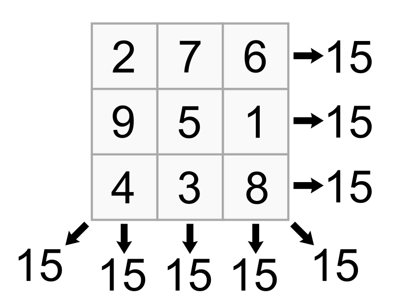

# Exercices

## Exercice 1

a) Écrire une fonction `affiche_liste_de_listes_parcours_indice(l : list)->None` qui prend en paramètre une liste de listes et affiche un par un tous les éléments de $l$ en effectuant le parcours par indice.

b) Écrire une fonction `affiche_liste_de_listes_parcours_element(l : list)->None` qui prend en paramètre une liste de listes et affiche un par un tous les éléments de $l$ en effectuant le parcours par élément.

## Exercice 2

Écrire une fonction `cree_table_de_multiplication(n : int)->list` qui prend en paramètre un entier et renvoie comme résultat une liste de listes représentant une table de multiplication de taille $n \times n$.

## Exercice 3

Ecrire une fonction `recherche_sequentielle(l : list, x : int)->bool` qui prend en paramètre une liste de listes d'entiers et un entier et renvoie comme résultat $True$ si $x$ est présent dans $l$, $False$ sinon.

## Exercice 4

Ecrire une fonction `somme_liste(l : list)->int` qui prend en paramètre une liste de listes d'entiers et renvoie la somme des éléments de $l$.

## Exercice 5 (Difficile)

Nous pouvons observer un clavier d'ordinateur comme un tableau à deux dimensions dans lequel chaque case contient un caractère :

| **a** | **z** | **e** | **r** | **t** | **y** | **u** | **i** | **o** | **p** |
| ----- | ----- | ----- | ----- | ----- | ----- | ----- | ----- | ----- | ----- |
| **q** | **s** | **d** | **f** | **g** | **h** | **j** | **k** | **l** | **m** |
| **<** | **w** | **x** | **c** | **v** | **b** | **n** | **,** | **;** | **:** |

En Python, nous modélisons ce tableau sous forme de liste de listes :

```python
>>> liste_clavier = [['a', 'z', 'e', 'r', 't', 'y', 'u', 'i', 'o', 'p'],
      ['q', 's', 'd', 'f', 'g', 'h', 'j', 'k', 'l', 'm'],
      ['<', 'w', 'x', 'c', 'v', 'b', 'n', ',', ';', ':']]
```

L'objectif de cet exercice est de réaliser une fonction permettant de calculer la distance entre deux touches du clavier.

a) Écrire une fonction ``coord_clavier(liste_clavier : list)->dict`` qui prend en paramètre une liste de listes correspondant à un clavier et renvoie un dictionnaire dont les clés sont les caractères du clavier et les valeurs sont les coordonnées de la touche.

```python
>>> dico_clavier = coord_clavier(liste_clavier)
>>> dico_clavier
{'a': (0, 0), 'z': (0, 1), 'e': (0, 2), 'r': (0, 3), 't': (0, 4), 'y': (0, 5), 'u': (0, 6), 'i': (0, 7), 'o': (0, 8), 'p': (0, 9), 'q': (1, 0), 's': (1, 1), 'd': (1, 2), 'f': (1, 3), 'g': (1, 4), 'h': (1, 5), 'j': (1, 6), 'k': (1, 7), 'l': (1, 8), 'm': (1, 9), '<': (2, 0), 'w': (2, 1), 'x': (2, 2), 'c': (2, 3), 'v': (2, 4), 'b': (2, 5), 'n': (2, 6), ',': (2, 7), ';': (2, 8), ':': (2, 9)}
```

b) Ecrire une fonction ``distance_touches(dico_clavier : dict, caractere_1 : str, caractere_2)->int`` qui prend en paramètres le dictionnaire et deux caractères et renvoie la distance qui les sépare sur le clavier.

Rappel : La distance entre deux points $A(x_1, y_1)$ et $B(x_2, y_2)$ se calcule : $\sqrt[]{(x_2 - x_1)^2 + (y_2 - y_1)^2}$.

```python
>>> distance_touches(dico_clavier, 'a', 'n')
6.324555320336759
>>> distance_touches(dico_clavier, 'a', 'b')
5.385164807134504
```

## Exercice 6 (Difficile)

Un carré magique d'ordre $n$ est un tableau de taille $n \times n$ dans lequel la somme des nombres de chaque ligne, chaque colonne et chaque diagonale est égale.

Par exemple :




Écrire une fonction `est_carre_magique(carre : list)->bool` qui prend en paramètre une liste de listes et renvoie $True$ s'il s'agit d'un carré magique, $False$ sinon.

```python
>>> est_carre_magique([2, 7, 6],
                      [9, 5, 1],
                      [4, 3, 8])
True
```

## Exercice 7 (Difficile)

L'objectif de cet exercice est de programmer le jeu du Tic-tac-toe aussi appelé Morpion.

Les règles du jeu du Tic-tac-toe sont disponibles [ici](https://fr.wikipedia.org/wiki/Tic-tac-toe).

Vous choisirez de programmer la version du jeu à deux joueurs ou la version du jeu à un joueur contre l'ordinateur.

Voici ci-dessous, quelques idées de fonctions à programmer pour débuter l'exercice.

a) Écrire une fonction `init_grille()->list` qui ne prend pas de paramètre et renvoie une liste de listes correspondant à la grille de jeu du Tic-tac-toe vide.

b) Écrire une fonction `affiche_grille(grille : list)->None` qui prend en paramètre une liste de listes et l'affiche proprement dans la console :

```python
>>> affiche_grille(init_grille())
|     |     |     |
|     |     |     |
|     |     |     |
```

c) Écrire une fonction `placer_pion(grille : list, pion : str, i : int, j : int)->None` qui prend en paramètre une liste de listes, un caractère correspondant au pion choisis et deux entiers correspondant aux indices de la position choisie :

```python
>>> affiche_grille(placer_jeton(init_grille(), 'X', 1, 1))
|     |     |     |
|     |  X  |     |
|     |     |     |
```

d) Écrire une fonction `test_victoire(grille : list)->bool` qui prend en paramètre une liste de listes et renvoie $True$ s'il s'agit d'un état de victoire, $False$ sinon.

_______________

[Sommaire](./../../README.md)