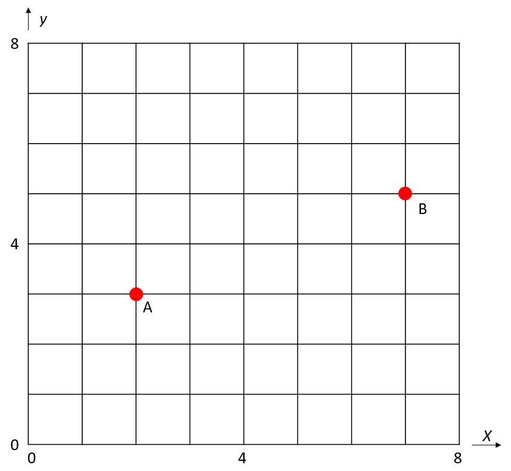

# Exercices

## Exercice 1

Expliquer pourquoi le programme suivant renvoie t-il une erreur ?

```python
tpl = ("bonjour", "goodbye", "guten tag")
tpl[1] = "hello"
```

## Exercice 2

Nous disposons d'un tuple : `fruits = ("banane", "raisin", "orange", ananas")` dont nous souhaitons afficher les éléments.

a) Ecrire une fonction `fruits_par_indice(fruits : tuple)->None`en python permettant d'afficher, en utilisant le parcours par indice, chaque fruit.

b) Ecrire une fonction `fruits_par_element(fruits : tuple)->None`en python permettant d'afficher, en utilisant le parcours par élément, chaque fruit.

## Exercice 3

a) Ecrire une fonction ``min(notes : tuple)->int`` qui prend en paramètre un tuple et renvoie l'élément le plus petit.

b) Ecrire une fonction `max(notes : tuple)->int` qui prend en paramètre un tuple et renvoie l'élément le plus grand.

c) Ecrire une fonction `moy(notes : tuple)->float` qui prend en paramètre un tuple et renvoie la moyenne des éléments.

d) Ecrire une fonction `min_max_moy(notes : tuple)->tuple` qui prend en paramètre un tuple et renvoie un tuple de trois éléments qui sont respectivement l'élément le plus petit, l'élément le plus grand et la moyenne des éléments.

## Exercice 4

Dans un plan orthonormé, un point est défini par ses coordonnées $x$ et $y$.

La distance entre deux points $A(x_1, y_1)$ et $B(x_2, y_2)$ se calcule : $\sqrt[]{(x_2 - x_1)^2 + (y_2 - y_1)^2}$



Par exemple, la distance entre le point $A$ et $B$ dans le plan ci-dessus est $5,4$.

Ecrire une fonction `distance(point_a : tuple, point_b : tuple)->float` qui prend en paramètres deux points de coordonnées $(x, y)$ et renvoie la distance entre ces deux points.

*Rappel : Pour utiliser la racine carrée en Python : ``from math import sqrt``*

## Exercice 5

Le négatif d'une image est une image dont les couleurs RGB des pixels sont les couleurs complémentaires des pixels originaux :


Pour le faire automatiquement, nous allons nous servir d'un programme utilisant le module PIL.

a) Télécharger l'image [logo_python.png](./../img/logo_python.png).

b) Télécharger et ouvrir le programme [negatif_img.py](./../src/negatif_img.py) dans votre répertoire de travail.

b) Remplacer les 'A COMPLETER' dans le programme donné par votre code pour obtenir le négatif de l'image.

## Exercice 6

Voici, ci-dessous, une fonction permettant d'échanger deux éléments d'une liste :

```python
def swap(liste : list, i1 : int, i2 : int):
    tmp = liste[i1]
    liste[i1] = liste[i2]
    liste[i2] = tmp
```

Ecrire une fonction ``swap2(liste : list, i1 : int, i2 : int)->None`` qui prend en paramètre une liste et deux indices et échange les valeurs situés à ces deux indices.

Le corps de la fonction devra s'écrire sur une seule ligne.

## Exercice 7 (Difficile)

Nous disposons de la variable ``semaine`` qui est une liste dont les éléments sont des tuples à deux éléments qui respectivement un jour de la semaine et un nombre d'heures de cours :

```python
>>> semaine = [("lundi" , 5), ("mardi", 2), ("mercredi", 8), ("jeudi", 6), ("vendredi", 3)]
```

a) Ecrire une fonction `total_heures(semaine : list)->int` qui prend en paramètre une liste et renvoie le nombre total d'heures de cours :

```python
>>> total_heures(semaine)
24
```

b) Ecrire une fonction ``journees_heures_inferieur_a_4(semaine : list)->list`` qui prend en paramètre une liste et renvoie une liste de tuple constitué des jours de la semaine où le nombre d'heures de cours est inférieur à 4 :

```python
>>> journee_heures_inferieur_a_4(semaine)
[('mardi', 2), ('vendredi', 3)]
```

________________

[Sommaire](./../../README.md)