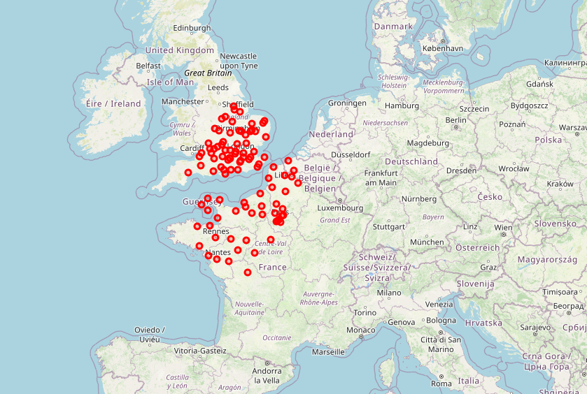

# Activité Mayday mayday

Nature : Branchée.

Matériel : Module `folium`.

Prérequis : [Fichiers CSV](Fichiers_csv.md), [Recherche dans une table](Recherche_dans_une_table.md), [Tri d'une table](Tri_d_une_table.md) et [Fusion d'une table](Fusion_de_tables.md).

À faire : Seul.

## I. Objectif 

L'objectif de cette activité est de développer une application exploitant des données existantes.

## II. Contexte

Incarnant le co-pilote d'un avion en plein vol, vous remarquez la défectuosité d'un des réacteurs et prevenez le pilote.

Celui-ci vous demande d'établir une carte indiquant les aéroports les plus proches afin de se poser en urgence.

## III. Installation

Le module `folium` est un module permettant de placer des points sur une carte interractive du monde à partir d'un couple de coordonnées.

Sa documentation est disponible [ici](https://python-visualization.github.io/folium/latest/getting_started.html)

a) Installer la bibliothèque `folium` :

Pour l'installer :

- Cliquer sur `Outils` puis `Open System shell`.

- Écrire dans la console qui vient de s'afficher la commande `pip install folium`.

b) Télécharger dans votre répertoire de travail les fichiers [airports.csv](./src/airports.csv) et [cities.csv](./src/cities.csv).

## III. Travail à faire

a) Une fois les fichiers téléchargés, les ouvrir et donner le nom de chaque attribut.

b) Et pour chacun des attributs, donner leur type et à quoi il correspond.

c) Sur Thonny, commencer par importer sous forme de liste de dictionnaires les données de [aiports.csv](./src/airports.csv) et [cities.csv](./src/cities.csv) à l'aide du module `csv` et les stocker respectivement dans les variables `airports` et `cities`.

d) À l'aide de la fonction de jointure écrite précédemment, écrire l'instruction permettant de créer la variable `airports_cities`, le résultat de la jointure entre `airports` et `cities` sur un attribut commun : `IATA`.

e) Écrire une fonction `valide_aiports_cities(airports_cities : list)->None` qui prend en paramètre une liste d'aéroports et modifie en place le type des attributs `Airport_ID`, `Latitude` et `Longitude` en flottant.

f) Écrire l'instruction permettant d'obtenir tous les noms d'aéroports du monde.

g) Écrire l'instruction permettant d'obtenir tous les noms d'aéroports situés en France.

```python
import folium
import math
import random

def contenu_popup(dictionnaire : dict)->str:
    """
    :param (dict): dictionnaire
    :return: Etant donné un dictionnaire passé en argument retourne une chaîne de caractères 
    dont la spécification est l'objet d'une question de l'énoncé
    """
    code = "<p> <style> table, tr, td {border: 1px solid pink;} </style> <table>"
    for cle, valeur in dictionnaire.items():
        code = code + ("<tr><td>" + cle + "</td>" + "<td>" + valeur + "</td></tr>")
    code = code + "</table></p>"
    return code

def generer_popup(dictionnaire : dict):
    """
    :param (dict): dictionnaire
    :return: Un popup
    """
    contenu_de_la_popup = contenu_popup(dictionnaire)
    iframe = folium.IFrame(html = contenu_de_la_popup, width = 300, height = 200)
    popup = folium.Popup(iframe, max_width = 500)
    return popup

def ajouter_marqueur(carte, latitude : float, longitude : float, dictionnaire : dict, couleur : str)->None:
    """
    :param (object): carte de type folium.Map
    :param (float) :latitude
    :param (float): longitude
    :param (dict) :dictionnaire : de type dict avec clées et valeurs de type str
    :param (str) : couleur au format '#RRGGBB' où RR, GG, BB sont des entiers entre 0 et 255 en hexadécimal représentant les composant Rouge, Verte et Bleue de la couleur
    :return: None
    """
    radius = 4
    folium.CircleMarker(
        location = [latitude, longitude],
        radius = radius,
        popup = generer_popup(dictionnaire),
        color = couleur,
        fill = True
    ).add_to(carte)

#étape 1 : création de la carte  
ma_carte = folium.Map(location=(47.5, 1), zoom_start=7)

#étape 2 : ajout de quatre marqueurs
ajouter_marqueur(ma_carte, 47.90, 1.90, {'Ville' : 'ORLEANS',    'Pop.' : '114644'}, "#FF0000")
ajouter_marqueur(ma_carte, 47.39, 0.68, {'Ville' : 'TOURS',      'Pop.' : '136252'}, "#880000")
ajouter_marqueur(ma_carte, 48.73, 1.36, {'Ville' : 'DREUX',      'Pop.' : '30836'},  "#00FFFF")
ajouter_marqueur(ma_carte, 46.81, 1.69, {'Ville' : 'CHATEAUROUX','Pop.' : '43732'},  "#88BB88")

#étape 3 : affichage de la carte
ma_carte.save("airports_map.html")
```

h) Après avoir lu le code précédent, recopier-le dans votre fichier Python et exécuter-le.

Un fichier `airports_map.html` a été généré dans votre répertoire de travail, l'ouvrir avec le navigateur Firefox.

Expliquer ce que fait les lignes de code de l'étape $2$.

i) Écrire la fonction `popup_aeroport(airport : dict)->dict` qui prend en paramètre un dictionnaire et renvoie ce même dictionnaire mais avec uniquement les attributs `City`, `Name` et `IATA`.

```python
>>> popup_airport(airports_cities[0])
{'Name': 'Utirik Airport', 'City': 'Utirik Island', 'IATA': 'UTK'}
```

j) Écrire une fonction `distance_euclidienne(point_a : tuple, point_b : tuple)->float` qui prend en paramètre deux points de coordonnées renvoie la distance entre ces deux points.

> Rappel : La distance entre deux points $A(x_1, y_1)$ et $B(x_2, y_2)$ se calcule : $\sqrt[]{(x_2 - x_1)^2 + (y_2 - y_1)^2}$.

k) Écrire l'instruction permettant d'obtenir la distance entre l'aéroport de Charles de Gaulle (`IATA:CDG`) et l'aéroport d'Orly (`IATA:ORY`).

l) Écrire la fonction `ajout_distances(point_de_vol : tuple, airports_cities : list)->list` qui prend en paramètre un point et une liste d'aéroports et renvoie une liste d'aéroports sur lequels la distance entre `point_de_vol` et la position de l'aéroport a été ajouté.

m) Écrire la fonction `cent_plus_proches(airports_cities : list)->list` qui prend en paramètre une liste d'aéroports et renvoie une liste des cent aéroports les plus proches.

Nous pourrons, pour cela, utiliser le tri d'une table en fonction de la distance.

n) En utilisant les fonctions précédentes, écrire une fonction `mayday_mayday(point_de_vol : tuple, airports_cities : list)->None` qui prend en paramètre un point et une liste d'aéroports et ajoute sur une carte interractive les cent plus proches aéroports de la position du point de vol.

Voici un exemple de résultat pour l'appel `mayday_mayday((0, 0), airports_cities)` :



__________________

[Sommaire](./../README.md)

___________

<p xmlns:cc="http://creativecommons.org/ns#" xmlns:dct="http://purl.org/dc/terms/"><a property="dct:title" rel="cc:attributionURL" href="https://github.com/boddaert/nsi">Cours NSI</a> by <a rel="cc:attributionURL dct:creator" property="cc:attributionName" href="https://github.com/boddaert">Théo Boddaert</a> is licensed under <a href="https://creativecommons.org/licenses/by/4.0/?ref=chooser-v1" target="_blank" rel="license noopener noreferrer" style="display:inline-block;">CC BY 4.0</a>    </p> 