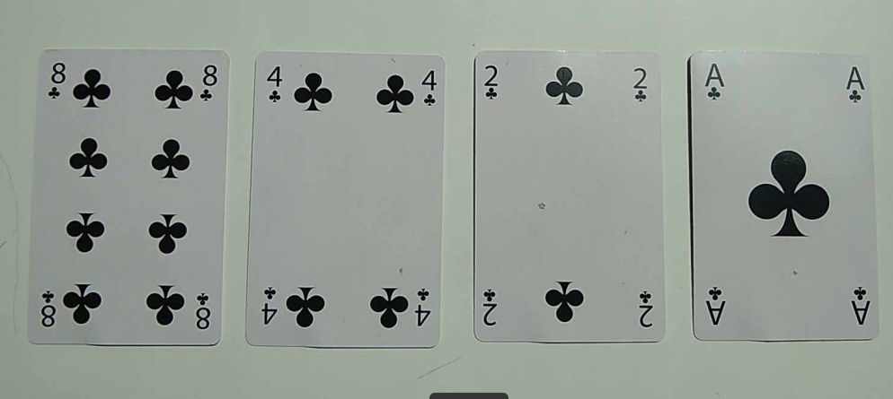

# Activité : Découverte du binaire

Nature : Débranchée.

Matériel : Jeu de quatre cartes, un crayon et une feuille de brouillon.

Prérequis : Aucun.

À faire : Seul.

## I. Objectif

L'objectif du jeu est de découvrir le langage binaire et de déterminer les algorithmes permettant de passer d'une représentation décimale à une représentation binaire et vice-versa.

## II. Installation

Placez les cartes dans l'ordre décroissant face visible comme ceci :

## III. Règles du jeu

Les cartes peuvent être face visible ou face cachées.

Lorsque la carte est face visible, elle vaut $1$.

Lorsque la carte est face cachée, elle vaut $0$.

## IV. Questions

Par groupe de deux, répondre aux questions suivantes sur votre feuille :

#### <ins>Représentation décimale à représentation binaire :</ins>

a) Retourner des cartes pour que la somme des points de toute les cartes face visible fasse $9$.

b) Inscrire sur la feuille la suite de $1$ et de $0$ ainsi obtenue.

c) En déduire la représentation binaire de $9$.

d) Répéter le procédé pour $3$, $12$ et $13$.

e) Existe-il plusieurs représentations binaires pour un même nombre ?

f) Quel est le plus grand nombre que l'on peut obtenir avec quatre cartes ?

g) Que faudrait-il ajouter sur la table pour dépasser ce nombre ?

h) Quel est le plus petit nombre possible ?

i) Existe-il un nombre compris entre le plus grand et le plus petit que tu ne puisse pas obtenir ?

j) Trouver les représentations binaires de $1$, $2$, $3$ et $4$ dans l'ordre. Quelle est la méthode permettant d'obtenir la représentation binaire d'un nombre $n+1$ ?

#### <ins>Représentation binaire à représentation décimale :</ins>

k) Retourner les cartes pour que la suite corresponde à $1010$.

l) Inscrire sur la feuille le nombre décimal ainsi obtenu.

m) En déduire la représentation décimale de $1010$.

n) Répéter le procédé pour $0101$, $1011$, et $1111$.

#### <ins>Addition binaire :</ins>

o) Après avoir combiné votre jeu avec celui de votre voisin, placez les jeux l'un au dessus de l'autre et inscrire sur votre feuille le résultat (en représentation binaire) de l'addition binaire de $0001$ et $0001$.

p) Vérifier que votre résultat est bien la représentation binaire de $2$.

q) Répéter ce procédé pour :

- $1000 + 0111$
- $5 + 3$
- $1001 + 0011$
- $0101 + 0111$

#### <ins>Multiplication binaire par deux :</ins>

r) Trouver la représentation binaire de $3$, puis $6$, puis $12$. Quelle est la méthode pour doubler un nombre en représentation binaire ?

s) Réciproquement, donner la méthode permettant de diviser par deux un nombre en représentation binaire.

_______________________

[Sommaire](./../README.md)

___________

<a property="dct:title" rel="cc:attributionURL" href="https://github.com/boddaert/nsi">Cours NSI</a> by <a rel="cc:attributionURL dct:creator" property="cc:attributionName" href="https://github.com/boddaert">Théo Boddaert</a> is licensed under <a href="https://creativecommons.org/licenses/by/4.0/?ref=chooser-v1" target="_blank" rel="license noopener noreferrer" style="display:inline-block;">CC BY 4.0</a>    
 
