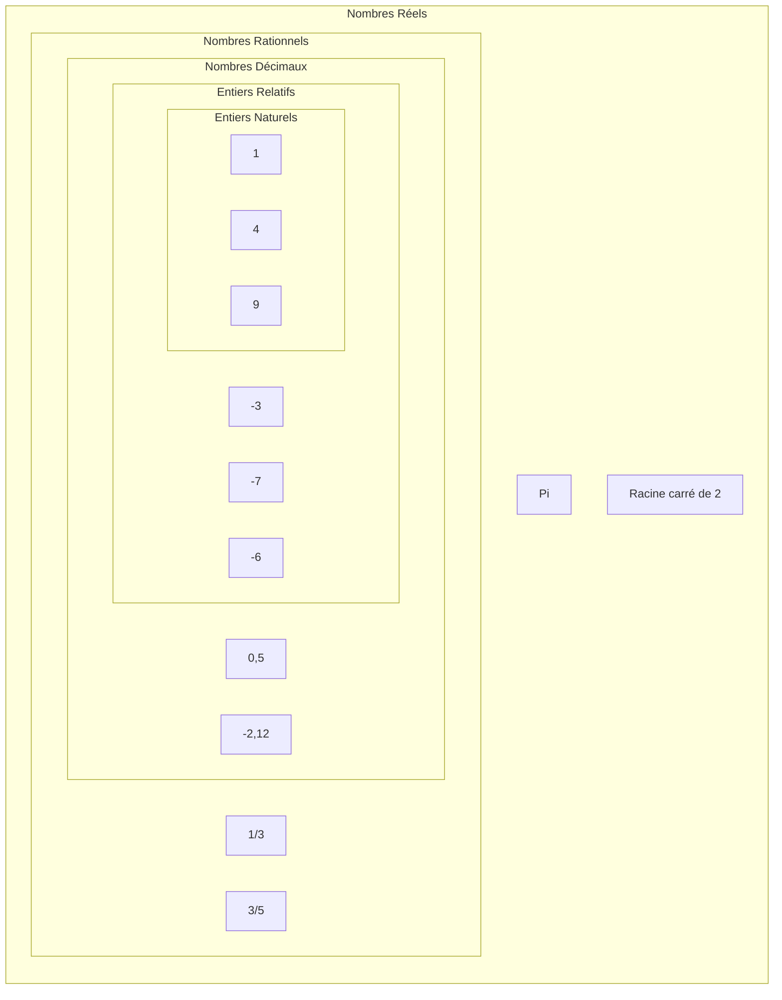
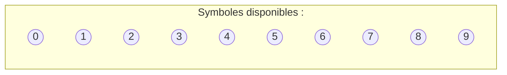
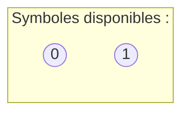
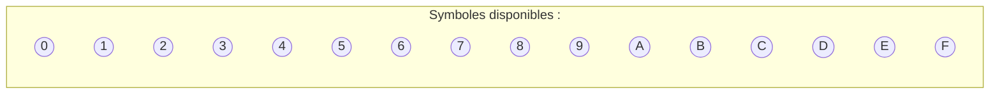

# Représentation des entiers naturels

## I. Les ensembles de nombres (Rappel)

## II. Définitions

> [!IMPORTANT]
>Un *nombre* désigne une quantité.

> [!IMPORTANT]
> La *représentation* d'un nombre est le symbole que nous lui associons.

Il existe plusieurs représentations pour un même nombre.

Par exemple le chiffre cinq peut s'écrire : $5$, $cinq$, $V$, ⚄, ...

## III. Représentation décimale

### a) Dix symboles

Nous, humains, utilisons usuellement la **représentation décimale** des nombres (parce que nous avons dix doigts).

Pour écrire un nombre dans cette représentation, nous avons à disposition dix symboles : 

Nous disons de ces nombres qu'ils sont écrits en **base dix**.

### b) Séquence

> [!IMPORTANT]
> Un nombre représenté en base dix est une *séquence* de chiffres compris entre $0$ et $9$.

> [!TIP]
> Par exemple :
> $456$

### c) Notation

Une nombre en base dix se note $n_{10}$ avec $n$ le nombre.

> [!TIP]
> Par exemple :
> $456_{10}$

### b) Poids des chiffres

Les chiffres de la séquence sont organisés selon leur poids : 

- le chiffre de poids zéro appelé le chiffre des unités
- le chiffre de poids un appelé le chiffre des dizaines
- le chiffre de poids deux appelé le chiffre des centaines
- etc...

> [!TIP]
> Par exemple :
>| Séquence $456_{10}$ | $4$ | $5$ | $6$ |
>| :---: | :---: | :---: | :---: |
>| Poids des chiffres | $2$ | $1$ | $0$ |

#### <ins>Application 1</ins>

Indiquer les poids de chacun des chiffres de la séquence $13098_{10}$.

## IV. Représentation binaire

### a) Deux symboles

Un ordinateur ne comprend que les $0$ (tension basse) et les $1$ (tension haute).

Pour écrire un nombre dans cette représentation, nous avons à disposition deux symboles : 

Nous disons de ces nombres qu'ils sont écrits en **base deux**.

### b) Séquence

> [!IMPORTANT]
> Un nombre représenté en base deux est une *séquence* de chiffres (aussi appelés **bits**) compris entre $0$ et $1$.

> [!TIP]
> Par exemple :
> $101$

### c) Notation

Une nombre en base deux se note $n_{2}$ avec $n$ le nombre.

> [!TIP]
> Par exemple :
> $101_{2}$

### d) Poids des bits

Les bits de la séquence sont organisés selon leur poids : 

- le bit de poids zéro aussi appelé le bit de poids faible
- le bit de poids un 
- le bit de poids deux
- etc...

> [!TIP]
> Par exemple :
>| Séquence $101_{2}$ | $1$ | $0$ | $1$ |
>| :---: | :---: | :---: | :---: |
>| Poids des bits | $2$ | $1$ | $0$ |

> [!NOTE]
> Le bit situé tout à gauche de la séquence est appelé **bit de poids fort**.

#### <ins>Application 2</ins>

Donner un nombre en base deux différent de l'exemple.

## V. Représentation hexadécimale

### a) Seize symboles

Parfois, nous utilisons la **représentation hexadécimale** car elle correspond à la représentation binaire sur quatre bits et nous fais gagner ainsi de la place et du temps.

Pour écrire un nombre dans cette représentation, nous avons à disposition seize symboles : 

Nous disons de ces nombres qu'ils sont écrits en **base seize**.

### b) Séquence

> [!IMPORTANT]
> Un nombre en base seize est une *séquence* de symboles compris entre $0$ et $F$.

> [!TIP]
> Par exemple :
> $A09$

### c) Notation

Une nombre en base deux se note $n_{16}$ avec $n$ le nombre.

> [!TIP]
> Par exemple :
> $A09_{16}$

### d) Poids des chiffres

Les chiffres de la séquence sont organisés selon leur poids : 

- le chiffre de poids zéro aussi appelé le bit de poids faible
- le chiffre de poids un 
- le chiffre de poids deux
- etc...

> [!TIP]
> Par exemple :
>| Séquence $A09_{2}$ | $A$ | $0$ | $9$ |
>| :---: | :---: | :---: | :---: |
>| Poids des chiffres | $2$ | $1$ | $0$ |

#### <ins>Application 3</ins>

Donner un nombre écrit en base seize différent de l'exemple.

## VI. Récapitulatif des représentations

| Représentation binaire | Représentation décimale | Représentation hexadécimale |
| :---: | :---: | :---: |
| $0$ | $0$ | $0$ |
| $1$ | $1$ | $1$ |
| $10$ | $2$ | $2$ |
| $11$ | $3$ | $3$ |
| $100$ | $4$ | $4$ |
| $101$ | $5$ | $5$ |
| $110$ | $6$ | $6$ |
| $111$ | $7$ | $7$ |
| $1000$ | $8$ | $8$ |
| $1001$ | $9$ | $9$ |
| $1010$ | $10$ | $A$ |
| $1011$ | $11$ | $B$ |
| $1100$ | $12$ | $C$ |
| $1101$ | $13$ | $D$ |
| $1110$ | $14$ | $E$ |
| $1111$ | $15$ | $F$ |

## VII. Changements de base

Un nombre ayant donc plusieurs représentations, il peut être utile de savoir comment passer la représentation de ce nombre d'une base à une autre.

### a) De la base dix vers la base deux

La méthode consiste à diviser euclidiennement et succéssivement le nombre par deux jusqu'à ce que le quotient atteigne $0$ et d'assembler les restes du bas vers le haut.

> [!TIP]
> Par exemple :
>
> 
>
> Ainsi $456_{10} = 111001000_2$ :

#### <ins>Application 4</ins>

Trouver la représentation binaire de $291_{10}$.

### b) De la base deux vers la base dix

La méthode consiste à multiplier chaque bit à un de la séquence par $2^p$ avec $p$ le poids.

> [!TIP]
> Par exemple :
> $111001000_2 = (1 * 2^8) + (1 * 2^7) + (1 * 2^6) + (1 * 2^3) = 456_{10}$

#### <ins>Application 5</ins>

Trouver la représentation décimale de $1011011_2$.

### c) De la base deux vers la base seize

La méthode consiste à regrouper les bits par bloc de quatre (en partant du bit du poids faible) et de convertir chaque groupe en hexadécimal.

> [!TIP]
> Par exemple :
>
>| $1$ | 1100 | $1000$ |
>| --- | --- | --- |
>| $1$ | $C$ | $8$ |
>
> Ainsi : $111001000_2 = 1C8_{16}$

#### <ins>Application 6</ins>

Trouver la représentation hexadécimale de $1011011_2$.
_____________________

[Exercices](./Exercices/Exercices_representation_des_entiers_naturels.md)

_____________________

[Sommaire](./../README.md)
___________

<a property="dct:title" rel="cc:attributionURL" href="https://github.com/boddaert/nsi">Cours NSI</a> by <a rel="cc:attributionURL dct:creator" property="cc:attributionName" href="https://github.com/boddaert">Théo Boddaert</a> is licensed under <a href="https://creativecommons.org/licenses/by/4.0/?ref=chooser-v1" target="_blank" rel="license noopener noreferrer" style="display:inline-block;">CC BY 4.0</a>    
 