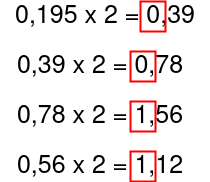

# Représentation des réels

## I. Représentation approximative

> [!NOTE]
> La représentation précise des réels en machine est impossible.

Si nous considérons le réel $\pi \approx 3.14159.......$ qui est infini, alors sa représentation binaire doit être une séquence infinie de bits.

Or, un ordinateur n'a pas une mémoire infinie.

C'est pourquoi les réels ont une **représentation approximative**.

Certains nombres décimaux ne peuvent également pas être représentés de manière précise.

#### <ins>Application 1</ins>

a) Tester dans la console l'égalité suivante : `0.1 + 0.2 == 0.3`.

b) Expliquer pourquoi l'égalité est fausse.

c) En déduire pourquoi il est préférable d'être prudent lorsque nous utilisons les flottants dans nos programmes.

## II. Représentation à virgule fixe

### a) Partie entière

La partie entière, c'est-à-dire la partie située à gauche de la virgule, est représentée comme les entiers naturels.

> [!TIP]
> Par exemple :
> La partie entière de $5,195_{10}$ est représentée par $101_2$.

### b) Partie décimale

La partie décimale, c'est-a-dire la partie située à droite de la virgule, s'obtient en récupérant les parties entières des produits successifs par deux.

> [!TIP]
> Par exemple :
> La partie décimale de $5,195_{10}$ est représentée par $0011_2$.
>
> 
>
> Donc, $5,195_{10} = 101,0011_2$.

#### <ins>Application 2</ins>

a) Trouver la représentation binaire à virgule fixe et en précision de quatre de $9,99_{10}$.

b) Trouver la représentation binaire à virgule fixe et en précision de quatre de $34,25_{10}$.

c) Trouver la représentation binaire à virgule fixe et en précision de quatre de $21,76_{10}$.

## III. Représentation à virgule flottante

Les nombres réels sont concrètement représentés en machine grâce à la norme IEEE 754.

Cette norme consiste à faire flotter la virgule pour finalement la faire disparaître de la représentation binaire d'où le nom de *nombre flottant*.

- Soit $x$, un nombre réel.

- Soit $S$, le bit de signe.

- Soit $e$, l'exposant.

- Et soit $M$, la mantisse.

La norme IEEE 754 est : $x = (-1)^S * 2^e * M$.

#### <ins>Application 3</ins>

a) Aller sur [Float Toy](http://evanw.github.io/float-toy/).

b) En demi-précision (seize bits), trouver la représentation décimale de $1100111110100111_2$ et noter le calcul effectué de la norme IEEE 754.

c) En demi-précision (seize bits), trouver la représentation décimale de $0001110111111111_2$ et noter le calcul effectué de la norme IEEE 754.

d) En demi-précision (seize bits), trouver la représentation décimale de $1100110000100011_2$ et noter le calcul effectué de la norme IEEE 754.

__________________

[Sommaire](./../README.md)

___________

<a property="dct:title" rel="cc:attributionURL" href="https://github.com/boddaert/nsi">Cours NSI</a> by <a rel="cc:attributionURL dct:creator" property="cc:attributionName" href="https://github.com/boddaert">Théo Boddaert</a> is licensed under <a href="https://creativecommons.org/licenses/by/4.0/?ref=chooser-v1" target="_blank" rel="license noopener noreferrer" style="display:inline-block;">CC BY 4.0</a>    
 
	

