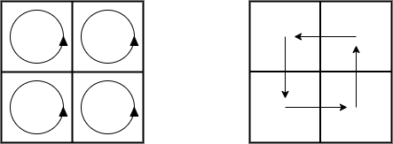

# Exercices

## Exercice 1

L'algorithme de recherche par dichotomie est un algorithme utilisant le principe de "Diviser pour régner".

a) Rappeler les étapes de l'algorithme de recherche dichotomique (via un schéma).

b) Décrire les étapes "Diviser", "Régner" et "Combiner" de l'algorithme de recherche dichotomique.

c) Écrire une fonction récursive ``recherche_dichotomique_recursive(l : list, elt : int)->int`` prenant en paramètre une liste triée d'entiers et un entier et renvoit l'élément ``elt`` si celui-ci est dans la liste sinon ``None``.

## Exercice 2 (Difficile)

Le problème des tours de Hanoï est un jeu célèbre constitué de trois tiges verticales sur lesquelles sont empilés des disques de diamètres différents.


Il s'agit de déplacer tous les disques de la première tige vers la dernière tige en respectant deux contraintes :

1. Nous ne pouvons déplacer qu'un seul disque à la fois.

2. Nous ne pouvons pas poser un disque sur un disque de diamètre plus petit.

a) Résoudre, en notant les déplacements effcetués, le problème des tours de Hanoï avec trois disques.

b) Résoudre, en notant les déplacements effcetués, le problème des tours de Hanoï avec quatre disques.

c) Écrire une fonction récursive `resolution_tours_de_hanoi(a : list, b : list, c : list, k : int)->None` qui prend en paramètres trois tiges représentées par des listes et un entier.

Cette fonction résout le problème des tours de Hanoï de $k$ disques de la tige `a` vers la tige `c` en utilisant la tige `b` comme tige intermédiaire.

Cette fonction ne renvoie rien mais affiche les déplacements effectués.

d) Remplacer les tiges `a`, `b` et `c` par des piles (cf [Piles](./../../../Structures_de_données/Structures_linéaires_de_données/Piles.md)).

## Exercice 3 (Difficile)

Dans cet exercice, nous cherchons à écrire une fonction qui effectue la rotation d'une image de $90$ degrés en utilisant le principe "Diviser pour régner" :


Pour manipuler une image en python, nous utiliserons le module PIL :

```python
from PIL import Image

# Nous chargeons l'image contenue dans le fichier image.png
image = Image.open("image.png")

# La méthode size permet d'obtenir les dimensions de l'image
largeur, hauteur = image.size

# La variable px représente le tableau des pixels de l'image
px = image.load()
```

Sa documentation est disponible [ici](https://pillow.readthedocs.io/en/stable/reference/Image.html).


La couleur du pixel situé aux coordonnées $x$ et $y$ est donnée par l'instruction ``px[x, y]``.

Une couleur est un triplet donnant les composantes rouge, vert et bleu sous la forme d'entiers entre $0$ et $255$.

Nous pouvons modifier la couleur d'un pixel avec l'affectation :

```python
c = (0, 255, 255)
px[x, y] = c
```

Nous supposons que notre image est carrée. L'idée est de couper l'image en quatre carrés, à effectuer la rotation de $90$ degrés de chacun des quatres carrés, puis à les déplacer vers les positions finales :



a) Exprimer, pour l'algorithme de rotation d'images, la méthode "Diviser pour régner" en décrivant les étapes :
   
   - Diviser :
   
   - Régner :
   
   - Combiner :

b) Afin de pouvoir procéder récursivement, nous allons définir une fonction ``rotation_aux(px : list, x : int, y :int, t :int)->None`` qui effectue la rotation de la portion carrée de l'image située aux coordonnées ``x``et ``y`` et ``x+t`` et ``y+t``.

Cette fonction modifie le tableau ``px`` pour effectuer la rotation de la portion de l'image et ne renvoie rien.

Écrire la fonction ``rotation_aux()``.

Vous pouvez télécharger une image de taille carrée [ici](./../src/image_de_taille_carree.jpg).

c) Écrire une fonction ``rotation(px : list, taille : int)`` qui effectue une rotation de l'image toute entière, elle prend en paramètre le tableau des pixels et la taille de celle-ci.
   
Une fois la rotation effectuée, l'image obtenue peut être sauvegardée dans un autre fichier avec l'instruction :
   
```python
image.save("rotation.png")
```

__________________

[Sommaire](./../../../README.md)

___________

<p xmlns:cc="http://creativecommons.org/ns#" xmlns:dct="http://purl.org/dc/terms/"><a property="dct:title" rel="cc:attributionURL" href="https://github.com/boddaert/nsi">Cours NSI</a> by <a rel="cc:attributionURL dct:creator" property="cc:attributionName" href="https://github.com/boddaert">Théo Boddaert</a> is licensed under <a href="https://creativecommons.org/licenses/by/4.0/?ref=chooser-v1" target="_blank" rel="license noopener noreferrer" style="display:inline-block;">CC BY 4.0</a>    </p> 