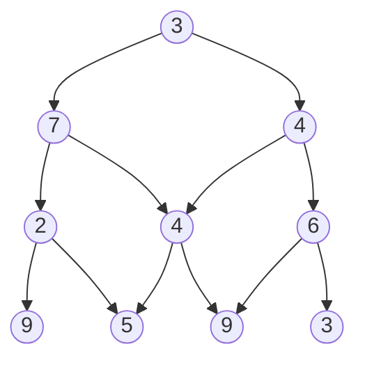

# Exercices

## Exercice 1

Assez similaire au problème du chercheur d'or, le problème de la pyramide est un problème incontournable de la programmation dynamique.

Le principe est le même : depuis le sommet, l'objectif est d'arriver à la base de la pyramide en ayant récupéré le maximum de points.

a) Retrouver à la main le chemin permettant de récolter le plus de points sur la pyramide ci-dessus.

b) Retrouver le(s) cas de base et cas récursifs afin de construire le principe de récurrence.

c) Écrire la fonction `pyramide_naif(p : list)->int` qui prend en paramètre une liste de listes et renvoie le nombre maximal de points.

d) Écrire la fonction `pyramide_descendante(p : list)->int` qui prend en paramètre une liste de listes et renvoie le nombre maximal de points en utilisant l'appoche descendante de la programmation dynamique.

e) Écrire la fonction `pyramide_ascendante(p : list)->int` qui prend en paramètre une liste de listes et renvoie le nombre maximal de points en utilisant l'appoche ascendante de la programmation dynamique.

## Exercice 2 (Difficile)

Alignement de séquence (p 240)

## Exercice 3 (Difficile)

Dans un système non canonique, l'algorithme glouton ne donne pas de solution optimale sur le problème du rendu de monnaie.

Pour ce problème, la programmation dynamique consiste à tester récursivement toutes les combinaisons possibles et de remonter la solution qui donne un nombre de pièces minimal.

Notons $p1$, $p2$, ..., $pi$, ..., $pn$ les pièces disponibles.

Considérons une somme $S$ et notons $nb(S)$ le plus petit nombre de pièces possible pour rendre cette somme.

L'ensemble des sommes que l'on peut rendre avec une pièce de plus (c'est-à-dire avec $nb(S) + 1$ pièces) est : $S-p1$, $S-p2$, ..., $S-pi$ , ..., $S-pn$. Avec $pi$ inférieur ou égal à $S$.

Nous pouvons alors calculer le plus petit nombre de pièces nécessaire pour chacune de ces sommes, c'est-à-dire :
$nb(S-p1)$, $nb(S-p2)$, ..., $nb(S-pi)$ , ..., $nb(S-pn)$. Avec $pi$ inférieur ou égal à $S$.

De cet ensemble de valeur, il ne faut garder que la plus petite.

Autrement dit, $nb(S) = 1 + min_{pour tous les i tels que pi < S}(nb(S-pi))$

La récurrence peut s'exprimer de la façon suivante :

    - si 

: - si : 

__________________

[Sommaire](./../../../README.md)

___________

<a property="dct:title" rel="cc:attributionURL" href="https://github.com/boddaert/nsi">Cours NSI</a> by <a rel="cc:attributionURL dct:creator" property="cc:attributionName" href="https://github.com/boddaert">Théo Boddaert</a> is licensed under <a href="https://creativecommons.org/licenses/by/4.0/?ref=chooser-v1" target="_blank" rel="license noopener noreferrer" style="display:inline-block;">CC BY 4.0</a>    
 