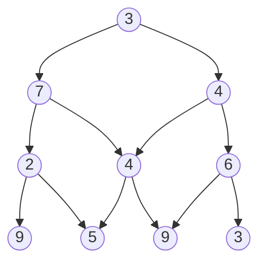

# Exercices

## Exercice 1

Assez similaire au problème du chercheur d'or, le problème de la pyramide est un problème incontournable de la programmation dynamique.

Le principe est le même : depuis le sommet, l'objectif est d'arriver à la base de la pyramide en ayant récupéré le maximum de points.

a) Retrouver à la main le chemin permettant de récolter le plus de points sur la pyramide ci-dessus.

b) Retrouver le(s) cas de base et cas récursifs afin de construire le principe de récurrence.

c) Écrire la fonction `pyramide_naif(p : list)->int` qui prend en paramètre une liste de listes et renvoie le nombre maximal de points.

d) Écrire la fonction `pyramide_descendante(p : list)->int` qui prend en paramètre une liste de listes et renvoie le nombre maximal de points en utilisant l'appoche descendante de la programmation dynamique.

e) Écrire la fonction `pyramide_ascendante(p : list)->int` qui prend en paramètre une liste de listes et renvoie le nombre maximal de points en utilisant l'appoche ascendante de la programmation dynamique.

## Exercice 2

Même exercice avec le problème du rendu de monnaie.

__________________

[Sommaire](./../../../README.md)