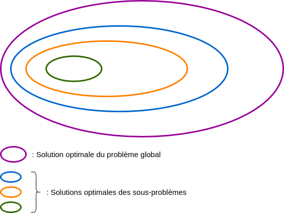
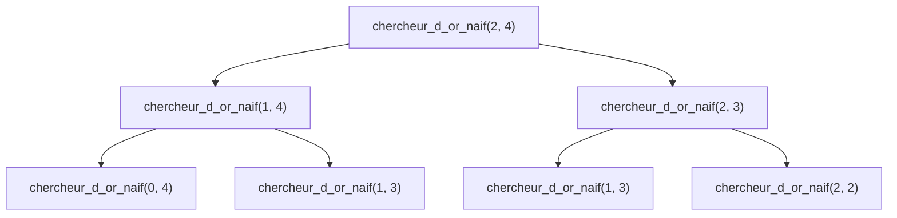

# Programmation dynamique

## I. Introduction 

Résoudre un problème d'optimisation combinatoire est facile : il suffit de calculer toutes les solutions possibles et de maximiser ou minimiser selon le critère sur cet ensemble de solutions.

Malheureusement, en informatique, une contrainte s'impose : la puissance actuelle des ordinateurs.

Une solution existe : les algorithmes gloutons.

Néanmoins, la stratégie gloutonne ne fournit pas nécessairement la meilleure solution. Nous disons de la stratégie gloutonne qu'elle donne une solution "satisfaisante".

Or, parfois, pour certains problèmes, il est nécessaire d’obtenir la meilleure solution.

Les informaticiens utilisent alors la programmation dynamique.

## II. Définitions

La *programmation dynamique* est une technique de programmation répondant à un problème d'optimisation combinatoire (cf [Problèmes d'optimisation combinatoire](./Problèmes_d_optimisation_combinatoire.md) en donnant la meilleure solution.

La *stratégie de la programmation dynamique* consiste à obtenir une solution optimale en utilisant les solutions optimales des précédents sous-problèmes où ceux-ci se chevauchent.



La résolution d'un tel problème est récursive : 

- La solution optimale du premier sous-problème étant trivial : c'est le cas de base.

- Les solutions optimales des problèmes suivants étant calculées à l'aide des précédents appels : c'est le cas récursif.

## III. Étude de cas : le chercheur d'or

### a) Intitulé

Le chercheur d'or souhaite récolter le plus de pépites d'or possible.

Muni d'un radar à pépites, le chercheur d'or connaît précisément le nombre de pépites présentes dans chaque parcelle de la mine.

Il commence toujours par creuser dans la parcelle du coin supérieur gauche de la mine et termine sur la parcelle dans le coin inférieur droit.

Pour chaque nouvelle parcelle de roche creusée, il récupère le nombre de pépites présentes dans celle-ci et l'ajoute à son butin.

Afin d'éviter de se faire ensevelir, le chercheur n'a d'autre choix que de creuser la parcelle située soit à droite soit en bas de sa position actuelle.

##### Application 1 

Démontrer que le problème du chercheur d'or s'agit d'un problème d'optimisation combinatoire.

##### Application 2

a) Quelle est la stratégie gloutonne pour le problème du chercheur d'or ?

b) Expliquer pourquoi, dans ce problème, la stratégie gloutonne ne donne pas toujours une solution satisfaisante.

### b) Modélisation de la mine

Une mine est modélisée par une liste de listes dans laquelle chaque entier représente le nombre de pépites d'or présentes dans la parcelle `[i][j]` :

```python
mine = [[1, 2, 1, 4, 5],
        [1, 2, 3, 1, 3],
        [3, 1, 2, 1, 1]]
```

### c) Nombre de solutions

Le nombre de solutions est équivalent au nombre de chemins possibles.

Le nombre de chemins est trouvable en calculant le coefficient binomial du nombre total de mouvement parmi le nombre de mouvement à droite (ou en bas) possibles.

> Dans le cas d'une mine non carrée, il faut prendre le maximum entre le nombre de mouvements à droite et le nombre de mouvements en bas.

Par exemple, dans ce cas d'étude, il y a quatre mouvements possible à droite sur, au total, six mouvements donc le nombre de chemins est égal à $\binom{6}{4} = 15$.

> Rappel : $\dfrac{n!}{k!(n-k)!} = \binom{n}{k}$

Par conséquent, il n'est pas raisonnable de construire un algorithme calculant les solutions de tous les chemins possibles si la taille de la mine est considérable.

##### Application 3

a) Donner le nombre de solutions possible pour une mine de taille $15 \times 15$.

b) Donner le nombre de solutions possible pour une mine de taille $30 \times 30$.

### d) Approche naïve

Dans ce problème, la stratégie de la programmation dynamique consiste à calculer le nombre maximal de pépites que le chercheur peut obtenir pour chaque parcelle de la mine en utilisant les nombres maximaux de pépites des parcelles précédentes.

Nous connaissons les parcelles pour lequelles le nombre maximal de pépites récoltables restera inchangé : ce sont nos cas de base du principe de récurrence que l'on cherche à écrire.

- Pour quelle(s) parcelle(s) de la mine, le chercheur connaît-il exactement le nombre maximal de pépites qu'il aura récoltées depuis le début du chemin ?

Nous connaissons le nombre maximal de pépites récoltable pour la parcelle `mine[0][0]` ainsi que toute la première ligne `mine[0][j]` et toute la première colonne `mine[i][0]`.

- Pour les autres parcelles, deux choix sont possibles : soit le chercheur arrive depuis la parcelle supérieure, soit le chercheur arrive depuis la gauche.

Il s'agit donc de déterminer si le chercheur arrive sur la parcelle avec plus de pépites en arrivant depuis le haut ou s'il arrive avec plus de pépites en arrivant depuis la gauche.

Principe de récurrence :

$$
chercheur\textunderscore d\textunderscore or(i, j)=
\begin{cases}
mine[0][0] & \quad \text{si i = 0 et si j = 0}\\ 
mine[0][j] + chercheur\textunderscore d\textunderscore or(0, j-1) & \quad \text{si i = 0 et si j != 0}\\
mine[i][0] + chercheur\textunderscore d\textunderscore or(i-1, 0) & \quad \text{si i != 0 et si j = 0}\\
mine[i][j] + max(chercheur\textunderscore d\textunderscore or(i, j-1), chercheur\textunderscore d\textunderscore or(i-1, j)) & \quad \text{sinon}
\end{cases}
$$

##### Application 4

a) En reprenant la mine de l'activité du chercheur d'or, ajouter, dans chaque parcelle de la mine, des perles de façon à ce que le nombre de pépites corresponde au nombre maximal de pépites pouvant être récoltées de la première parcelle jusqu'à celle-ci.

b) Depuis la dernière parcelle en remontant jusqu'à la première, reconstituer le chemin offrant le plus de pépites et donner la réponse au problème.

### e) Programme naïf

```python
def chercheur_d_or_naif(mine : list, i : int, j : int)->int:
    if i == 0 and j == 0 :
        return mine[0][0]
    elif i == 0 and j != 0 :
        return mine[0][j] + chercheur_d_or_naif(mine, i, j-1)
    elif i != 0 and j == 0 :
        return mine[i][0] + chercheur_d_or_naif(mine, i-1, j)
    else :
        return mine[i][j] + max(chercheur_d_or_naif(mine, i, j-1), chercheur_d_or_naif(mine, i-1, j))
```

##### Application 5

a) Réécrire dans Thonny la fonction `chercheur_d_or_naif()`.

b) À l'aide du débogueur, exécuter la fonction `chercheur_d_or_naif()` avec la variable `mine`.

### f) Pile d'appels

Un problème subsiste cependant avec cette approche naïve : en effet, nous remarquons que cette approche va réaliser plusieurs fois les mêmes appels :



Dès la troisième profondeur de l'arbre, deux appels récursifs sont effectués pour le même calcul.

##### Application 6

Compléter la pile d'appels ci-dessus et donner le nombre d'appels total qui ont déjà été effectués.

### g) Approche ascendante

L'*approche ascendante* de la programmation dynamique consiste à supprimer le problème des appels redondants en dérécursivant la fonction.

Les résultats des calculs effectués sont stockés dans un tableau `tab` :

```python
def chercheur_d_or_ascendante(mine : list, i : int, j : int)->int:
    tab = [[0 for j in range(len(mine[0]))] for i in range(len(mine))]
    tab[0][0] = mine[0][0]
    for j in range(1, len(mine[0])):
        tab[0][j] = tab[0][j-1] + mine[0][j]
    for i in range(1, len(mine)):
        tab[i][0] = tab[i-1][0] + mine[i][0]
    for i in range(1, len(mine)):
        for j in range(1, len(mine[0])):
            tab[i][j] = mine[i][j] + max(tab[i-1][j], tab[i][j-1])
    return tab[i][j]
```

##### Application 7

a) Réécrire dans Thonny la fonction `chercheur_d_or_ascendante()`.

b) À l'aide du débogueur, exécuter la fonction `chercheur_d_or_ascendante()` avec la variable `mine`.

c) À quoi correspond `tab` ?

### h) Approche descendante

L'*approche descendante* de la programmation dynamique consiste à supprimer le problème des appels redondants en mémorisant les résultats des calculs dans un dictionnaire (que nous appelons `mem` et qui est égal à `None` lors de l'appel initial):

```python
def chercheur_d_or_descendante(mine : list, i : int, j : int, mem = {}):
    if (i, j) in mem :
        return mem[(i, j)]
    if i == 0 and j == 0 :
        mem[(i, j)] = mine[0][0]
    elif i == 0 and j != 0 :
        mem[(i, j)] = mine[0][j] + chercheur_d_or_descendante(mine, i, j-1)
    elif i != 0 and j == 0 :
        mem[(i, j)] = mine[i][0] + chercheur_d_or_descendante(mine, i-1, j)
    else :
        mem[(i, j)] = mine[i][j] + max(chercheur_d_or_descendante(mine, i, j-1), chercheur_d_or_descendante(mine, i-1, j))
    return mem[(i, j)]
```

##### Application 8

a) Réécrire dans Thonny la fonction `chercheur_d_or_descendante()`.

b) À l'aide du débogueur, exécuter la fonction `chercheur_d_or_descendante()` avec la variable `mine`.

c) Donner l'état de `mem` à l'issue de l'exécution de la fonction.

_______________

[Exercices](./Exercices/Exercices_programmation_dynamique.md)

_______________

[Sommaire](./../../README.md)