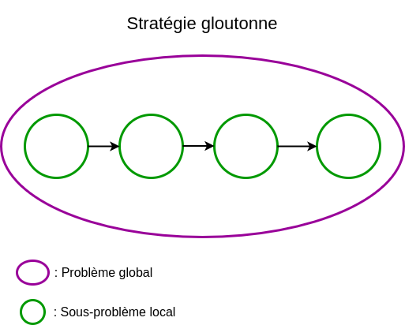

# Rappels sur les algorithmes gloutons 

## I. Introduction

Résoudre un problème d'optimisation combinatoire est facile : il suffit de calculer toutes les solutions possibles et de maximiser ou minimiser selon le critère sur cet ensemble de solutions.

Malheureusement, en informatique, une contrainte s'impose : la puissance actuelle des ordinateurs.

Prenons un exemple de problème d'optimisation combinatoire : le voyageur de commerce.

Depuis une ville de départ, le voyageur cherche à visiter toutes les villes comprises dans le problème une et une seule fois et finit son tour en passant par la ville de départ.

Il existe plusieurs itinéraires et le voyageur cherche à minimiser la distance parcourue.

#### <ins>Application 1</ins>

a) Démontrer que, dans le cas du problème du voyageur de commerce, il s'agit bien d'un problème d'optimisation combinatoire.

b) Pour un problème du voyageur de commerce à onze villes, combien le voyageur a t-il de choix quant à la ville de départ ? 

c) Depuis une ville de départ, combien le voyageur a t-il de choix quant à la seconde ville à visiter ?

d) Combien y a t-il d'itinéraires possibles pour ce problème à onze villes ?

e) Combien y a t-il d'itinéraires possibles pour ce problème à $n$ villes ?

f) Est-il possible pour un ordinateur de concevoir une solution en temps raisonnable avec cette stratégie ?

## I. Généralités

### a) Définitions

> [!IMPORTANT]
> Les *algorithmes gloutons* sont des algorithmes répondant à un problème d'optimisation combinatoire.

Les algorithmes gloutons utilisent la stratégie gloutonne.

> [!IMPORTANT]
> La *stratégie gloutonne* consiste, par une suite de choix, à sélectionner à chaque étape le choix qui est le meilleur localement.

Cette stratégie ne traite qu'un seul sous-problème local et indépendant des autres à la fois :



> [!WARNING]
> Cette stratégie ne fournit pas forcément la meilleure solution. Nous disons de la stratégie gloutonne qu'elle donne une solution "satisfaisante".

## II. Mise en application 

#### <ins>Application 2</ins>

a) Donner l'idée de la stratégie gloutonne utilisée pour le problème de rendu de monnaie.

b) Donner l'idée de la stratégie gloutonne utilisée pour le problème du voyageur de commerce.

#### <ins>Application 3</ins>

Écrire une fonction `rendu_de_monnaie_glouton(l_pieces : list, somme_a_rendre : int)->list` qui prend en paramètre un système monnaitaire sous forme de liste et un entier et renvoie, en utilisant la stratégie gloutonne, une liste des pièces satisfaisante à rendre.

```python
>>> rendu_de_monnaie_glouton([1, 2, 5, 10, 20, 50], 34)
[20, 10, 2, 2]
```

#### <ins>Application 4</ins>

Écrire une fonction `voyageur_de_commerce_glouton(l_villes : list, i_depart : int)->list` qui prend en paramètre une liste de villes, une ville étant modélisée par un tuple de coordonnées et une ville de départ et renvoie sous forme de liste, en utilisant la stratégie gloutonne, un ordre de visite satisfaisant des villes.

```python
>>> voyageur_de_commerce([(2,3), (4,7), (10,1), (3,8), (1, 0), (10, 9)],3)
[3, 1, 0, 4, 2, 5, 3]
```

_________________

[Sommaire](./../../README.md)

___________

<p xmlns:cc="http://creativecommons.org/ns#" xmlns:dct="http://purl.org/dc/terms/"><a property="dct:title" rel="cc:attributionURL" href="https://github.com/boddaert/nsi">Cours NSI</a> by <a rel="cc:attributionURL dct:creator" property="cc:attributionName" href="https://github.com/boddaert">Théo Boddaert</a> is licensed under <a href="https://creativecommons.org/licenses/by/4.0/?ref=chooser-v1" target="_blank" rel="license noopener noreferrer" style="display:inline-block;">CC BY 4.0</a>    </p> 