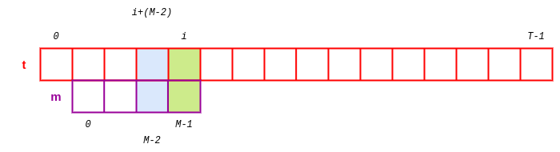

# Recherche textuelle

## I. Introduction

Un exemple d'application de la recherche textuelle est la recherche de texte dans un document numérique utilisable avec le raccourci `Ctrl+F`.

Cela permet, entre autres, de repérer où se situe le sujet qui nous intéresse dans un document numérique pouvant comporter des centaines de pages.

Une autre application de la recherche textuelle est le séquençage des génomes.

Le séquençage du génome (étant codé sur quatre lettres : `A`, `C`, `T` et `G` et qui sont les initiales de quatre bases nucléiques : adénine, cytosine, thymine et guanine), avant les années quatre-vingt, était réalisé à la main par les biologistes jusqu'à ce qu'une collaboration entre généticiens et informaticiens voit le jour.

Cette collaboration a permis au développement de nouveaux algorithmes dans les années quatre-vingt.

Ces algorithmes pouvaient, en un temps record, retrouver une séquence précise choisie dans tout le génome.

## II. Définitions

La *recherche textuelle* est un problème algorithmique de recherche qui consiste à retrouver une chaîne de caractère dans une autre chaîne de caractère et de renvoyer leur position.

Le *motif* est le nom donné à la chaîne de caractère que nous souhaitons retrouver.

Le *texte* est le nom donné à la chaîne de caractère sur laquelle la recherche s'effectue.

##### Application 1

Dans le texte `abracadabra`, rechercher et donner les positions du motif `bra`.

## III. Problème de recherche textuelle

### a) Notations

Notons $m$ le motif et $M$ la longueur de $m$.

Notons $t$ le texte et $T$ la longueur de $t$.

### b) Premières observations

- Remarquons qu'il ne peut y avoir une occurence de $m$ dans $t$ si $M > T$.

- Il y a $T + 1$ occurences si $m$ est une chaîne vide ($M = 0$).

### c) Formalisation du problème


Au dessus, le texte $t$ allant de l'indice $0$ à $T-1$.

En dessous, le motif $m$ allant de l'indice $0$ à $M-1$.

Si une occurence du motif existe à la position $i$, alors les caractères `t[i]`, `t[i+1]`, ... , `t[i+(M-1)]` coïncident avec les caractères `m[0]`, `m[1]`, ... , `m[M-1]`.

## IV. Algorithme naïf

L'idée de l'algorithme naïf est de tester à chaque position la présence du motif :

```
Algorithme recherche_textuelle_naïve
Entrées : m le motif, une chaîne de caractère et t le texte, une chaîne de caractères
Sorties : La liste des positions de motif dans texte

positions <- []
Pour i allant de 0 à taille(texte)-taille(motif)+1, faire :
    j <- i
    k <- 0
    TantQue k est inférieur à taille(m) et t[j] est égal à m[k], alors :
        j <- j + 1
        k <- k + 1
    Si k est égal à taille(m), alors :
        Ajouter i à positions
Renvoyer positions
```

Celui-ci se voit ajouter deux nouveaux indices `j` et `k` qui représentent respectivement les indices de comparaisons entre $t$ et $m$.

##### Application 2

a) Réécrire l'algorithme de recherche textuelle naïve en Python.

b) Vérifier, en utilisant le débogueur, le résultat suivant :

```python
>>> recherche_textuelle_naive("bra", "abracadabra")
[1, 8]
```

## V. Algorithme de Boyer-Moore

Les faibles performances de la recherche naïve lorsque la taille du texte augmente a poussé de nombreux informaticiens à proposer des solutions pour améliorer le coût algorithmique de ce type de recherche.

L'algorithme de Boyer et Moore est un algorithme de recherche textuelle très efficace developpé en 1977.

Bien trop complexe pour le programme de terminale, nous étudierons sa version simplifiée dévelopée en 1980 par Nigel Horspool.

## VI. Algorithme de Horspool

### a) Idées d'améliorations

Afin de réduire le coût algorithmique de la recherche textuelle naïve, Boyer et Moore imaginent deux concepts :

**1) Comparer de droite à gauche**

La première idée est de parcourir, non plus de gauche à droite, mais de droite à gauche le motif lors des comparaisons.

Ainsi, pour une position $i$ donnée, nous allons comparer les caractères de $m$ et $t$ de la droite vers la gauche, c'est-à-dire en comparant d'abord `m[M-1]` avec `t[i+(M-1)]` :


Puis, `m[-2]` avec `t[i+(M-2)]` si les caractères coïncident :



Etc ...

Le changement peut paraître anecdotique mais permet d'effectuer moins de comparaisons si nous la combinons avec l'idée suivante :

**2) Sauter des rangs**

La seconde idée est de pré-traiter le texte dans le but de construire un tableau des décalages.

Ce tableau des décalages permet de savoir de nombre de rang que $i$ effectuera en cas de non correspondance des lettres.

Par exemple, dans la configuration suivante, il est inutile de réaliser la comparaison à $i+1$ et $i+2$ puisque nous savons que la lettre `B` ne figure pas parmi les trois dernières lettres de $m$.


### b) Construction de la table des décalages

La table des décalages indique pour chaque lettre du motif le nombre de décalage à droite à réaliser.

- Si la lettre `t[i]` n'apparaît pas dans le motif, le décalage est égal à la longueur du motif : $M-1$.

- Si la lettre `t[i]` apparaît dans le motif, le décalage est égal à la distance entre cette lettre et la dernière lettre du motif.

Avec $m \quad = \quad WIKIPEDIA$, la table des décalages de ce motif est :

| Lettre `t[i]` | Décalage de $i$ dans $t$ |
| :---: | :---: |
| $I$ | $1$ |
| $D$ | $2$ |
| $E$ | $3$ |
| $P$ | $4$ |
| $K$ | $6$ |
| $W$ | $8$ |
| Autre lettre | $9$ |

##### Application 3

Établir la table des décalages pour le motif `bra`.

### c) Algorithme de construction de la table des décalages

Pour simplifier la programmation en Python, l'algorithme `table_des_decalages()` construisant la table des décalages renvoie un dictionnaire :

```
Algorithme table_des_decalages
Entrées : m le motif, une chaîne de caractère
Sorties : Un dictionnaire des décalages

décalages <- {}
Pour i allant de 0 à taille(m), faire :
    lettre <- m[len(m)-1-i]
    Si lettre n'est pas présente dans décalages, alors :
        Ajouter à décalages la clé : lettre ayant comme valeur : taille(m)-1-i
Renvoyer décalages
```
##### Application 4

a) Réécrire l'algorithme de construction de la table des décalages en Python.

b) Vérifier, en utilisant le débogueur, le résultat suivant :

```python
>>> table_des_decalages("wikipedia")
{'i': 1, 'd': 2, 'e': 3, 'p': 4, 'k': 6, 'w': 8}
```

### d) Algorithme de Horspool

```python
def horspool(m : str, t : str)->list:
    positions = []
    decalages = table_des_decalages(m)
    i = len(m)-1
    while i < len(t) :
        if t[i] != m[len(m)-1] :
            if t[i] in decalages :
                i = i + decalages[t[i]]
            else :
                i = i + len(m)
        else :
            j = i
            k = len(m)-1
            while k > 0 and t[j-1] == m[k-1] :
                j = j - 1
                k = k - 1
            if k == 0 :
                positions.append(i-(len(m)-1))
            i = i + 1
    return positions
```

##### Application 5

a) Réécrire l'algorithme de recherche textuelle de Horspool en Python.

b) Vérifier, en utilisant le débogueur, le résultat suivant :

```python
>>> horspool("bra", "abracadabra")
[1, 8]
```

c) Après avoir compris l'algorithme de Horspool, le réécrire en français de façon à ce que n'importe qui puisse l'appliquer.

____________

[Sommaire](./../../README.md)
