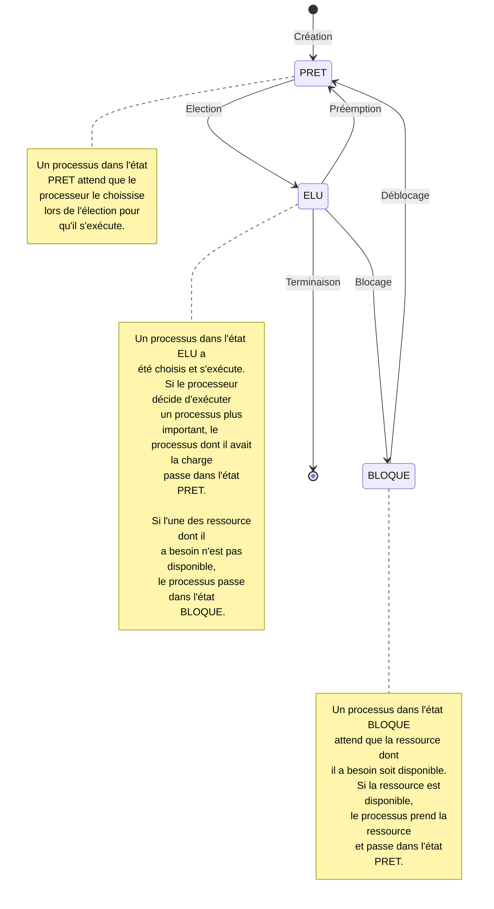

# Gestion des processus et des ressources par un système d'exploitation

Petit rappel sur la définition d'un système d'exploitation : [Systèmes d'exploitation](./../../première/Architecture_des_machines/Systèmes_d_exploitation.md).

Cette leçon décrit le fonctionnement de la gestion du processeur par un système d'exploitation et répond à la question : Quel programme exécuter ?

## I. Processus et ressources

### a) Définitions

Un *programme* est statique: c’est un fichier contenant une suite d’instructions qui lorsqu’elles sont exécutées modifient l’état du processeur et de la mémoire afin de réaliser une tâche donnée.

Un *processus* est dynamique : Il s'agit d'un programme en cours d'exécution. Il incarne l'état du programme dans le temps.

Nous caractérisons un processus par :

- Un identifiant appelé *PID*.

- Un état : l'état dans lequel se trouve le processus.

- Un espace mémoire : l'espace mémoire alloué necéssaire à l'exécution du programme.

- Une durée d'exécution : le temps necéssaire à l'exécution du programme.

- Un ensemble de ressources : les ressources dont a besoin le processus.

Une *ressource* est une entité matérielle ou logicielle dont a besoin un processus pour s'exécuter.

Une ressource est soit libre soit occupée par un processus, elle possède un certain nombre de point d'accès.

### b) Etats d'un processus

Lorsqu'un programme commence son exécution, un processus est alors créé : c'est la `création` d'un processus.

Lorsqu'un processus est créé, il passe dans l'état `PRET` : il attend que le processeur le choisisse.

S'il est choisis lors de l'`élection`, il passe dans l'état `ELU`.

Lorsqu'un processus est dans l'état `ELU`, il s'exécute. S'il a toute les ressources dont il a besoin il peut terminer son exécution.

### c) Visualisation des processus

## Politiques d'ordonnancement

## Problèmes

### Exclusion mutuelle
### Interblocage

#### Coffman