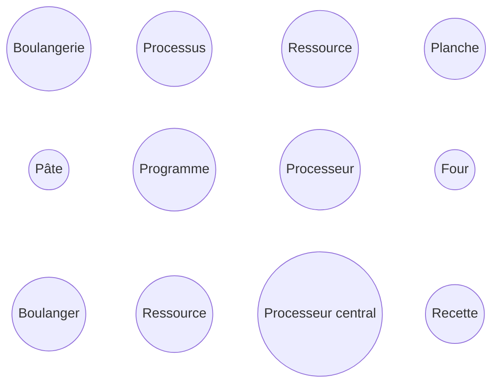

# Activité : Panique à la boulangerie

Nature : Débranchée

Matériel : Aucun

Prérequis : Notion d'interblocage

Groupe : Seul

## I. Objectif

L'objectif est de repérer quelle situation pourrait mener à un interblocage.

## II. Contexte

Dans une boulangerie, tous les boulangers sont tombés malades sauf un.

Seul, il va devoir préparer les baguettes avant l'ouverture de la boutique aux clients. Pour cela, il devra suivre la recette qui lui demande de faire cuire la pâte à pain pendant un certain temps dans le four.

Pour poser et reprendre la pâte du four, le boulanger se sert d'une planche.

Parce qu'un malheur n'arrive jamais seul, le boulanger s'aperçoit qu'un seul four fonctionne et qu'une seule planche est en bon état.

Avec l'expérience, le boulanger sait qu'un four ne peut cuire qu'une seule pâte à la fois que que sa planche ne peut porter qu'une seule pâte.

## III. Travail à faire

a) La gestion de la cuisson des pâtes peut être assimilée à la gestion des processus dans un ordinateur. Relier chaque élément de la boulangerie avec son correspondant informatique :



b) Dans chacune des situations suivantes, expliquer pourquoi il y a ou pas interblocage :

```
Situation n°1:
Le boulanger prépare une première pâte.
Le boulanger met la première pâte au four.
Le boulanger prépare la seconde pâte.
Le boulanger retire la première pâte du four.
Le boulanger met la seconde pâte au four.
Le boulanger retire la seconde pâte du four.
```

```
Situation n°2:
Le boulanger prépare une première pâte.
Le boulanger prépare une seconde pâte.
Le boulanger met la première pâte au four.
Le boulanger met la seconde pâte au four.
Le boulanger retire la première pâte du four.
Le boulanger retire la seconde pâte du four.
```

```
Situation n°3:
Le boulanger prépare une première pâte.
Le boulanger prépare une seconde pâte.
Le boulanger met la première pâte au four.
En mettant la seconde pâte au four, le boulanger retire la première pâte du four.
Le boulanger retire la seconde pâte du four.
```
________________

[Sommaire](./../README.md)